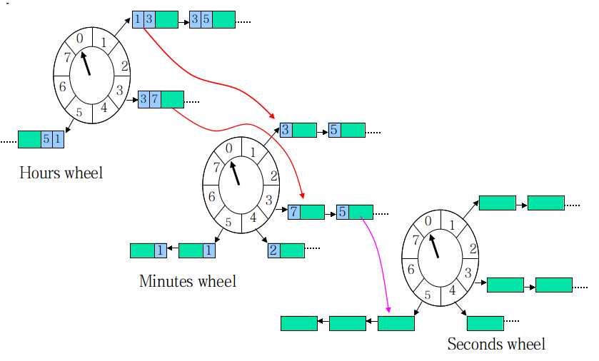
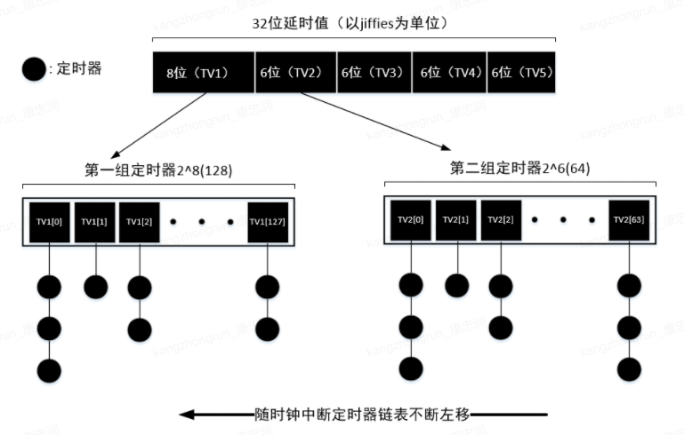

### 定时器实现方式


#### 1. 作用与数据结构要求

定时器主要为执行定时任务：

- 需要快速找到到期任务，数据结构应该具有**有序性**；
- 其**查找**、**插入**(添加定时任务)和**删除**(取消定时任务)的频率比较高，三种操作效率必须保证

> 设计定时器是需要考虑精度问题；定时器一般跟`epoll`搭配使用(用`epoll_wait`来阻塞)

有序链表：添加`O(n)`；删除`O(1)`；`expire`执行`O(1)`

堆`heap`：添加`O(logn)`；删除`O(logn)`,`expire`执行`O(1)`

hash wheel timer：添加`O(1)`；删除`O(1)`；expire执行平均`O(1)`，最坏`O(n)`


#### 2. 需要实现的接口(封装给用户使用)

- 初始化`init_timer`：创建定时器，执行初始化任务
- 添加`add_timer`: 添加定时任务
- 删除`cancel_timer`: 取消定时任务
- 执行任务`expire_timer`: 执行到期定时任务对应的回调；有两种工作方式：
  	1. 轮询: 每隔一个时间片去查找哪些任务到期；
   	2. 睡眠/唤醒：不停查找deadline最近任务，到期执行，否则sleep；sleep期间，任务有改变，线程会被唤醒


#### 3. 跳表实现定时器

- 跳表查找，插入，删除(任意节点、头节点)的时间复杂度大概率趋向于`O(logn)`

- 过期任务查找，只需要跟第一个节点比较，因其第一个节点即为最小节点

**学会吸取开源框架中优秀数据结构和代码思想**，直接采用`redis`中跳表结构的实现，并取出不需要用到的部分，用来实现定时器；

代码如下：

```c
// skiplist.h 头文件 数据结构及相关需要实现接口，具体接口实现太多了，不贴出来, 可参考redis源码跳表实现
#ifndef _SKIPLIST_
#define _SKIPLIST_
#define ZSKIPLIST_MAXLEVEL 32
#define ZSKIPLIST_P 0.25

typdef struct zskiplistNode zskiplistNode;
typdef void (*handler_pt) (zskiplistNode *node);
// 节点
struct zskiplistNode {
    unsigned long score;
    handler_pt handler;
    struct zskiplistLevel {
        struct zskiplistNode* *forward;
    }level[];
};

// 跳表结构
typdef struct zskiplist {
    struct zskiplistNode *header;
    int length;
    int level;
}zskiplist;

zskiplist *zslCreate(void);  // 创建跳表并初始化
void zslFree(zskiplist *zsl);  // 释放
zskiplistNode *zslInsert(zskiplist *zsl, unsigned long score, handler_pt func);  // 插入节点
void zsklDeleteHead(zskiplist *zsl);  // 删除头节点
void zslDelete(zskiplist *zsl, zskplistNode *zn);  // 删除任意节点
void zslPrint(zskiplist *zsl);
#endif


// test_user.c  封装给用户使用的接口
static uint32_t
current_time() {
	uint32_t t;
    struct timespec ti;
    clock_getttime(CLOCK_MONOTONIC, &ti);
    t = (uint32_t)ti.tv_sec * 1000;
    t += ti.tv_sec / 1000000;
}

zskiplist *init_timer() {
    // 初始化定时器
    return zslCreate();
}

zskiplistNode *add_timer(zskiplist *zsl, uint32_t msec, handler_pt func) {
    // 添加定时任务
    msec += current_time();
    return zslInsert(zsl, msec, func);
}

void cancel_timer(zskiplist *zsl, zskiplistNode *zn) {
    // 删除/取消定时任务
    zslDelete(zsl, zn);
}

void expire_timer(zskiplist *zsl){
    // 处理定时任务
    zskiplistNode *x;
    uint32_t now = current_time();
    for (;;) {
        x = zslMin(zsl);  // 最近节点
        if (!x) break;
        if (x->score > now)  break;  // 时间未到
        x->handler(x);  // 执行相关定时任务
        zslDeleteHead(zsl);  // 执行完删除
    }
}
```


#### 4. 红黑树实现定时器

`AVL` 平衡要求太高，维护平衡操作过多，较复杂；`rbtree` 只需维护一个黑高度，效率较高

`rbtree`查找，删除，添加时间复杂度为：O(log(n))

>  插入时候 不更新 节点，只新加节点   (区别map set 插入时候如果key相同会修改)

红黑树结构直接使用`nginx`中结构。

代码如下：

```c
// rbtree.h  红黑树数据结构以及相关接口，具体接口实现同上
#ifndef _NGX_RBTREE_H_INCLUDE_
#define _NGX_RBTREE_H_INCLUDE_

typedef unsigned int ngx_rbtree_key_t;
typedef unsigned int ngx_uint_t;
typedef int ngx_rbtree_key_int_t;

typedef struct ngx_rbtree_node_s  ngx_rbtree_node_t;

// 红黑树节点
struct ngx_rbtree_node_s {
    ngx_rbtree_key_t	key;
    ngx_rbtree_node_t	*left;
    ngx_rbtree_node_t	*right;
    ngx_rbtree_node_t	*parent;
    u_char				color;
    u_char				data;
};

typedef struct ngx_rbtree_s	ngx_rbtree_t;
// 插入函数指针
typedef void (*ngx_rbtree_insert_pt) (ngx_rbtree_node_t *root,
     ngx_rbtree_node_t *node, ngx_rbtree_node_t *sentinel);
 
// 红黑树
struct ngx_rbtree_s {
    ngx_rbtree_node_t		*root;
    ngx_rbtree_node_t		*sentinel;
    ngx_rbtree_insert_pt	insert;
};

// 红黑树初始化
#define ngx_rbtree_init(tree, s, i)					  \
	ngx_rbtree_sentinel_init(s);					 \
	(tree)->root = s;								\
	(tree)->sentinel = s;							\
	(tree)->insert = i;								

void ngx_rbtree_insert(ngx_rbtree_t *tree, ngx_rbtree_node_t *node);  // 插入
void ngx_rbtree_delete(ngx_rbtree_t *tree, ngx_rbtree_node_t *node);  // 删除
void ngx_rbtree_insert_value(ngx_rbtree_node_t *root, ngx_rbtree_node_t *node,
                            ngx_rbtree_node_t *sentinel);			// 插入value
void ngx_rbtree_insert_timer_value(ngx_rbtree_node_t *root,
                                  ngx_rbtree_node_t *node,
                                  ngx_rbtree_node_t *sentinel);  // 插入timer
ngx_rbtree_node_t *ngx_rbtree_next(ngx_rbtree_t *tree, ngx_rbtree_node_t *node);  // 下一个节点

#define ngx_rbt_red(node)				((node)->color = 1)
#define ngx_rbt_black(node)				((node)->color = 0)
#define ngx_rbt_is_red(node)			((node)->color)
#define ngx_rbt_is_black(node)			(!ngx_rbt_is_red(node))
#define ngx_rbt_copy_color(n1, n2)		(n1->color = n2->color)
#define ngx_rbtree_sentinel_init(node)	 ngx_rbt_black(node)

// 找到最小值
static inline ngx_rbtree_node_t *
ngx_rbtree_min(ngx_rbtree_node_t *node, ngx_rbtree_node_t *sentinel)
{
    while (node->left != sentinel){
        node = node->left;
    }
    return node;
}
#endif

// test_user.c  封装给用户使用的接口
ngx_rbtree_t					timer;
static ngx_rbtree_node_t		 sentinel;
typedef struct timer_entry_s timer_entry_t;
typedef void (*timer_handler_pt)(timer_entry_t *ev);

struct timer_entry_s {
  	ngx_rbtree_node_t timer;
    timer_handler_pt  handler;
};

// 初始化
int init_timer() {
    ngx_rbtree_init(&timer, &sentinel, ngx_rbtree_insert_timer_value);
    return 0;
}

// 添加定时任务
void add_timer(timer_entry_t *te, uint32_t msec) {
    msec += current_time();
    te->timer.key = msec;
    ngx_rbtree_insert(&timer, &te->timer);
}

// 取消定时
void cancel_timer(timer_entry_t *te) {
    ngx_rbtree_delete(&timer, &te->timer);
}

// 执行到期任务
void expire_timer() {
    timer_entry_t *te;
    ngx_rbtree_node_t *sentinel, *root, *node;
    sentinel = timer.sentinel;
    uint32_t now = current_time();
    for(;;){
        root = timer.root;
        if (root == sentinel) break;
        if (node->key > now) break;
        te = (timer_entry_t *) ((char *) node - offsetof(timer_entry_t, timer));
        te->handler(te);
        ngx_rbtree_delete(&timer, &te->timer);
        free(te);
    }
}
```


#### 5. 时间轮实现定时器

红黑树和跳表，多线程环境下加锁粒度比较大，高并发场景下效率不高


##### a) 简单时间轮实现方案：

功能：假设检测连接超时，根据心跳包，10s没收到那么断开连接

一般做法：map<fd, *connect>  每秒轮询这个结构 检查所有连接是否超时，收到心跳包 记录一下时间戳；

缺点：效率很差，每次需要检查所有连接，时间复杂度O(n)。


优化：分治思想

考虑只检测快要过期的连接， 数组+链表，hash数组设置成16 

`[0] + [1] + [2] + ... + [15]` 相同过期时间放入一个数组，每次只需检测最近过期的数组即可。

```cc
// 功能：假设检测连接超时，根据心跳包，10s没收到那么断开连接 时间轮实现
// timer节点，增加引用计数ref， 只有当ref为0才会删除连接
class CTimerNode {
public:
    CTimerNode(int fd) : id(fd), ref(0) {}
    void Offline() {this->ref = 0};
    bool tryKill() {
        if (this->ref == 0) return true;
        DecRef();
        if (this->ref == 0){
            return true;
        }
        return false;
    }
    void IncRef() {this->ref++;}
protected:
    void DecRef() {this->ref--;}
private:
    int ref;
    int id;
}

const int TW_SIZE = 16;  // 时间轮数组大小16, (x对16取余)==(x&1111）  落到0 - 15之间  直接落到对应的数组
const in EXPIRE = 10;	// 过期间隔
const int TW_MASK = TW_SIZE - 1;  // 掩码, 用于对16取余
static size_t iReadTick = 0;  // 滴答时钟
typedef list<CTimerNode*> TimeList;	// 数组每一个槽位对应一个list
typedef TimeList::iterator TimeListIter;
typedef vector<TimeList> TimeWheel;	// 时间轮

// 添加定时
void AddTimeOut(TimerWheel &tw, CTimerNode *p) {
    if (p) {
        p->IncRef();
        // 找到iRealTick对应数组的idx(槽位)
        TimeList &le = tw[(iRealTick+EXPIRE) & TW_MASK];
        le.push_back(p);  // 把时间节点加入list中
    }
}

// 延时调用
void AddTimeOutDelay(TimeWheel &tw, CTimerNode *p, size_t delay) {
    if (p) {
        p->IncRef();
        TimeList &le = tw[(iRealTick + EXPIRE + delay) & TW_MASK];
        le.push_back(p);
    }
}

// 时间轮移动
void TimerShift(TimeWheel &tw) {
    size_t tick = iRealTick;
    iRealTick++;
    TimeList &le = tw[tick & TW_MASK];
    TimeListIter iter = le.begin();
    for (; iter != le.end(); iter++) {
        CTimerNode *p = *iter;
        if (p && p->trySkill()){
            delete p;
        }
    }
    le.clear();
}
```


##### b) 时间轮实现定时器(`Skynet`版本)：

每一层都用2^n次方，下一层每一个格子映射到上一层



每个任务除了要维护在当前轮子的`round`，还要计算在所有下级轮子的`round`。当本层的`round`为0时，任务按下级`round`值被*下放*到下级轮子，最终在最底层的轮子得到执行。

优点：加锁粒度较小，只需要加一个格子即可，一个格子对应一串链表；适合高并发场景

缺点：

1. 总是移动，不好删除；如何解决：a. 引用计数；b. 不处理， node->deleted = true , 在函数回调是判断这个标记是否需要处理(业务层解决)
2. 向时钟一样运行，确保每`10ms`运行一次

> 参考`skynet`定时器一文


#### 6. 最小堆实现定时器

最小堆实现例子：`boost.asio`采用二叉树，`go`采用四叉树， `libuv`


#### 其它

`redis`定时器结构:双链表(无序)

`redis`中有哪些时间需要定时器处理：key的expire特性需要用到

`linux`内核定时器就是用时间轮，跟skynet一致



`libuv`采用最小堆来实现


