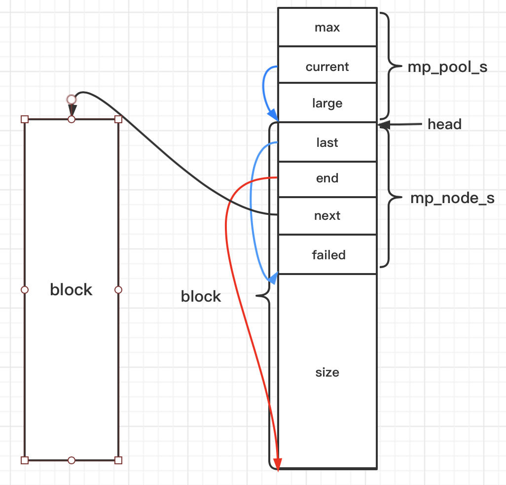

##### 1.  内存池原理，以及为何使用内存池

分配一整块内存备用，每次需要内存则从这里取，而不需要再次直接向系统申请。

避免频繁的对内存进行`malloc/free`，减少内存碎片，防止内存泄漏

##### 2.  实现方法一

参照nginx内存池



##### 内存池实现

```c
// 对齐，找到下一个对齐的数值
// 比如aligment为2，11-->16
#define MP_ALIGNMENT	32  // 对齐方式
#define MP_PAGE_SIZE	4096 // 页大小
#define MP_MAX_ALLOC_FROM_POOL	(MP_PAGE_SIZE-1) // 
#define mp_align(n, alignment) (((n)+（alignment-1)) & ~(alignment-1))
#define mp_align_ptr(p, aligment) (void*)((((size_t)p)+(alignment-1)) & ~(alignment-1)))

// 结构体

// 大块内存结构体
struct mp_large_s {
    struct mp_large_s *next;
    void *alloc;
};

// 小块内存节点，没有小块内存构成一个链表
struct mp_node_s {
 		unsigned char *last;  // 下一次内存从此分配
    unsigned char *end;  // 内存池结束位置
    struct mp_node_s *next;  // 指向下一个内存块
    size_t failed;  // 改内存块/node分配失败的次数
};

// 内存池结构
struct mp_pool_s {
  	size_t max;  // 能直接从内存池中申请的最大内存，超过需要走大块内存申请逻辑
    struct mp_node_s *current;  // 当前分配的node
    struct mp_large_s *large;  // 大块内存结构体
    struct mp_node_s head[0];  // 柔性数组不占用大小，其地址为紧挨着结构体的第一个node
};

// 需要实现的接口
struct mp_pool_s *mp_create_pool(size_t size);  // 创建内存池
void mp_destory_pool(struct mp_pool_s *pool);	// 销毁内存池
void *mp_alloc(struct mp_pool_s *pool, size_t size);  // 分配内存 对齐？
void *mp_nalloc(struct mp_pool_s *pool, size_t size);  // 不对齐？
void *mp_calloc(struct mp_pool_s *pool, size_t size);  // 分配内存，并初始化为0
void mp_free(struct mp_pool_s *pool, void *p); // 释放p节点内存

// posix提供的malloc,calloc,realloc返回的地址都是对齐的，32位8字节, 64位16字节，不可调；所以由了posix_memalign
// 
// 介绍一个函数posix_memalign，类似malloc，分配的内存由free释放
// int posix_memalign(void**memptr, size_t alignment, size_t size)
// memptr: 分配好的内存空间的首地址
// alignment: 对齐边界，Linux中32位系统8字节，64位系统16字节，必须为2的幂
// size: 指定分配size字节大小的内存
// 发牛size字节的动态内存，这块内存为alignment倍数；

// 创建线程池，内配线程池整块内存
struct mp_pool_s *mp_create_pool(size_t size) {
    struct mp_pool_s *p;
  	// 分配内存池内存：mp_pool_s + mp_node_s + size
    int ret = posix_memalign((void**)&p), MP_ALIGNMENT, size + sizeof(struct mp_pool_s) + sizeof(struct mp_node_s));
    if (ret) {
        return NULL;
    }
    // 可从内存池申请的最大内存
    p->max = (size < MP_MAX_ALLOC_FROM_POOL) ? size : MP_MAX_ALLOC_FROM_POOL;
    p->current = p->head;  // 当前可分配的第一个节点mp_node_s
    p->large = NULL;
    // 下一个可分配的地址
    p->head->last = (unsigned char *)p + sizeof(struct mp_pool_s) + sizeof(struct mp_node_s);
    p->head->end = p->head->last + size;
    p->head->failed = 0;
    return p;
}

// 销毁线程池
void mp_destroy_pool(struct mp_pool_s *pool) {
    struct mp_node_s *h, *n;
    struct mp_large_s *l;
    // 销毁大块内存
    for (l = pool->large; l; l = l->next) {
        if (l->alloc) {
            free(l->alloc);
        }
    }
    // 销毁小块内存
    h = pool->head->next;
    while (h) {
        n = h->next;
        free(h);
        h = n;
    }
    free(pool);
}

// 线程池重置
void mp_reset_pool(struct mp_pool_s *pool) {
		struct mp_node_s *h;
  	struct mp_large_s *l;
  	// 大块内存全部销毁
  	for (l = pool->large; l; l = l->next) {
      	if (l->alloc) {
        		free(l->alloc);
        }
    }
  	pool->large = NULL;
  	for (h = pool->head; h; h = h->next) {
      	// 每个节点的last位置重置
      	h->last = (unsigned char *)h + sizeof(struct mp_node_s);
    }
}


// 分配大块内存
static void *mp_alloc_large(struct mp_pool_s *pool, size_t size) {
    void *p = malloc(size);
    size_t n = 0;
    struct mp_large_s *large;
    for (large = pool->large; large; large = large->next) {
        if (large->alloc == NULL) {
            large->alloc = p; // 存入large链表中
            return p;
        }
        if (n ++ > 3) break;  // ???只遍历三次？
    }
    large = mp_alloc(pool, sizeof(struct mp_large_s));
    if (large == NULL) {
        free(p);
        return NULL;
    }
    large->alloc = p;
    large->next = pool->large;
    pool->large = large;
    return p;
}

// 分配新的内存块/node: mp_node_s + psize
static void *mp_alloc_block(struct mp_pool_s *pool, size_t size) {
    unsigned char *m;
    struct mp_node_s *h = pool->head;
    size_t psize = (size_t)(h->end - (unsigned char *)h);  // 第一个内存块大小
    // 分配psize大小的内存块
    int ret = posix_memalign((void **)&m, MP_ALLIGMENT, psize);
   	if (ret) return NULL;
    
    struct mp_node_s *p, *new_node, *current;
    new_node = (struct mp_node_s*)m;  // 新的节点
    new_node->end = m + psize;  // end位置
    new_node->next = NULL; 
    new_node->failed = 0;
    
    m += sizeof(struct mp_node_s);  // 移可分配的内存位置起始位置
    m = mp_align_ptr(m, MP_ALIGMENT);
    new_node->last = m + size;  // 分配完当前size后下一个分配内存的起点
    current = pool->current;
    // 寻找内存池下一个分配的节点，5次分配失败的过滤
    for (p = current; p->next; p = p->next) {
        if (p->failed++ > 4) {
            current = p->next;
        }
    }
    p->next = new_node;  // 加入链表
    pool->current = current ? current : new_node;
    return m;
}

// mp_alloc 分配内存
void *mp_alloc(struct mp_pool_s *pool, size_t size) {
    unsigned char *m;
    struct mp_node_s *p;
    if (size <= pool->max) {
        p = pool->current;
        do {
            // 32位对齐的下个位置
            m = mp_align_ptr(p->last, MP_ALIGMEENT);
            if ((size_t)(p->end - m) >= size) {
                // 当前节点内存足够，分配成功，返回
                p->last = m + size;
                return m;
            }
            p = p->next; // 不够则找下一个节点
        } while (p);
        // 内存池中所有节点内存都不以满足分配size内存，需要再次分配一个block
        return mp_alloc_block(pool, size);
    }
    return mp_alloc_largepool, size);
}

// 分配内存并初始化
void *mp_calloc(struct mp_pool_s *pool, size_t size) {
    void *p = mp_alloc(pool, size);
  	if (p) {
      	memset(p, 0, size);
    }
  return p;
}

// 大块节点内存释放
void mp_free(struct mp_pool_s *pool, void *p) {
  	struct mp_large_s *l;
  for (l = pool->large; l; l = l->next) {
    	if (p == l->alloc) {
        	free(l->alloc);
        	l->alloc = NULL;
        	return ;
      }
  }
}
```


##### 3.  Nginx内存池

##### 4.  伙伴算法

linux内核内存管理就采用伙伴算法


