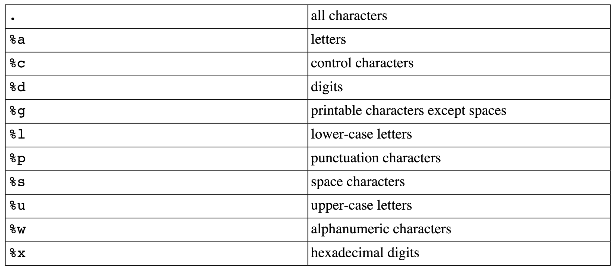
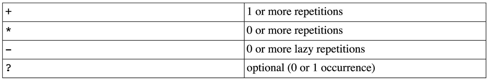
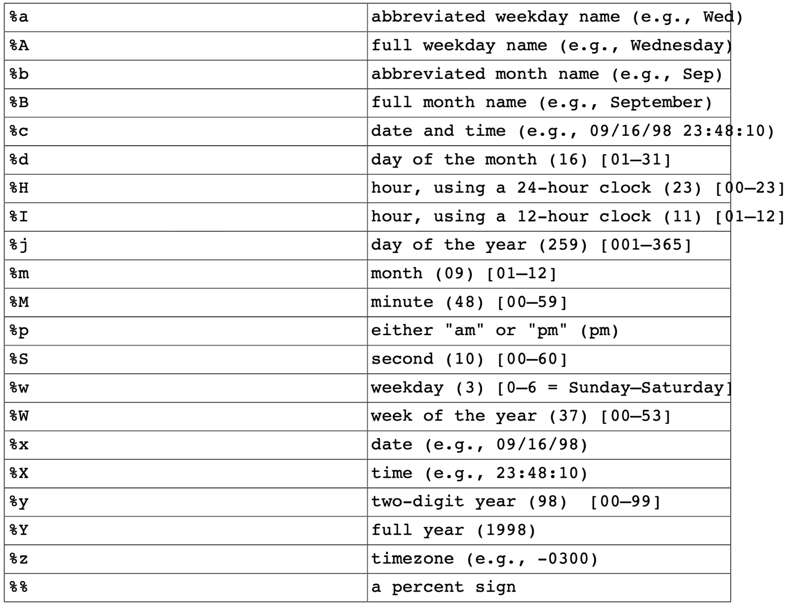
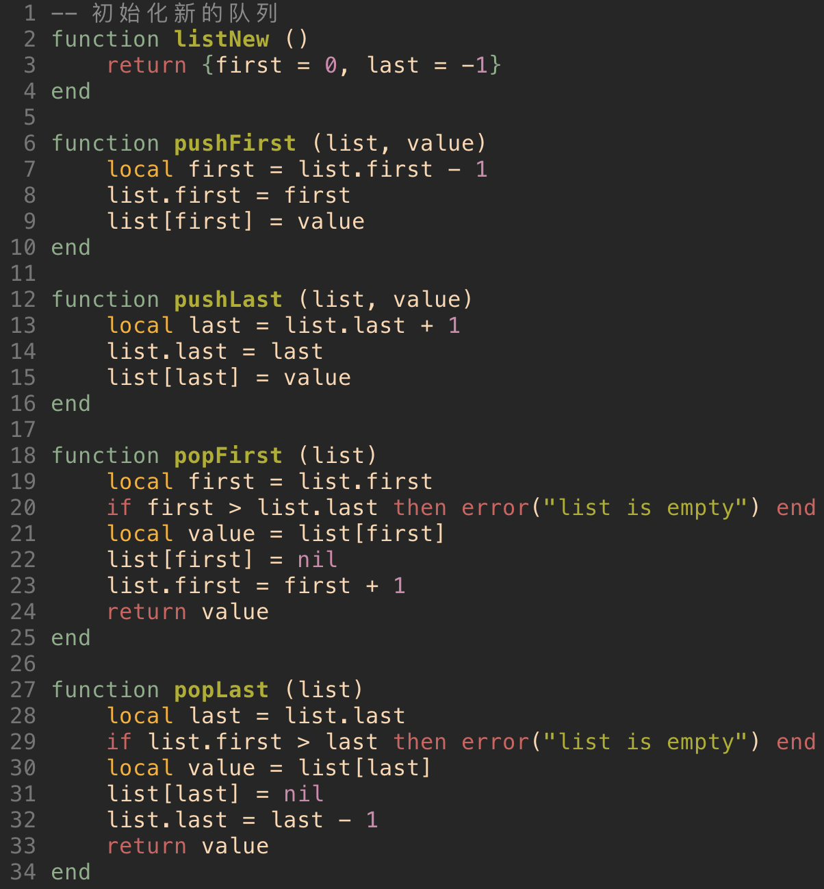
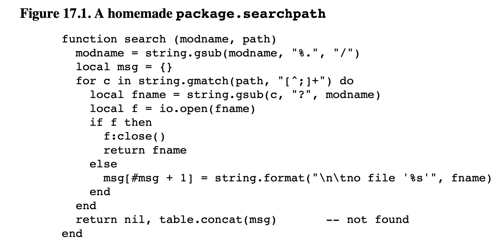

#### 前言

《Programming In Lua》Part II

#### 1. Closures（闭包）

Lua的函数function属于first-class的值, 也就是function同Lua中的其他类型number、string，table等所处的地位是一样的，function也可作为一个变量存储在table中。那么如何理解function是为first-class呢？以下通过两种函数申明方式来进行解释

```lua
-- 1
function foo (x) return 2 * x end

-- 2
foo = function (x) return 2 * x end
```

这两种声明方式都是申明一个foo的函数，实现2 * x的功能，从第2种申明可如此理解：右侧函数定义作为一条申明语句，创建一个类型为function的值，并把它赋予foo这个变量。甚至，可以理解在Lua中所有的函数都是匿名的，我们平常用到的函数比如print，只不过是把print作为一个变量保存了对应的函数而已。

使用`table.sort`来举例说明匿名函数的便利性，根据如下network中name这种字段的字母逆序进行排序

```lua
network = {
  {name = "grauna", IP = "210.26.30.34"},
  {name = "arraial", IP = "210.26.30.23"},
  {name = "lua", IP = "210.26.30.12"},
  {name = "derain", IP = "210.26.30.20"},
}

-- 解法 sork的第二个参数就是一个匿名函数,sort则为这个匿名函数的高阶函数
table.sort(network, function (a, b) return (a.name > b.name) end)

```

##### 函数申明方式

```lua
-- 1
Lib = {}
Lib.foo = function (x, y) return x + y end
Lib.goo = function (x, y) return x - y end

-- 2
Lib = {
  foo = function (x, y) return x + y end,
  goo = function (x, y) return x - y end
}

-- 3
Lib = {}
function Lib.foo (x, y) return x + y end
function Lib.goo (x, y) return x - y end
```

对于局部函数，需要注意递归的情况，如下申明会出现函数未定义情况

```lua
local fact = function (n)
  if n == 0 then
    return 1
  else 
    return n * fact(n - 1)  -- undefined buggy
  end
end
```

##### 闭包

先看下面例子

```lua
function newCounter ()
  local count = 0
  return function ()
    				count = count + 1
    				return count
    		 end
end

c1 = newCounter()
c2 = newCounter()
print(c1())  -- 1
print(c1())  -- 2
print(c2())  -- 1
```

以上就是一个闭包，newCounter返回一个匿名函数，而这个匿名函数用到了newCounter中定义的local变量count，这个count就是所谓的上值(up-value)，每次调用这个返回的匿名函数比如`c1()`，这个count貌似已经不在作用域内了，因为newCounter已经返回了，于是，Lua中采用闭包来处理和解决这种情况，每一次的调用，这个count的值会加一并保存。当创建一个新的匿名函数比如c2，c2的count跟c1拥有的count是完全分开独立，互不干扰的，也就是说c2产生了一个新的闭包。因此c1和c2是基于同一个匿名函数的不同闭包。

闭包让Lua函数的功能变得更加强大，以下是使用闭包的例子：

```lua
-- 实现回调函数 
-- 创建Button，指令标签和点击button后的回调函数
function digitButton (digit)
  return Button{ label = tostring(digit),
  							 action = function() add_to_display(digit) end}
end
  
-- 实现沙盒环境(sandbox)
-- 只有check成功才能调用io.open，很好的保护了该接口的使用。
do
  local oldOpen = io.open
  local access_OK = function (filename, mode)
    -- check access
  end
  io.open = function (filename, mode)
    if access_OK(filename, mode) then
      return oldOpen(filename, mode)
    else
      return nil, "access denied"
    end
  end
end
```


#### 2. Pattern Matching（模式匹配）

Lua模式匹配的实现代码不到600行，没有实现所有POSIX正则表达式的全部功能，但是Lua模式匹配功能强大，提供了很多feature是在标准的POSIX中很难做到的。

模式匹配相关函数

`string.gsub`, 这个接口之前已有介绍，不再赘述。

##### string.find

是的方式`string.find (s, pattern [, init [, plain]])`水电费

寻找字符串s中pattern匹配的位置，匹配成功则返回两个索引值（pattern的起始和终止位置），否则返回nil。

```lua
s = "hello world"
i, j = string.find(s, "hello")
print(i, j) -- 1 5
print(string.sub(s, i, j)) -- hello
print(string.find(s, "lll"))  --- nil
```

第三个可选参数init表明从哪里开始搜索，其默认值是1

第四个可选参数plain表明是否为普通的字符串子串的搜索，不考虑模式匹配，如下：

```lua
string.find("a [word]", "[") -- 会报缺失']'的错
string.find("a [word]", "[", 1, true) -- 3  3 声明了plain为true，因此忽略了模式匹配，只是简单字符串搜索
```

##### string.match

`string.match (s, pattern [, init])`

跟`string.find`类似，但是其不是返回成功匹配的位置，而是返回成功匹配的内容，第三个默认参数init同样为指定搜索起点。例子如下：

```lua
-- 对于固定字符串的匹配毫无意义
print(string.match("hello world", "hello")) ---> hello

-- 其强大在于可变模式的匹配
date = "Today is 17/7/1990"
d = string.match(date, "%d+/%d+/%d+")
print(d)  -- 17/7/1990
```

##### string.gmatch

 `string.gmatch(s, pattern)`

返回一个迭代器函数，遍历字符串中所有出现的pattern。

```lua
-- 遍历字符串中所有的单词，每行打印一个
s = "hello world from lua"
for w in string.gmatch(s, "%a+") do  -- %a+ 匹配一个或多个字符，即单词
  print(w)
end

-- 收集字符串中所有的key=value对，并存于table中
t = {}
s = "from=world, to=lua"
for k, v in string.gmatch(s, "(%w+)=(%w+)") do
  t[k] = v
end
```

##### Patterns模式

Lua中使用`%`来作为转义字符，常用字符含义如下



所有转义字符的大小，表示其补集，例如`%A`代表所有的非字母字符，如：

```lua
print((string.gsub("hello, up-down!", "%A", ".")))
-- hello..up.down.
```

在Lua的模式中有一些字符具有特殊含义，被称为Magic Characters, 如下：

```lua
( ) . % + - ? [ ] ^ $

[%w_]：同时匹配字母数字和下划线

[%[%]]: 匹配方括号
```

Lua提供了4种修改器如下：



```lua
-- + 匹配一个或多个 比如%a+, 匹配一个或多个字符
%a+

-- 匹配空括号
%(%s*%)  -- %s* 匹配0个或多个空格，因为括号在模式匹配中有特殊的意义，因此需要使用%转义

-- 一个序列由字符或者下划线开头，后面跟着0个或多个下划线或字符数字字符
[_%a][_%w]*

-- * 和 - 的区别
-- 例如，如果要删除c语言中的注释/**/，分别用*和-会得到不同结果
test = "int x; /* x */   int y;  /* y */"
-- 如果使用*, .*会匹配/*之后的所有字符，直到最后一个*/
print((string.gsub(test, "/%*.*%*/", "")))
-- int x;
-- 如果使用-, ._会匹配/*之后的第一个*/,因此可以得到我们想要的结果
print((string.gsub(test, "/%*.-%*/", "")))
-- int x;    int y;

-- ？ 可选字符
[+-]?%d+  -- [+-]表示匹配+或者-，接下来的?表示[+-]为可选符号，即可有可无

-- ^用于匹配特定字符开头的，$用于匹配特定字符结尾的
-- 以下用于匹配一个整数，以+-符号或者数字开头，以数字结尾
if string.find(s, "^[+-]?%d+$") then ...
  
-- %bxy  其中x为起始字符，y为结束字符，x和y必须为不同的字符
  s = "a (enclosed (in) parantheses) line"
  print((string.gsub(s, "%b()", ""))) --> a line
```


##### Exercise

```lua
-- 请编写一个函数split,该函数接受两个参数，第一个参数是字符串，第二个参数是分隔符模式
-- 函数的返回值是分隔符分割后的原始字符串中每一部分的序列
```


#### 3. Date and Time（日期时间）

Lua中日期和时间有两种表示方式：一种是整数形式，一种是table形式（日期table有以下这些域：year, month, day, hour, min, sec, way, yay, and isdst）。


##### os.time

```lua
-- 1 
-- os.time() 返回当前时间戳
os.time()  --> 1613649050

-- 2
-- os.time(date table) 如果传入date table会把其转换为时间戳形式，
-- year month day字段是必须的，hour min sec是可选的 其他忽略
os.time({year=2015, month=8, day=15, hour=12, min=45, sec=20})
--> 1613648720
```


##### os.date

其功能跟`os.time`相反，是将数字表示的时间和日期转换成date table或者字符串等更加易读的形式。



例如：

```lua
print(os.date("a %A in %B"))  --> a Tuesday in May
print(os.date("%d/%m/%Y", 906000490)) --> 16/09/1998
```


##### Date-Time操作

从现在起40天以后那天的日期

```lua
t = os.date("*t")
print(os.date("%Y/%m/%d", os.time(t)))  -- 2015/08/18
t.day = t.day + 40
print(os.date("%Y/%m/%d", os.time(t)))  -- 2015/09/27
```

##### Exercise


#### 4. Data Structures（数据结构）

Lua可以用table高效的实现数组，列表，队列，集合等数据结构，


##### Arrays数组

```lua
local a = {}
for i = 1, 1000 do
  a[i] = 0
end
```


##### Linked List 列表

```lua
list = nil
-- insert element at the beginning of the list
list = {next = list, value = v}
-- traverse list
local l = list
while l do
  visit l.value
  l = l.next
end
```


##### Queue队列

使用两个索引值，一个指向队首，一个指向队尾，在队列两端插入和删除元素均为常数时间




##### Sets集合

将元素作为key放入table中，value置为true即可

```lua
reserved = {
  ["while"] = true, ["if"] = true,
  ["else"] = true, ["do"] = true,
}

for w in string.gmatch(s, "[%a_][%w_]") do
  if not reserved[w] then
    do something with 'w'
  end
end
```


##### String buffer字符串缓存z

假定我们需要从文件中一行行读取数据，可以选用以下方法：

```lua
local buff = ""
for line in io.lines() do
  buff = buff .. line .. "\n"
end
```

这种方式效率极低，前面我们也提高过`..`进行字符串拼接是很低效的（一次拼接就是一个内存分配和字符移动）。因此可以选用更为高效的方式`table.concat`

```lua
local t = {}
for line in io.lines() do
  t[#t + 1] = line
end
s = table.concat(t, "\n") .. "\n"
```


#### 5. Data Files and Serialization（数据文件和序列化）

一般向文件中写入数据时简单，可以任意形式写入即可。但是从文件中读取数据是一件很麻烦的事情，你需要优雅地处理各种异常情况。

Lua使用Lua语法来作为写入的数据格式，当从文件中读取数据时，也就十分简单了。


#### 6. Compilation, Execution, and Errors（编译，执行和错误）

##### Compilation

`loadfile`从文件中加载Lua代码，只编译代码并将编译结果作为函数返回，`dofile`是基于`loadfile`，会执行函数，可定义如下：

```lua
function dofile (filename)
  -- 如果loadfile失败，会抛错
  local f = assert(loadfile(filename))
  return f()
end
```

`dofile`更加完整，但是`loadfile`更加灵活，可只编译一次，运行多次，而`dofile`每次运行都需要编译，开销大。

`load`跟`loadfile`功能类似，但是`load`不是从文件中读取Lua代码，而是从字符串或者函数中读取，如：

```lua
-- 1
f = load("i = i + 1")

i = 0
f();print(i) -- 1
f();print(i) -- 2

-- 2
-- dostring可理解为
assert(load(s)())

-- 3
i = 32
local i = 0
-- 以下f，g看似功能一致，但其运行结果是不一样的
-- load是在全局环境中编译，因此其中的i为全局变量i，而g中i为local
f = load("i = i + 1; print(i)")
g = function () i = i + 1; print(i) end
f()  --> 3
g()  --> 1
```

在加载定义了函数的代码块时，有一个坑需要注意，lua中定义是需要通过赋值的：

```lua
-- file 'foo1.lua'
function foo (x)
  print(x)
end

-- file 'foo2.lua'
foo = function (x)
  print(x)
end
```

当使用`loadfile`加载上述两个文件时，加载`foo1.lua`后foo函数时没有被定义了，需要执行之后才可使用，而`foo2.lua`被加载后foo可直接使用，如下

```lua
f = loadfile("foo1.lua")
print(foo)  -- nil
f()  -- run the chunk
foo("ok")  -- ok

f = loadfile("foo2.lua")
f("ok")
```

##### Errors

处理错误的方式：

```lua
-- 1.  使用error打印错误原因
print "enter a number: "
n = io.read("n")
if not n then error("invalid input") end

-- 2. assert
print "enter a number: "
n = assert(io.read("*n"), "invalid input")

-- 3. 可以在调用之前做判断, 如果n不是数字，tonumber会抛错
n = io.read()
assert(tonumber(n), "invalid input: " .. n .. "is not a number")
```

可以使用`pcall`在lua代码内部处理错误，不过使用pcall是看不到traceback的，因为其在返回错误代码时就已经销毁了调用栈。


#### 7. Modules and Packages （模块和包）

模块：是能够通过函数`require`加载，然后返回一个table，任何模块导出的函数和常量，都定义在table中，这个table可以看作是一个命名空间。

Packages：由许多模块组成。

模块在lua中不是first-class，其不能作为参数传递给函数。

`require`加载模块时，会从`package.path`路径中去搜索，如果找到了对应文件，就通过`loadfile`进行加载。如果`package.path`中不能找对应的lua文件，就会从c库中去搜索，即`package.cpath`，如果在c库中找到了，就通过`package.loadlib`去找`luaopen_modname`的函数，其中modname为模块名称，`luaopen_modname`表示一个lua函数。


##### 路径搜索

`require`搜索路径由一系列模版组成，模版之间用`;`隔开，如下；

```
?;?.lua;c:\windows\?;/usr/local/lua/?/?.lua
```

如果调用`require sql`，直接用sql替换上述路径中的`?`，那么其搜索顺序如下：

```
sql
sql.lua
c:\windows\sql
/usr/local/lua/sql/sql.lua
```

以下为实现一个类似`package.searchpath`的例子



首先要把modname中的`.`换成`/`，然后将modname替换path中的`?`。

##### Lua中实现模块的方法

定义一个table，将所有函数放入table中，并返回table即可：

```lua
local M = {}
local function new (r, i)
  return {r=r, i=i}
end

M.new = new -- add 'new' to the module

M.i = new(0, 1)
function M.add (c1, c2)
  return new(c1.r + c2.r, c1.i + c2.i)
end

return M
-- 如果前面定义了package.loaded[...] = M的话，就不需要return
```


以上，主要介绍了闭包的概念，以及其用途，Lua的模式匹配，日期时间的两种表现形式以及相关转换接口，如何用table来实现其他数据结构如数组，列表，队列，集合等，编译，执行以及错误的相关概念，最后介绍了Module和Package的概念。


