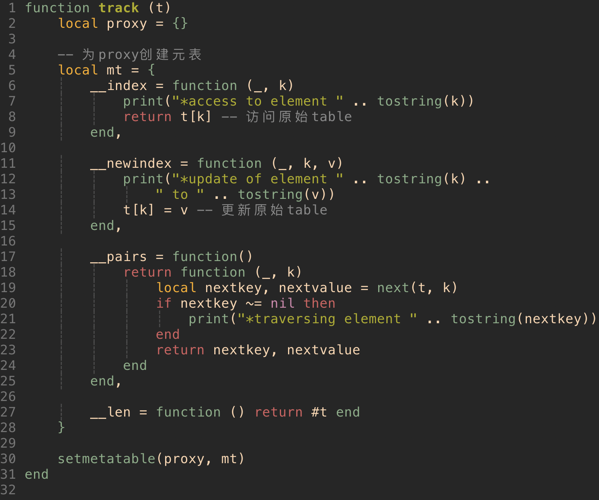

#### 前言

《Programming In Lua》Part III Lua-isms（Lua主义？）

#### 1. Iterators and the Generic for（迭代器与通用for）

本章节会学习使用`for`来实现各种各样的迭代器

##### Iterators and Closures（迭代器和闭包）

迭代器是一个允许我们遍历集合中所有元素的结构体，Lua中通常使用函数来表示迭代器，每次调用就返回集合中的下一个元素，比如之前用到的`io.read`，每次调用都返回标准输入文件的下一行，如果没有数据可读了就返回`nil`。

任何迭代器都需要记住连续两次调用之间的状态，闭包提供了很好的机制来记录这些状态，实现这样一个机制需要包含两个函数：一个是闭包，另一个是工厂函数（用来创建闭包及其非静态变量）。以下为列表实现一个简单的迭代器：

```lua
-- values就是一个工厂函数，创建闭包，并将状态保存在外部i中
-- 每次调用都会返回列表中的下一个元素，直到最后一个元素，迭代器返回nil来终止迭代
function values (t)
  local i = 0
  return function () i = i + 1
    				return t[i]
    		 end
  end
```

接下来提供两种使用上述迭代器的方法：

```lua
t = {10, 20, 30}

-- 1 使用while循环
iter = values(t)  -- 创建迭代器
while true do 
  local element = iter()  -- 调用迭代器返回下一个元素
  if element == nil then break end
  print(element)
end

--2 使用for循环，这种更为简便
for element in values(t) do
  print(element)
end
  
```

迭代器的实现可能会很复杂，但是对于使用者来说是很简单的，而大多数情况，我们不需要自己去实现一个迭代器，而只是去使用。


##### The Semanitics of the Generic for

上述迭代器（while循环）有一个缺点：每次开启一个新的循环都需要创建一个新的闭包。

这种开销其实是可以避免的，我们可以使用`for`自己来保存迭代的状态。其通常会保存三个值：迭代器函数，不变状态和一个控制变量。`for`的用法如下

```lua
-- 如果下一个元素不为nil，执行body，并接着调用迭代器函数
for var-list in exp-list do
  body
end
```


##### ipairs

ipairs使用和实现如下：

```lua
-- ipairs
a = {"one", "two", "three"}
for i, v in ipairs(a) do
  print(i, v)
end

-- 用Lua来实现ipairs
local function iter (t, i)
  i = i + 1
  local v = t[i]
  if v then
    return i, v
  end
end

function ipairs (t)
  return iter, t, 0
end
```

当调用`for`循环时，其会获得3个值：迭代器函数`iter`，不变状态table `t`, 以及控制变量初始值0，接着Lua调用`iter(t, 0)`, 其结果为`1, t[1]`, 第二次迭代时，Lua调用`iter(t, 1)`，其结果为`2, t[2]`，直到遍历完所有元素。


##### pairs

pairs同ipairs类似，也是遍历table的所有元素，但是其用的迭代器是Lua原生的函数`next`，如下：

```lua
-- 调用next(t, k), 其中k是table t中的key，返回table中的下一个key，无序
function pairs (t)
  return next, t, nil
end

-- 我们也可以直接使用next，不使用pairs
for k, v in next, t do
  loop body
end
```


##### Traversing Tables in Order（有序遍历Table）

考虑下面这个table，按照字母顺序打印。

```lua
lines = {
  ["luaH_set"] = 10,
  ["luaH_get"] = 24,
  ["luaH_present"] = 48,
}
```

如果使用`pairs`进行遍历，得到的结果是无序的，因为其使用`next`。因此需要用一个数组将table的key保存，然后对table进行排序，最后再打印，如下：

```lua
function pairsByKeys (t, f)
  local a = {}
  for n in pairs(t) do  -- 保存所有的key在a中
    a[#a + 1] = n
  end
  table.sort(a, f) -- 对数组a进行排序
  local i = 0
  return function ()
    i = i + 1
    return a[i], t[a[i]] -- return key, value
  end
end

-- 所有的细节都隐藏在迭代器的实现中，使用迭代器就非常简单了
for name, line in pairsByKeys (lines) do
  print(name, line)
end
```


##### Exercise

```lua
-- 1. 编写一个迭代器fromto，是的如下循环与数值for循环等价
for i in fromto(n, m) do block end
local function fromto(n, m)
  return function()
    n = n + 1
    if n > m then return nil end
    return n
  end
end

-- 2. 编写一个迭代器uniqwords, 该迭代器返回指定文件中没有重复的所有单词
local function uniqwords(filename)
  local wordCounter = {}
  local wordList = {}
	for line in io.lines(filename) do
    for word in string.gmatch(line, "%w+") do
      wordCounter = (wordCounter[word] or 0) + 1
    end
  end
  
  for word, count in pairs(wordCounter) do
    if count == 1 then wordList[#wordList+1] = word end
  end
  local i = 0
  return function() i = i + 1 return wordList[i] end
end
```


#### 2. Metatables and Metamethods（元表和元方法）

当遇到未知操作时，元表允许我们改变值的行为，比如，使用元表，可以让两个table相加，当我们尝试对两个table a和b使用+时，`a + b`，会检查其中是否有元表，以及其元表是否有`__add`字段，如果有的话，就会调用相应的元方法。

table默认是没有元表的，可以通过`setmetatable`来设置来改变一个table的元表

```lua
t = {}
print(getmetatable(t))  -- nil
t1 = {}
setmetatable(t, t1)
print(getmetatable(t) == t1)  -- true
```

字符串库给字符串设置了元表，其他类型的值是没有元表的

```lua
print(getmetatable("hello"))  -- table: 0x80772e0
print(getmetatable(10)) -- nil
```


##### Arithmetic Metamethods（算数元方法）

使用table来表示集合，并实现并集、交集等方法，如下：

```lua
local Set = {}
function Set.new (l)  -- 根据list创建set
  local set = {}
  for _, v in ipairs(l) do set[v] = true end
  return set
end
function Set.union (a, b)  -- 并集
  local res = Set.new{}
  for k in pairs(a) do res[k] = true end
  for k in pairs(b) do res[k] = true end
  return res
end
function Set.intersection (a, b)  -- 交集
  local res = Set.new{}
  for k in pairs(a) do res[k] = b[k] end
	return res
end
function Set.difference(a, b)  --  a-b
  local set = Set.new{}
  for k in pairs(a) do
    if not b[k] then set[k] = true end
  end
  return set
end
function Set.tostring (set)  -- set to string
  local l = {}
  for e in pairs(set) do l[#l + 1] = tostring(e) end
  return "{" .. table.concat(l, ", ") .. "}"
end
return Set
```

接下来用元表来实现通过`+`号来求得其并集，在创建set的时候，需要设置其元表：

```lua
local mt = {}
function Set.new (l)
  local set = {}
  setmetatable(set, mt)  -- 设置set的元表为mt，所有set都共用mt这个元表
  for _, v in ipairs(l) do set[v] = true end
  return set
end

-- 接下来需要给元表添加元方法
mt.__add = Set.union
-- s1 + s2会触发元表并调用union方法求并集
mt.__mul = Set.intersection
-- s1 * s2会触发元表并调用intersection求交集
mt.__tostring = Set.tostring
-- print(s)
```


##### Relational Metamethods（关系元方法）

元表允许我们通过元方法（`__eq`, `__lt`, `__le`）赋予关系操作符意义。接下来通过元方法判断两个集合的关系：

```lua
mt.__le = function (a, b)  -- subset
  for k in pairs(a) do
    if not b[k] then return false end
  end
  return true
end

mt.__lt = function (a, b)  -- proper subset(a和b不能相等)
  return a <= b and not (b <= a)
end

mt.__eq = function (a, b)  -- a，b相等
  return a <= b and b <= a
end
```


##### Table-Access Metamethods（Table访问元方法）

##### The __index metamethod

之前提到，当我们访问table中不存在的字段时，其结果会是`nil`，但是不全对，实际上，解释器会去寻找元表中是否有`__index`元方法，如果没有当然返回`nil`，如果有的话，相应的元方法会提供结果。

以窗口为例来说明`__index`的使用：

```lua
-- 使用默认值创建原型
prototype = {x = 0, y = 0, width = 100, height = 100}

-- 定义一个构造函数，创建新窗口，并设置其元表
local mt = {}
function new (o)
  setmetatable(o, mt)
  return o
end
-- 定义__index元方法
mt.__index = prototype
-- 实例化
w = new({x = 10, y = 10})
-- 尝试访问w中width字段，因为w中没有定义width字段，会触发__index对应元方法
print(w.width) --> 100
```


##### The __newindex metamethod

当尝试把一个值赋给table中不存在的key时，解释器会寻找`__newindex`对应的元方法，就会把赋值操作转换为调用`__newindex`对应的元方法。

Lua中提供了`rawget`和`rawset`两种方法，来禁止触发`__index`和`__newindex`的调用。

用元表来实现带有默认值的table，如下：

```lua
function setDefault (t, d)
  local mt = {__index = function() return d end}
  setmetatable(t, mt)
end
-- 实例
tab = {x=10, y=20}
print(tab.x, tab.z)  -- 10 nil
setDefault(tab, 0)  -- 设置其默认值为0
print(tab.x, tab.z)  -- 10 0
```

上述这种设置默认值的方法中，如果d中没有对应字段，那么优惠触发d的元表，这样效率很低，因此可以把默认值直接保存在table的字段中，如下：

```lua
-- 把默认值保存在t中，就不会多次触发元表
local mt = {__index = function (t) return t.__ end}
function setDefault (t, d)
  t.__ = d
  setmetatable(t, mt)
end
```

使用元表来实现跟踪table的访问：



使用元表实现只读table

```lua
function readOnly (t)
  local proxy = {}
  local mt = {
    __index = t,
    __newindex = function (t, k, v)
      error("attempt to update a read-only table", 2)
    end
  }
  setmetatable(proxy, mt)
	return proxy
end
```


#### 3. Object-Oriented Programming（面向对象编程）

##### Classes（类）

Lua中没有类的概念，但可以通过元表来模拟出类的实现。可通过`__index`元方法和继承的概念来实现原型，如下，B就是A的一个原型

```lua
setmetatable(A, {__index = B})
```

```lua
Account = { balance=0,
						withdraw = function (self, v)
  											self.balance = self.balance -v
  										 end
					}
function Account:deposit (v)
  self.balance = self.balance + v
end

Account.desposit(Account, 200.00)
Account:withdraw(100.00)

-- 设置Account为其__index对应的元方法
local mt = {__index = Account}
function Account.new (o)
  o = o or {}
  setmetatable(o, mt)
  return o
end

-- 当创建一个新Account是，会将mt设置为其元表
a = Account.new{balance = 0}
a:deposit(100.00) -- 等同于getmetatable(a).__index.deposit(100.00)
```

上述做法可以改进，其实不必要创建mt，直接将self设置为其元表即可，如下：

```lua
-- 注意，当使用:时，函数用默认有一个变量self表示自身
function Account:new (o)
  o = o or {}
  self.__index = self
  setmetatable(o, self)
  return o
end
```


##### Inheritance（继承）

因为类是对象，它能从其他类中获得方法，这种行为使得在Lua中实现继承变得非常简单。假设有一个基类Account如下：

```lua
Account = {balance = 0}
function Account:new (o)
  o = o or {}
  self.__index = self
  setmetatable(o, self)
  return o
end
function Account:deposit (v)
  self.balance = self.balance + v
end
function Account:withdraw (v)
  if v > self.balance then error "insufficient funds" end
  self.balance = self.balance - v
end
```

创建一个Account的实例SpecialAccount：`SpecialAccount = Account:new()`, 接下来调用SpecialAccount的实例s：`s = SpecialAccount:new{limit=1000.00}`, 这三者关系可以理解为：s继承SpecialAccount，SpecialAccount继承Account, 如果调用s的某个方法，如果s中找不到就会去SpecialAccount中搜索，SpecialAccount中找不到就去Account中找。也可重定义Account中的方法：

```lua
s = SpecialAccount:new{limit=1000.00}
function SpecialAccount:withdraw (v)
  if v - self.balance >= self.getLimit() then
    error"insufficient funds"
  end
  self.balance = self.balance - v
end

function SpecialAccount:getLimit ()
  return self.limit or 0
end
-- s重定义getLimit方法
function s:getLimit() 
  return self.balance * 0.10
end
```


##### Multiple Inheritance

一个多重继承的实现如下：

```lua
-- 在plist的所有table中搜索k
local function search (k, plist)
  for i = 1, #plist do
    local v = plist[i][k]
    if v then return v end
  end
end

function createClass (...)
  local c = {}
  local parents = {...}  -- 所有父类
  setmetatable(c, {__index = function (t, k)
      return search(k, parents)
  end})
  c.__index = c
  function c:new (o)
    o = o or {}
    setmetatable(o, c)
    return o
  end
  return c  -- 返回新的类
end
```

接下来介绍如何使用多重继承，先定义一个类Name如下

```lua
Named = {}
function Named:getname()
  return self.name
end
function Named:setname(n)
  self.name = n
end
```

创建一个新的类NameAccount，继承Account和Named如下：

```lua
NamedAccount = createClass(Account, Named)
-- 实例化
account = NamedAccount:new{name="Paul"}
print(account:getname()) -- Paul
```


##### Exercise

```lua
--1. 实现一个类Stack，该类具有push、pop、top、isempty
local stack = {}
stack.__index = stack
function stack:new(o)
  o = o or {}
  setmetatable(o,self)
  o.list = {}
  return o
end
function stack:isempty()
  return #self.list == 0
end
function stack:push(v)
  self.list[#self.list + 1] = v
end
function stack:top()
  if self:isempty() then error("empty stack") end
  return self.list[#self.list]
end
function stack.pop()
  if self:isempty() then error("empty stack") end
  local v = self.list[#self.list]
  table.remove(self.list)
  return v
end
--2. 实现类Stack的子类StackQueue。除了继承的方法外，还给这个子类增加一个方法insertbottom
local StackQueue = stack:new()
StackQueue.__index = StackQueue
function StackQueue:insertbottom(v)
    table.insert(self.list,1,v)
end
```


#### 4. The Environment（环境）

Lua把自己的全局环境存储在全局变量`_G`中，并且`_G._G==_G`

`getfield`和`setfield`实现方式如下：

```lua
function setfield (f, v)
  local t = _G
  for w, d in string.gmatch(f, "([%a_][%w_]*)(%.?)") do
    if d == "." then. -- not last name
      t[w] = t[w] or {}
      t = t[w]  -- 获得table
    else  -- last name
      t[w] = v
    end
  end
end

function getfield (f)
  local v = _G
  for w in string.gmatch(f, "[%a_][%w_]*") do
    v = v[w]
  end
  return v
end

-- 使用
setfield("t.x.y", 10)
print(t.x.y)  -- 10
print(getfield("t.x.y"))  -- 10
```


##### Global_Variable Declarations

使用元表来检查访问的变量是否存在或被申明，如下：

```lua
-- Checking global-variable declaration
local declaredNames = {}
setmetatable(_G, {
    __newindex = function (t, n, v)
      if not declaredNames[n] then
        local w = debug.getinfo(2, "S").what
        if w ~= "main" and w ~= "C" then
          error("attempt to write to undeclared variable " .. n, 2)
        end
        declaredNames[n] = true
      end
      rawset(t, n, v)  -- do actual set
    end,
    
    __index = function (_, n)
      if not declaredNames[n] then
        error("attemp to read undeclared variable " ..n, 2)
      else
        return nil
      end
    end,
  })
```


##### Non-Global Environments and _ENV

Lua中全局变量没有必要真的是全局的，其实Lua压根就没有全局变量。把没有申明为`local`的变量定义为`free`变量，Lua把代码块中所有`free`变量放在`_ENV`表中，如下：

```lua
-- x和y就是free变量
local z = 10
x = y + z

-- 等同于
local z = 10
_ENV.x = _ENV.y + z
```

`_ENV`并不是一个全局变量，Lua中所有的代码块都可视为匿名函数，而这个`_ENV`就是这个匿名函数的上值(up-value)，当我们`load`一个Lua代码块(chunk)时，会使用全局环境来初始化`_ENV`表，如下：

```lua
local _ENV = the global environment
return function (...)
    local z = 10
    _ENV.x = _ENV.y + z
end
```

对Lua中全局变量的处理总结如下：

- 编译时会在代码块匿名函数外创建一个局部变量`_ENV`
- 编译器会把所有的`free`变量放入`_ENV`中
- 函数`load or loadfile`用全局环境来初始化代码块的第一个上值(up-value)

Lua交互模式下，每一行都有一个不同的`_ENV`，可以使用`do .. end`来运行一个代码块（沙盒环境），可以通过让`_ENV = nil`来使得代码块中之后对全局变量的访问都失效，如下：

```lua
-- 将_ENV置为nil后，全局变量都无法再访问
-- 而print, sin声明为了局部变量，是没有放在_ENV表中的，因此可用
local print, sin = print, math.sin
_ENV = nil
print(13)  -- 13
print(sin(13))  -- 0.42
print(math.cos(13))  -- error!!!
```

`_G`和`_ENV`虽然指向相同的table，但是他们是不同的实体，`_ENV`是一个局部变量，代表的是当前的环境，代码块中所有对“全局”变量的访问都是访问`_ENV`。`_G`代表的是全局的环境。可以随时改变`_ENV`，如下：

```lua
_ENV = {}  -- 清空ENV
a = 1  -- a放入ENV中
print(a)  -- error, 因为ENV表中找不到print

-- 如下理解_G和_ENV的区别
a = 15  -- 创建一个全局变量，可以同时通_ENV和_G访问
_ENV = {g = _G}  -- 改变当前的环境ENV，此时变量a不在_ENV中
a = 1  -- 在_ENV中创建一个新的字段，但是不会_G中a的值不会改变
g.print(_ENV.a, g.a)  -- 1  15

-- 通过元表可避免意外修改_G中变量
a = 1
local newgt = {}
setmetatable(newgt, {__index = _G})
_ENV = newgt
print(a) -- 可以访问到print 和 a，任何操作都会newgt新表中
```

##### Environments and Modules

避免污染全局变量的模块实现：

```lua
-- 1 这一种方式没法访问全局变量，很不方便
local M = {}
_ENV = M  -- 将M赋值给_ENV，这样ENV就没有其它全局变量
function add (c1, c2)
    return new(c1.r + c2.r, c1.i + c2.i)
end

-- 2 把我们要用的函数拧出来放到local中，再将_ENV置为nil
local M = {}
local sqrt = math.sqrt
local io = io
_ENV = nil
```

##### Exercise

```lua
-- 1 解释下面代码的细节
local foo  -- 申明局部变量
-- do end 构造沙盒环境
do
    -- 将_ENV指向的全局变量表赋值一个临时变量_ENV
    local _ENV = _ENV
    -- 打印_ENV.X，此时_ENV指向全局表
    function foo() print(X) end
end
-- 将_ENV.X值设为13
X = 13
-- 将当前作用域中_ENV表引用清空
_ENV = nil
-- foo处于另外沙盒环境，不受当前_ENV影响，可正常打印13
foo()
-- _ENV为nil，因此X访问出错
X = 0
```


#### 5. Garbage（垃圾回收）

Lua中主要的垃圾回收机制：Weak Table, finalizers, and function `collectgarbage`

##### Weak Tables（弱表）

垃圾回收器无法判断那些我们认为的垃圾，比如stack，通过一个数组和一个top索引值来实现，当pop元素时，只减少top的索引值，则栈顶元素还在数组中，垃圾回收器不会认为这是垃圾，而在我们看来它就是垃圾。因此，需要我们将其置为nil，才能被回收。

`Weak tables`其实就是告诉Lua这个引用的收回不受保护。因此如果所有对这个对象的引用都是弱引用，垃圾回收器会回收这个对象并删掉所有的弱引用。Lua通过`Weak table`来实现弱引用。

有三种类型的弱表: 弱键(weak key), 弱值(weak value), 弱键和弱值(both keys and values are weak)，通过元表的`__mode`字段来设置弱表的类型，三种情况分别对应`k`, `v`, `kv`。

```lua
a = {}
mt = {__mode = "k"}
setmetatable(a, mt)  -- a就是一个有弱key的表
key = {}  -- 第一个key
a[key] = 1
key = {}  -- 创建第二个key
a[key] = 2
collectgarbage() -- 第一个key会从a中移除掉
```

不管什么类型，当key或者value被回收后，其对应的entry都会从table中删掉。

meorization机制：`load`是一个很耗的操作，因此可以把其结果记录下来，每次`load`前会先判断是否在记录中，如果在，则直接使用，不需要再`load`，如果不在，则调用`load`并把结果记录。

但是这种机制有一个缺点，一旦记录下`load`的结果，就会一直占用内存，哪怕之后不再用到，久而久之，必然耗尽内存。因此可以有弱表来优化这种机制，对于一些不再用的，直接交给垃圾回收机制处理，一个color的例子如下：

```lua
local results = {}
setmetatable(results, {__mode = "v"})  -- 弱值
function createRGB (r, g, b)
    local key = string.format("%d-%d-%d", r, g, b)
    local color = results[key]
    if color == nil then
        color = {red = r, green = g, blue = b}
        results[key] = color
    end
    return color
end
```


##### Revisiting Tables with Default Values

##### Ephemeron Tables


##### Finalizers

`finalizer`是一个跟对象相关的函数，当对象将要被回收时被调用。Lua通过元方法`__gc`来实现`finalizers`，如下：

```lua
o = {x = "hi"}
setmetatable(o, {__gc == function (o) print(o.x) end})
o = nil
collectgarbage()  --> hi
```

注意`__gc`添加必须在setmetatable之前，如下：

```lua
-- 1 __gc没有设置成功
o = {x = "hi"}
mt = {}
setmetatable(o, mt)
mt.__gc = function (o) print(o.x) end
o = nil
collectgarbage()   ---> print nothing o并没有被回收

-- 2 __gc先占据一个field，也可以
o = {x = "hi"}
mt = {__gc = true}
setmetatable(o, mt)
mt.__gc = function (o) print(o.x) end
o = nil
collectgarbage()  --> hi
```


##### The Garbage Collector

标记清除分为四步：`mark`, `cleaning`, `sweep`, `finalization`.

mark: 从根节点开始，标记Lua能够访问到的节点为alive。

cleaning: 处理finalizers和弱表，遍历所有finalization的对象中没有被标记为alive的对象，放入另一个列表中，用于`finalization`阶段。然后遍历弱表，将其中key或者value没有被标记为alive的entry从table中移除。

sweep: 遍历所有的Lua对象，回收没有被标记为alive的对象

finalization: 针对cleaning阶段放入列中的对象，调用其`__gc`元方法。

Lua 5.0在gc时需要暂停主程序，Lua5.1推出了一种增量gc的方法，不需要停止正在运行的程序，一步一步来来gc。


#### 6. Coroutines（协程）

协程跟线程类似，它是一条执行的流程，有自己的栈、局部变量，指令指针，并且和其它线程共享全局变量。协程和线程的主要区别在于多线程程序是可以并行运行的，而协程同时只能有一个在运行，其它的挂起，因此协程之间是协作关系（collaborative）。

##### Coroutine Basics

Lua把所有协程相关的函数放在`coroutines`表中，`create`创建新协程，传入协程执行的方法，返回一个线程来代表新的协程，如下：

```lua
co = coroutine.create(function () print("hi") end)
print (type(co))  -- thread
```

协程有四种状态：挂起(suspended)，运行(running)，正常(normal)，死亡(dead)，可以使用`coroutine.status`来查看但协程的状态。协程创建的初始状态为挂起，通过`coroutine.resume`来启动协程，将其状态改为运行状态。正在运行的协程可以通过`coroutine.yield`来交出执行权，并切换至挂起状态，等待下一次`resume`。

通常可以通过`resume-yield`对来交换数据，如下：

```lua
co = coroutine.create(function (a, b)
    	coroutine.yield(a + b, a - b)  -- yield把数据返回给resume
    end)
print(coroutine.resume(co, 20, 10))  -- true 30 10
```

协程一个典型的例子就是生产者-消费者问题，如下：

```lua
function receive (prod)
    local status, value = coroutine.resume(prod)
    return value
end

function send (x)
    coroutine.yield(x)
end

function producer ()
    return coroutine.create(function ()
        while true do
            local x = io.read()
            send(x)
        end
    end)
end

function consumer (prod)
    while true do
        local x = receive(prod)
        io.write(x, "\n")
    end
end

consumer(producer())
```


##### Event-Driven Programming

在异步的库上运行同步的代码

```lua
local lib = require "async-lib"
function run (code)  -- 同步代码
    local co = coroutine.wrap(function()
        code()
        lib.stop()  -- event loop结束
    end)
    co()  -- 启动协程
    lib.runloop()  -- 启动event loop
end
function putline (stream, line)
    local co = coroutine.running()  -- 调用协程
    local callback = (function () coroutine.resume(co) end)
    lib.writeline(strream, line, callback)
    coroutine.yield()
end
function getline (stream, line)
    local co = coroutine.running()  -- 调用协程
    local callback = (function (line) coroutine.resume(co, line) end)
    lib.readline(stream, callback)
    local line = coroutine.yield()
    return line
end
```


##### Exercise

```lua
-- 1. 使用生产者驱动式设计重写24.2节中生产者-消费者的示例，其中消费者是协程，而生产者是主线程
local function producer(consumer)
    while true do
        local x = io.read()
        coroutine.resume(consumer,x)
    end
end
local consumer = coroutine.create(function (x)
    print(x) --the first time into this func
    while true do
        local val = coroutine.yield()
        print(val)
    end
end)
producer(consumer)
```


#### 7. Relfection（反射）

反射机制：程序具有检查和修改其执行流程的能力。动态语言天然支持一些反射特性：环境允许在运行时检查全局变量，`type`和`pairs`函数允许在运行时检查和遍历不了解的数据结构等。但是仍然有些没法做到：程序不能检查其局部变量，不能跟踪函数的执行，函数没法知道它的调用者等等，这些在debug库得以实现。

debug库由两种类型函数组成：`introspective functionsh`和`hooks`，前者允许我们可以检查正在运行程序的一些状态：函数栈，当前执行哪一行，局部变量的值等等。后者允许我们跟踪一个程序的执行流程。

##### Introspective Facilities

主要的`introspective function`为`getinfo`，其第一个参数可为一个函数或者stack level, 返回这个函数的一些数据。

##### Access local variables

`debug.getlocal`: 第一个参数为stack level, 第二个参数为变量索引，返回改变量的当前名称和值。