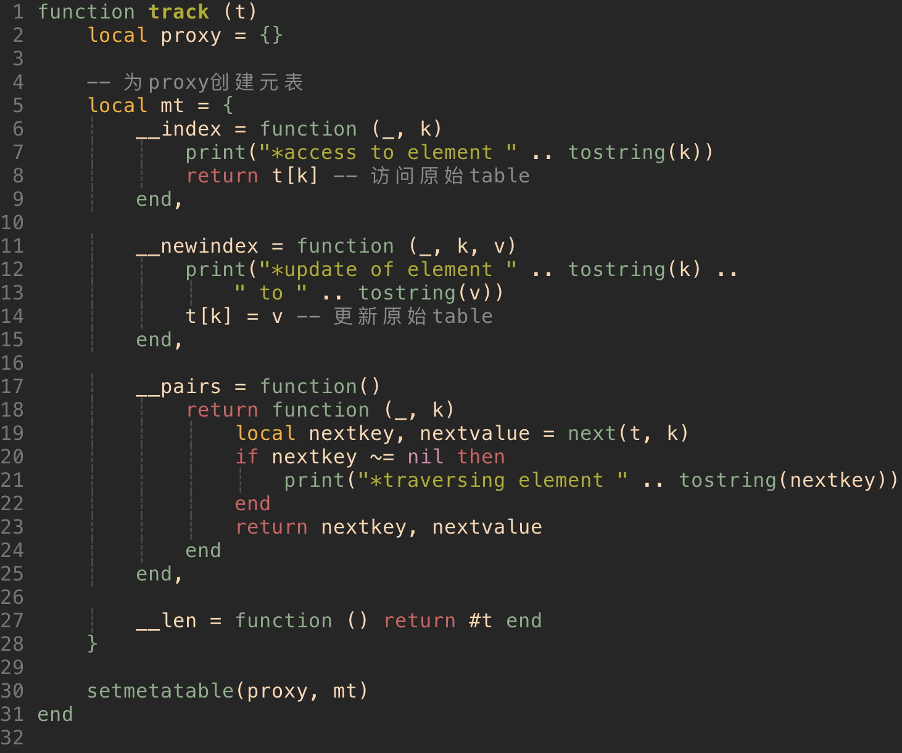

#### 前言

《Programming In Lua》Part III Lua-isms（Lua主义？）

#### 1. Iterators and the Generic for（迭代器与通用for）

本章节会学习使用`for`来实现各种各样的迭代器

##### Iterators and Closures（迭代器和闭包）

迭代器是一个允许我们遍历集合中所有元素的结构体，Lua中通常使用函数来表示迭代器，每次调用就返回集合中的下一个元素，比如之前用到的`io.read`，每次调用都返回标准输入文件的下一行，如果没有数据可读了就返回`nil`。

任何迭代器都需要记住连续两次调用之间的状态，闭包提供了很好的机制来记录这些状态，实现这样一个机制需要包含两个函数：一个是闭包，另一个是工厂函数（用来创建闭包及其非静态变量）。以下为列表实现一个简单的迭代器：

```lua
-- values就是一个工厂函数，创建闭包，并将状态保存在外部i中
-- 每次调用都会返回列表中的下一个元素，直到最后一个元素，迭代器返回nil来终止迭代
function values (t)
  local i = 0
  return function () i = i + 1
    				return t[i]
    		 end
  end
```

接下来提供两种使用上述迭代器的方法：

```lua
t = {10, 20, 30}

-- 1 使用while循环
iter = values(t)  -- 创建迭代器
while true do 
  local element = iter()  -- 调用迭代器返回下一个元素
  if element == nil then break end
  print(element)
end

--2 使用for循环，这种更为简便
for element in values(t) do
  print(element)
end
  
```

迭代器的实现可能会很复杂，但是对于使用者来说是很简单的，而大多数情况，我们不需要自己去实现一个迭代器，而只是去使用。


##### The Semanitics of the Generic for

上述迭代器（while循环）有一个缺点：每次开启一个新的循环都需要创建一个新的闭包。

这种开销其实是可以避免的，我们可以使用`for`自己来保存迭代的状态。其通常会保存三个值：迭代器函数，不变状态和一个控制变量。`for`的用法如下

```lua
-- 如果下一个元素不为nil，执行body，并接着调用迭代器函数
for var-list in exp-list do
  body
end
```


##### ipairs

ipairs使用和实现如下：

```lua
-- ipairs
a = {"one", "two", "three"}
for i, v in ipairs(a) do
  print(i, v)
end

-- 用Lua来实现ipairs
local function iter (t, i)
  i = i + 1
  local v = t[i]
  if v then
    return i, v
  end
end

function ipairs (t)
  return iter, t, 0
end
```

当调用`for`循环时，其会获得3个值：迭代器函数`iter`，不变状态table `t`, 以及控制变量初始值0，接着Lua调用`iter(t, 0)`, 其结果为`1, t[1]`, 第二次迭代时，Lua调用`iter(t, 1)`，其结果为`2, t[2]`，直到遍历完所有元素。


##### pairs

pairs同ipairs类似，也是遍历table的所有元素，但是其用的迭代器是Lua原生的函数`next`，如下：

```lua
-- 调用next(t, k), 其中k是table t中的key，返回table中的下一个key，无序
function pairs (t)
  return next, t, nil
end

-- 我们也可以直接使用next，不使用pairs
for k, v in next, t do
  loop body
end
```


##### Traversing Tables in Order（有序遍历Table）

考虑下面这个table，按照字母顺序打印。

```lua
lines = {
  ["luaH_set"] = 10,
  ["luaH_get"] = 24,
  ["luaH_present"] = 48,
}
```

如果使用`pairs`进行遍历，得到的结果是无序的，因为其使用`next`。因此需要用一个数组将table的key保存，然后对table进行排序，最后再打印，如下：

```lua
function pairsByKeys (t, f)
  local a = {}
  for n in pairs(t) do  -- 保存所有的key在a中
    a[#a + 1] = n
  end
  table.sort(a, f) -- 对数组a进行排序
  local i = 0
  return function ()
    i = i + 1
    return a[i], t[a[i]] -- return key, value
  end
end

-- 所有的细节都隐藏在迭代器的实现中，使用迭代器就非常简单了
for name, line in pairsByKeys (lines) do
  print(name, line)
end
```


##### Exercise

```lua
-- 1. 编写一个迭代器fromto，是的如下循环与数值for循环等价
for i in fromto(n, m) do block end
local function fromto(n, m)
  return function()
    n = n + 1
    if n > m then return nil end
    return n
  end
end

-- 2. 编写一个迭代器uniqwords, 该迭代器返回指定文件中没有重复的所有单词
local function uniqwords(filename)
  local wordCounter = {}
  local wordList = {}
	for line in io.lines(filename) do
    for word in string.gmatch(line, "%w+") do
      wordCounter = (wordCounter[word] or 0) + 1
    end
  end
  
  for word, count in pairs(wordCounter) do
    if count == 1 then wordList[#wordList+1] = word end
  end
  local i = 0
  return function() i = i + 1 return wordList[i] end
end
```


#### 2. Metatables and Metamethods（元表和元方法）

当遇到未知操作时，元表允许我们改变值的行为，比如，使用元表，可以让两个table相加，当我们尝试对两个table a和b使用+时，`a + b`，会检查其中是否有元表，以及其元表是否有`__add`字段，如果有的话，就会调用相应的元方法。

table默认是没有元表的，可以通过`setmetatable`来设置来改变一个table的元表

```lua
t = {}
print(getmetatable(t))  -- nil
t1 = {}
setmetatable(t, t1)
print(getmetatable(t) == t1)  -- true
```

字符串库给字符串设置了元表，其他类型的值是没有元表的

```lua
print(getmetatable("hello"))  -- table: 0x80772e0
print(getmetatable(10)) -- nil
```


##### Arithmetic Metamethods（算数元方法）

使用table来表示集合，并实现并集、交集等方法，如下：

```lua
local Set = {}
function Set.new (l)  -- 根据list创建set
  local set = {}
  for _, v in ipairs(l) do set[v] = true end
  return set
end
function Set.union (a, b)  -- 并集
  local res = Set.new{}
  for k in pairs(a) do res[k] = true end
  for k in pairs(b) do res[k] = true end
  return res
end
function Set.intersection (a, b)  -- 交集
  local res = Set.new{}
  for k in pairs(a) do res[k] = b[k] end
	return res
end
function Set.difference(a, b)  --  a-b
  local set = Set.new{}
  for k in pairs(a) do
    if not b[k] then set[k] = true end
  end
  return set
end
function Set.tostring (set)  -- set to string
  local l = {}
  for e in pairs(set) do l[#l + 1] = tostring(e) end
  return "{" .. table.concat(l, ", ") .. "}"
end
return Set
```

接下来用元表来实现通过`+`号来求得其并集，在创建set的时候，需要设置其元表：

```lua
local mt = {}
function Set.new (l)
  local set = {}
  setmetatable(set, mt)  -- 设置set的元表为mt，所有set都共用mt这个元表
  for _, v in ipairs(l) do set[v] = true end
  return set
end

-- 接下来需要给元表添加元方法
mt.__add = Set.union
-- s1 + s2会触发元表并调用union方法求并集
mt.__mul = Set.intersection
-- s1 * s2会触发元表并调用intersection求交集
mt.__tostring = Set.tostring
-- print(s)
```


##### Relational Metamethods（关系元方法）

元表允许我们通过元方法（`__eq`, `__lt`, `__le`）赋予关系操作符意义。接下来通过元方法判断两个集合的关系：

```lua
mt.__le = function (a, b)  -- subset
  for k in pairs(a) do
    if not b[k] then return false end
  end
  return true
end

mt.__lt = function (a, b)  -- proper subset(a和b不能相等)
  return a <= b and not (b <= a)
end

mt.__eq = function (a, b)  -- a，b相等
  return a <= b and b <= a
end
```


##### Table-Access Metamethods（Table访问元方法）

##### The __index metamethod

之前提到，当我们访问table中不存在的字段时，其结果会是`nil`，但是不全对，实际上，解释器会去寻找元表中是否有`__index`元方法，如果没有当然返回`nil`，如果有的话，相应的元方法会提供结果。

以窗口为例来说明`__index`的使用：

```lua
-- 使用默认值创建原型
prototype = {x = 0, y = 0, width = 100, height = 100}

-- 定义一个构造函数，创建新窗口，并设置其元表
local mt = {}
function new (o)
  setmetatable(o, mt)
  return o
end
-- 定义__index元方法
mt.__index = prototype
-- 实例化
w = new({x = 10, y = 10})
-- 尝试访问w中width字段，因为w中没有定义width字段，会触发__index对应元方法
print(w.width) --> 100
```


##### The __newindex metamethod

当尝试把一个值赋给table中不存在的key时，解释器会寻找`__newindex`对应的元方法，就会把赋值操作转换为调用`__newindex`对应的元方法。

Lua中提供了`rawget`和`rawset`两种方法，来禁止触发`__index`和`__newindex`的调用。

用元表来实现带有默认值的table，如下：

```lua
function setDefault (t, d)
  local mt = {__index = function() return d end}
  setmetatable(t, mt)
end
-- 实例
tab = {x=10, y=20}
print(tab.x, tab.z)  -- 10 nil
setDefault(tab, 0)  -- 设置其默认值为0
print(tab.x, tab.z)  -- 10 0
```

上述这种设置默认值的方法中，如果d中没有对应字段，那么优惠触发d的元表，这样效率很低，因此可以把默认值直接保存在table的字段中，如下：

```lua
-- 把默认值保存在t中，就不会多次触发元表
local mt = {__index = function (t) return t.__ end}
function setDefault (t, d)
  t.__ = d
  setmetatable(t, mt)
end
```

使用元表来实现跟踪table的访问：



使用元表实现只读table

```lua
function readOnly (t)
  local proxy = {}
  local mt = {
    __index = t,
    __newindex = function (t, k, v)
      error("attempt to update a read-only table", 2)
    end
  }
  setmetatable(proxy, mt)
	return proxy
end
```


#### 3. Object-Oriented Programming（面向对象编程）

##### Classes（类）

Lua中没有类的概念，但可以通过元表来模拟出类的实现。可通过`__index`元方法和继承的概念来实现原型，如下，B就是A的一个原型

```lua
setmetatable(A, {__index = B})
```

```lua
Account = { balance=0,
						withdraw = function (self, v)
  											self.balance = self.balance -v
  										 end
					}
function Account:deposit (v)
  self.balance = self.balance + v
end

Account.desposit(Account, 200.00)
Account:withdraw(100.00)

-- 设置Account为其__index对应的元方法
local mt = {__index = Account}
function Account.new (o)
  o = o or {}
  setmetatable(o, mt)
  return o
end

-- 当创建一个新Account是，会将mt设置为其元表
a = Account.new{balance = 0}
a:deposit(100.00) -- 等同于getmetatable(a).__index.deposit(100.00)
```

上述做法可以改进，其实不必要创建mt，直接将self设置为其元表即可，如下：

```lua
-- 注意，当使用:时，函数用默认有一个变量self表示自身
function Account:new (o)
  o = o or {}
  self.__index = self
  setmetatable(o, self)
  return o
end
```


##### Inheritance（继承）

因为类是对象，它能从其他类中获得方法，这种行为使得在Lua中实现继承变得非常简单。假设有一个基类Account如下：

```lua
Account = {balance = 0}
function Account:new (o)
  o = o or {}
  self.__index = self
  setmetatable(o, self)
  return o
end
function Account:deposit (v)
  self.balance = self.balance + v
end
function Account:withdraw (v)
  if v > self.balance then error "insufficient funds" end
  self.balance = self.balance - v
end
```

创建一个Account的实例SpecialAccount：`SpecialAccount = Account:new()`, 接下来调用SpecialAccount的实例s：`s = SpecialAccount:new{limit=1000.00}`, 这三者关系可以理解为：s继承SpecialAccount，SpecialAccount继承Account, 如果调用s的某个方法，如果s中找不到就会去SpecialAccount中搜索，SpecialAccount中找不到就去Account中找。也可重定义Account中的方法：

```lua
s = SpecialAccount:new{limit=1000.00}
function SpecialAccount:withdraw (v)
  if v - self.balance >= self.getLimit() then
    error"insufficient funds"
  end
  self.balance = self.balance - v
end

function SpecialAccount:getLimit ()
  return self.limit or 0
end
-- s重定义getLimit方法
function s:getLimit() 
  return self.balance * 0.10
end
```


##### Multiple Inheritance

一个多重继承的实现如下：

```lua
-- 在plist的所有table中搜索k
local function search (k, plist)
  for i = 1, #plist do
    local v = plist[i][k]
    if v then return v end
  end
end

function createClass (...)
  local c = {}
  local parents = {...}  -- 所有父类
  setmetatable(c, {__index = function (t, k)
      return search(k, parents)
  end})
  c.__index = c
  function c:new (o)
    o = o or {}
    setmetatable(o, c)
    return o
  end
  return c  -- 返回新的类
end
```

接下来介绍如何使用多重继承，先定义一个类Name如下

```lua
Named = {}
function Named:getname()
  return self.name
end
function Named:setname(n)
  self.name = n
end
```

创建一个新的类NameAccount，继承Account和Named如下：

```lua
NamedAccount = createClass(Account, Named)
-- 实例化
account = NamedAccount:new{name="Paul"}
print(account:getname()) -- Paul
```


##### Exercise

```lua
--1. 实现一个类Stack，该类具有push、pop、top、isempty
local stack = {}
stack.__index = stack
function stack:new(o)
  o = o or {}
  setmetatable(o,self)
  o.list = {}
  return o
end
function stack:isempty()
  return #self.list == 0
end
function stack:push(v)
  self.list[#self.list + 1] = v
end
function stack:top()
  if self:isempty() then error("empty stack") end
  return self.list[#self.list]
end
function stack.pop()
  if self:isempty() then error("empty stack") end
  local v = self.list[#self.list]
  table.remove(self.list)
  return v
end
--2. 实现类Stack的子类StackQueue。除了继承的方法外，还给这个子类增加一个方法insertbottom
local StackQueue = stack:new()
StackQueue.__index = StackQueue
function StackQueue:insertbottom(v)
    table.insert(self.list,1,v)
end
```


#### 4. The Environment（环境）

Lua把自己的全局环境存储在全局变量`_G`中，并且`_G._G==_G`

`getfield`和`setfield`实现方式如下：

```lua
function setfield (f, v)
  local t = _G
  for w, d in string.gmatch(f, "([%a_][%w_]*)(%.?)") do
    if d == "." then. -- not last name
      t[w] = t[w] or {}
      t = t[w]  -- 获得table
    else  -- last name
      t[w] = v
    end
  end
end

function getfield (f)
  local v = _G
  for w in string.gmatch(f, "[%a_][%w_]*") do
    v = v[w]
  end
  return v
end

-- 使用
setfield("t.x.y", 10)
print(t.x.y)  -- 10
print(getfield("t.x.y"))  -- 10
```


##### Global_Variable Declarations

使用元表来检查访问的变量是否存在或被申明，如下：

```lua
-- Checking global-variable declaration
local declaredNames = {}
setmetatable(_G, {
    __newindex = function (t, n, v)
      if not declaredNames[n] then
        local w = debug.getinfo(2, "S").what
        if w ~= "main" and w ~= "C" then
          error("attempt to write to undeclared variable " .. n, 2)
        end
        declaredNames[n] = true
      end
      rawset(t, n, v)  -- do actual set
    end,
    
    __index = function (_, n)
      if not declaredNames[n] then
        error("attemp to read undeclared variable " ..n, 2)
      else
        return nil
      end
    end,
  })
```


##### Non-Global Environments


#### 5. Garbage（垃圾回收）


#### 6. Coroutines（协程）


#### 7. Relfection（反射）


