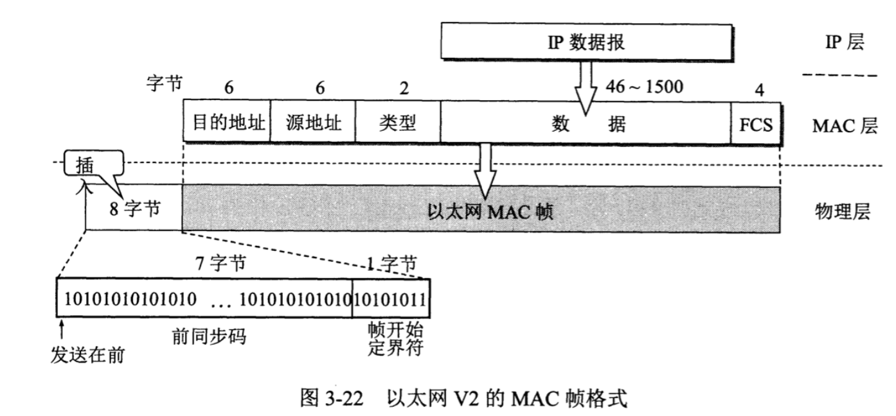
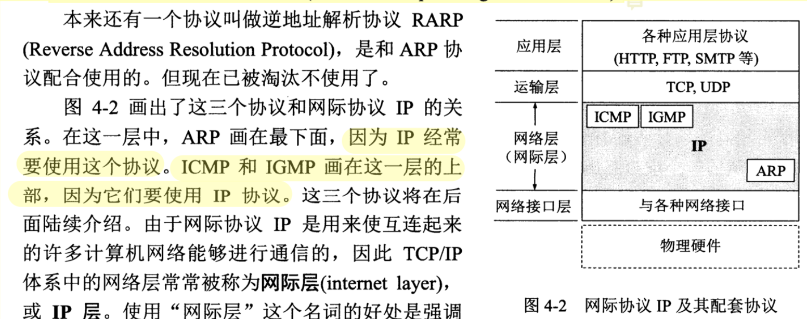
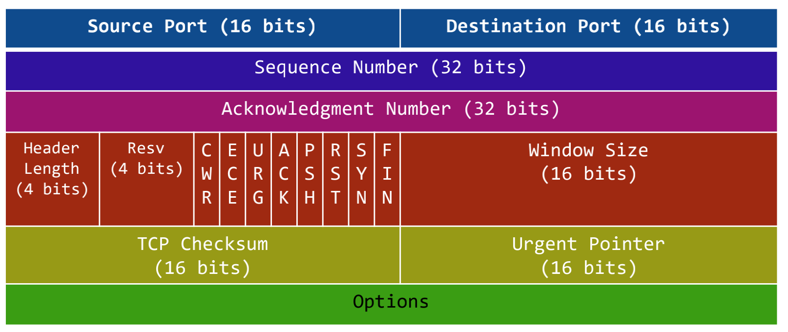

协议栈(protocol stack)设计和实现

问题：

1. 滑动窗口如何实现
2. sk_buff是什么？
3. TCP_NODELAY设置，抓包后是N个包？
4. Epoll检测网络IO，水平触发和边沿触发如何判断
5. DDOS？
6. UDP广播？


#### 一. 计算机网络体系结构


- 应用层：最高层，应用程序之间进行通信（进程间通信），交互数据单元为**报文**(Message)
- 运输层：使用TCP/UDP协议，向进程通信提供通用的数据传输服务
  - TCP传输控制协议：面向连接的、可靠的数据传输服务，数据传输单位为**报文**段(segment)
  - UDP用户数据报协议：无连接的，尽最大努力数据传输服务（不可靠），数据传输单位为**用户数据报**
- 网络层：IP协议；数据传输单位为**IP数据报**，向上为运输层提供数据(解包)，向下将运输层数据封装成包进行传输
- 数据链路层：具有Mac地址，数据传输单位为MAC**帧**；需要进行差错控制等。（MAC地址只在局域网有效）
- 物理层：传输单位为bit；进行A/D转换；

其中在**内核**中的为：数据链路层，网络层，运输层，TCP/IP协议栈是在内核中的。

网卡（网络适配器）：工作在物理层和数据链路层之间，

ARP协议：确认mac地址来源，

IP地址和MAC地址的关联保存在ARP表中，由驱动程序和操作系统完成。


**将网络互相连接需要使用一些中间设备**：

- 物理层：转发器
- 数据链路层：网桥/桥接器(bridge)
- 网络层：路由器
- 网络层以上：网关(gateway)


#### 二，协议栈实现

#### 1. 数据链路层以太网协议

- 封装成帧（帧头SOH，帧尾EOT，中间为IP数据报），透明传输（ESC字节填充），差错检测（循环冗余检测CRC）
- 以太网MAC层的硬件地址，（计算机的硬件地址-MAC地址，在适配器的ROM中；软件地址-IP地址在存储器中）
- 适配器、转发器、集线器、网桥、以太网交换机作用以及使用场合

适配器（网络接口卡NIC+ROM+RAM等），适配器与局域网之间的通信通过电缆/双绞线以串行传输方式进行，与计算机之间的通信通过主板上IO以并行传输方式进行。两者数据率不一致，因此适配器需要缓存。

**帧格式：**

- 前12个字节表示目的地址和源地址(48位长)；在不同网络上传输时，mac地址会不管变化
- 接下来2个字节表示上层协议（0x0800 IP数据报）
- 接下来数据范围（46字节-1500字节）
- FCS，4个字节，采用CRC检验



**以太网协议头**：

```c
#define ETH_ALEN 	6
struct ethhdr {
  	unsigned char h_dest[ETH_ALEN];
  	unsigned char h_src[ETH_ALEN];
  	unsigned short h_proto;
};
```


#### 2. 网络层IP协议



工作在网络层的协议除了IP协议，还有三个协议：

- **地址解析协议ARP**(Address Resolution Protocol)

  每台主机都有一个**ARP Cache**，存有**本局域网上**各主机/路由器的**IP地址**到**MAC地址**的映射表。通过使用ARP，找到IP对应的MAC地址，**找不到则交给路由器处理**。因此MAC地址只在本局域网有效。

  如果找到则介入MAC再通过局域网发送，如果找不到则运行ARP；如果在同一个局域网中，则找到下一跳（路由器），直到找到对应的地址。（Ping， TTL就是一跳一跳）

- 网际控制报文协议ICMP(Internet Control Message Protocol)、

- 网际组管理协议IGMP;

**IP格式**


ip头部固定20个字节

- 版本：4位，IPv4/6
- 首部长度：4位
- 区分服务：1个字节服务类型TOS
- 总长度：2个字节，首部和数据合总长度(2^16)
- 标识：2个字节，一个数据报对应一个标识（相同表示片组成同一数据包）
- 标志：3位，最低位MF（==1 还有分片，==0没有分片）；中间位DF（不能分片）
- 片偏移：13位，较长的分组分片后，某片在原分组中的位置
- 生存时间：1个字节，数据报在网络中的寿命（最大跳数）
- 协议：1个字节，
- 首部检验合：2个字节，只检验数据报首部
- 源地址+目的地址：各4个字节

**IP协议头**

```c
struct iphdr {
  unsigned char version: 4,
    						head_len: 4;
  unsigned char tos;
  unsigned short tot_len;
  unsigned short id;
  unsigned short flag: 3,
  							 offset: 13;
  unsigned char ttl;
  unsigned char protocol;
  unsigned short check;
  unsigned int saddr;
  unsigned int daddr;
};
```

**网际控制报文协议ICMP**

为更有效转发IP数据报和提高交付成功机会。

- ICMP差错报文报告
  - 终点不可达
  - 时间超过
  - 参数问题
  - 重定向
- ICMP询问报文
  - 回送请求和回答PING（直接只用网络层，没有经过传输层）
  - 时间戳请求和回答

traceroute（逐一增加ttl）


#### 3. 运输层协议TCP/UDP

滑动窗口，流量控制，拥塞控制

**IP网络层角度：通信的端点是两台主机；运输层角度：同时是两台主机中的进程。**


**UDP**

UDP用户数据报协议：无连接的，尽最大努力数据传输服务（不可靠），数据传输单位为**用户数据报**

没有拥塞控制，首部开销小（8个字节）


**UDP协议头和udp数据包**

```c
struct udphdr {
  	unsigned short source;
  	unsigned short dest;
  	unsigned short len;
  	unsigned short check;
};

struct udppkt {
  	struct ethhdr eh;
  	struct iphdr	ip;
  	struct udphdr	udp;
  	unsigned char body[128];
};
```


UDP应用场景（实时性与传输效率）

- 下载（迅雷下载）
- 游戏（实时性强）


**TCP**

TCP传输控制协议：面向连接的、面向字节流stream（流入进程或进程流出的字节序列），全双工的，可靠的（无差错，不丢失，不重复，按序达）数据传输服务，数据传输单位为**报文**段(segment);

TCP连接的端点叫做socket（IP+Port）。

**TCP格式**



- 源端口+目的端口：各占2个字节
- 序号(Seq)：4个字节，报文段序号
- 确认号(Ack)：4个字节，期望收到对方下一个报文段第一个数据字节的序号
- 数据偏移：4位，
- 保留：4位
- 紧急URG：=1，表示紧急字段有效
- ACK：=1，则Seq字段有效
- PSH：推送
- RST：复位，TCP出现严重差错，释放连接，重新建立连接。
- SYN：在建立连接时用来同步信号，=1表示连接请求或者接受报文。
- FIN：用来释放一个连接，=1表示数据发送完毕。
- 窗口大小：2个字节，表示发送报文段一方的接受窗口。
- 校验和：2个字节，首部+数据
- 紧急指针：URG==1才生效

**TCP协议头**

```c
struct tcphdr {
  
};
```


MMS：TCP报文段中数据字段的最大长度，不是TCP报文总长度。


**滑动窗口**

动态滑动窗口包含三部分数据：1. 已经发送且确认；2. 已经发送还未确认；3. 等待发送

**如何确定窗口大小？**

ACK带过来滑动窗口大小，ACK 等于 下一个未发送的数据包，即下一个待发送数据报序列号Seq；

窗口：[ACK, ACK + Windows size]

**如何保序？**

延时确认：收到包，重置定时器，等待200ms，超时则检查，确认ack前的数据全部收到；

FIN包发送失败，对方没有收到ACK，会超时重传。

**TCP状态图**


**TCP三次握手**

**TCP四次挥手：**

CLIENT：


SERVER:


**Q1: 主动方处于FIN_WAIT_2状态，被动方以智没有发送close，主动方如何终止这个状态？**

A：首先这个状态下，主动方依旧可以发送数据，被动方依旧可以收到，但是被动方无法发送数据，处于半关闭状态。这个状态没办法直接终止，除非杀掉进程。

**Q2: TIME_WAIT的作用？**

避免最后一次ACK丢失情况，时间一般为2 * MSL；因为如果被动方发送FIN后没有收到ACK包，会超时重传；

一个包的存活时间为MSL；

**Q3: FIN与ACK同时发送，会出现什么情况？为什么会出现这种情况？**

被动方直接进入CLOSING状态；recv后再close，由于延时发送机制，ACK和FIN是可以一起发送的。

**Q4：出现大量TIME_WAIT的原因，如何解决？**

TIME_WAIT设置时间过长；将TIME_WAIT状态设置可重用, 让其尽快回收，

```shell
/etc/sysctl.conf中设置 开启SYN Cookies，

echo "1" > /proc/sys/net/ipv4/tcp_tw_reuse   # 可重用

echo "1" > /proc/sys/net/ipv4/tcp_tw_recyle		# 回收
```


**Q5: 出现大量CLOSE_WAIT的原因，如何解决：**

现象：too many open files

原因：被动方未关闭socket造成（recv后没有close）

解决：1. 设置超时，启用socket keepalive机制 /proc/sys/net/ipv4/tcp_keepalive_time；2. 修改文件限制cat /prop/sys/fs/file-max;  /etc/security/limits.conf


网络编程接口：socket，listen，accept，send，recv，close，connect，bind。

其中具有send功能的：connect，close，send


**滑动窗口，流量控制，拥塞控制，慢启动机制(c = 2 ^ c)。**


#### 三，用户态协议栈Netmap

nginx/skynet/zeromq/redis全部使用linux内核协议栈

**为什么要使用用户态协议栈？**

内核协议栈流程：


用户态协议栈：

把协议栈做到应用程序，实现零copy；使用mmap，p f_ring, libcap等


原生的socket可以抓到链路层的数据，还是会经过协议栈，只是不经过tcp/ip解析。

netmap：将网卡数据通过mmap映射到内存

dpdk：商业团队维护，有比较多的资料，更适合做产品。

**如何实现用户态协议栈？**

用户态协议栈NtyTCP基于netmap实现。


单机服务器实现c10M(千万并发)，考虑以下方面：

内存，cpu，磁盘，网卡，应用程序，操作系统。

