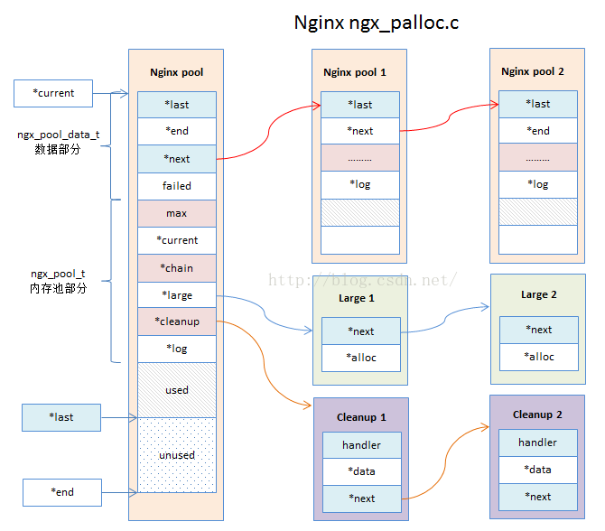

### 基础数据结构

#### 内存池

`ngx_palloc.c`

Nginx内存管理通过内存池实现

直接使用`malloc/alloc/free`等函数来分配和释放内存，有以下缺点：

- 容易产生内存碎片
- 容易产生内存泄漏

使用内存池的优点：

- 提升内存分配效率，不需要每次都`malloc/alloc`
- 内存管理更加简单；内存分配都在一块大内存上，防止内存泄漏，减少内存碎片问题

##### 内存池主结构体

实际是由多个节点串成的单向链表，每个节点分配小块内存，其中max, current, 大块内存链表只在头节点，

64位系统大小为80字节，结构体里没有保存块大小的字段，由`d.end-p`得到

```c
struct ngx_pool_s {
    ngx_pool_data_t		   d;
    size_t			      max;  	   // 可分配最大块
    ngx_pool_t		      *current;  	// 当前使用的内存池节点
    ngx_chain_t		      *chain;		// 空闲缓冲区链表
    ngx_pool_large_t       *large;      // 大块内存，串成链表
    ngx_pool_cleanup_t     *cleanup;   // 清理链表头指针
    ngx_log_t			  *log;
};
```

##### 数据区域结构

描述内存池的信息，每个内存块都有，在最开头部分，管理本块内存，64位系统大小为32字节

```c
typedef struct {
    u_char				*last;  // 可用内存的起始位置, 小块内存每次都从这里分配
    u_char				*end;  // 可用内存的结束位置，即此内存块的末地址
    ngx_pool_t			*next;  // 下一个内存池节点
    ngx_uint_t			failed;  // 本节点分配失败次数，超过4次不再参与分配
} ngx_pool_data_t;
```

##### 大块数据结构

大块内存节点(大于`4k`)，保存成链表方便回收利用

```c
typdef struct ngx_pool_large_s ngx_pool_large_t;
struct ngx_pool_large_s {
    ngx_pool_large_t	*next;  // 多个大块内存串成链表
    void 			   *alloc; // 指向malloc分配的大块内存
};
```

##### 清理结构

类似于lambda，绑定了函数指针和参数；`ngx_pool_t::cleanup`指向所有清理函数

```c
struct ngx_pool_cleanup_s {
    ngx_pool_cleanup_pt		handler;  // 清理函数
    void				   *data;    // 传递给handler，清理用
    ngx_pool_cleanup_t		*next;	  // 链表指针，所有清理结构体为一个链表
};
```

#####  结构分析

- Nginx内存池会放在`ngx_pool_t`的数据结构上，(`ngx_pool_data`用于记录内存块block的可用地址空间和内存块尾部)，当内存不足时调用`ngx_palloc_block`函数来分配一块新内存，通过链表形式连接起来
- 当申请的内存大于`pool->max`时，会单独分配一块large的内存块，放置再`pool->large`链表结构上
- `pool->cleanup`的链表结构主要存放需要通过回调函数清理的内存数据




##### 具体接口实现

##### **内存分配`ngx_alloc`和`ngx_calloc`**

主要用于封装`nginx`的内存分配函数`malloc`

```c
// 封装C库函数malloc，并记录错误日志
void* 
ngx_alloc(size_t size, ngx_log_t *log)
{
    void *p;
    p = malloc(size);
    if (p == NULL) {
        ngx_log_error(NGX_LOG_EMERG, log, ngx_errno,
                     "malloc(%uz) failed", size);
    }
    ngx_log_debug2(NGX_LOG_DEBUG_ALLOC, log, 0, "malloc: %p:%uz", p, size);
    return p;
}

// #define ngx_memzero(buf, n) (void) memset(buf, 0, n);
void*
ngx_calloc(size_t size, ngx_log_t *log) 
{
    void *p;
    // 分配内存
    p = ngx_alloc(size, log);
    if (p) {
        // 将内存块全部设置为0
        ngx_memzero(p, size);
    }
    return p
}

```

##### 创建内存池`ngx_create_pool`

```c
// 创建内存池
ngx_pool_t *
ngx_create_pool(size_t size, ngx_log_t *log)
{
}
```

##### 销毁内存池`ngx_destroy_pool`

```c
// 每个ngx_pool_cleanup_t数据结构上，保存着内存数据本身cleanup->data和回调清理函数cleanup->handler
// 例如保存fd句柄
void
ngx_destroy_pool(ngx_pool_t *pool){
    // 清理clearnup链表
    for (c = pool->cleanup; c; c = c->next) {
        if (c->handler) {
            c->handler(c->data);
        }
    }
    // 清理pool->large链表 直接free
    for (l = pool->large; l; l = l->next) {
        if (l->alloc) {
            ngx_free(l->alloc);
        }
    }
    // 遍历内存池节点，逐个free
}
```

##### 重设内存池`ngx_reset_pool`

##### 使用内存池分配一块内存`ngx_palloc`和`ngx_pnalloc`

内存分配逻辑：

- 分配一块内存，size < pool->max，则走小内存分配逻辑；否则走大内存分配逻辑


#### 数组结构`ngx_array`

##### 数据结构定义

Nginx的内存管理都是围绕内存池来实现，array数组也基于pool，主要用于存储小块内存，数组每个元素的大小是固定的

```c
// 动态数组, 连续内存,  nelts > nalloc 扩容
typedef struct {
    void		*elts;  // 数组的内存位置？首地址
    ngx_uint_t	 *nelts; // 数组当前的元素数量
    size_t		*size;  // 数组元素的大小
    ngx_uint_t	 *nalloc; // 可容纳的最多元素数量
    ngx_pool_t   *pool;  // 数组使用内存池
}ngx_array_t;
```

- 只存储比较小的数据
- 数组的元素长度再创建数组时固定死了，数组个数会自动扩容
- 数组数据结构和元素内存都会分配再Nginx的pool内存池上
- 数组回收会去检查pool内存池，看是否可将数组内存交还给内存池


##### 数据结构图


##### 具体接口实现

##### 创建数组`ngx_array_create`

```c
ngx_array_t*
ngx_array_create(ngx_pool_t *p, ngx_uint_t n, size_t size){
    
}
```

##### 数组销毁`ngx_array_destroy`

```c
// 会检查是否在内存池内存块上结尾部分，在的话内存回收给内存池
void
ngx_array_destroy(ngx_array_t *a){
    
}
```

##### 添加元素`ngx_array_push`

```c
void *
ngx_array_push(ngx_array_t *a){
    
}
```


#### 缓冲区结构ngx_buf

主要用于存储非常大块的内存，贯穿整个nginx，即可应用于内存数据也可应用于磁盘数据

[参考](https://blog.csdn.net/initphp/article/details/50611021)


#### 双向链表`ngx_queue`

设计非常小巧简单，实现数据结构和具体业务解耦

##### 数据结构定义

```c
typedef struct ngx_queue_s ngx_queue_t;

struct ngx_queue_s {
    ngx_queue_t *prev;
    ngx_queue_t *next;
};

```

如何使用？一般情况会在业务数据结构中放一个`ngx_queue_t`的数据结构，通过双向链表进行连接

```c
// example 网络连接
struct ngx_connection_s {
  void *data;  // 连接使用时由模块决定
  ngx_event_t *read;
  ...
  ngx_queue_t queue;
};
```


- 双向链表
- 遍历链表后，通过`ngx_queue_data`方法获取链表的主体业务数据结构 
- 链表和业务数据结构解耦，使用灵活方便

```c
// 各种宏实现链表操作
```


#### 单链表数据结构`ngx_list`


#### `hash`表结构`ngx_hash`

hash模块包含对内存利用最大化、CPU利用最大化的很多设计。

- 静态只读；初始化生成后，不能动态修改这个hash表结构内容
- 将内存利用最大化；将内存利用率发挥到了极致
- 查询速度快；hash表做了内存对齐等优化
- 主要解析配置数据

##### 数据结构定义

```c
// 存储hash元素
typedef struct {
    void 		*value;  // 指向value指针
    u_short		*len;   // key的长度
    u_char		name[1];  // 指向key的第一个地址, key长度为变长
};


// hash表结构
typedef struct {
    ngx_hash_elt	**bucket;    // hash表的桶指针值
    ngx_uint_t   	*size;		// hash表的桶的个数
}ngx_hash_t;


```


#### 字符串结构`ngx_string`


