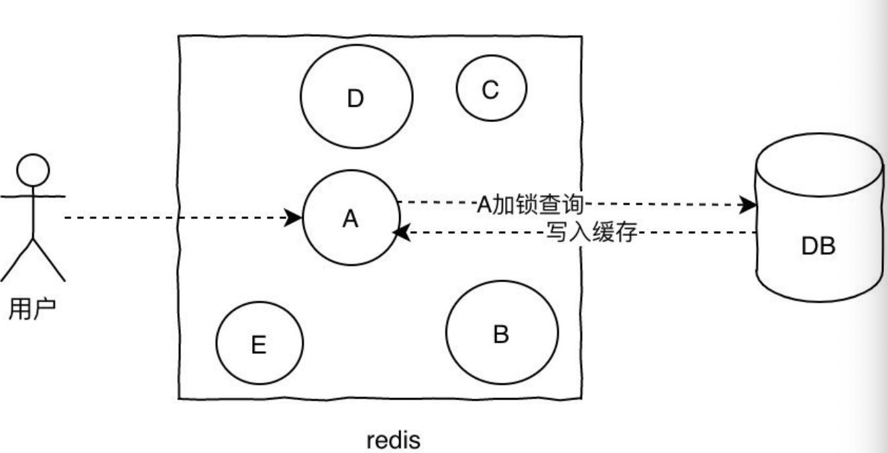
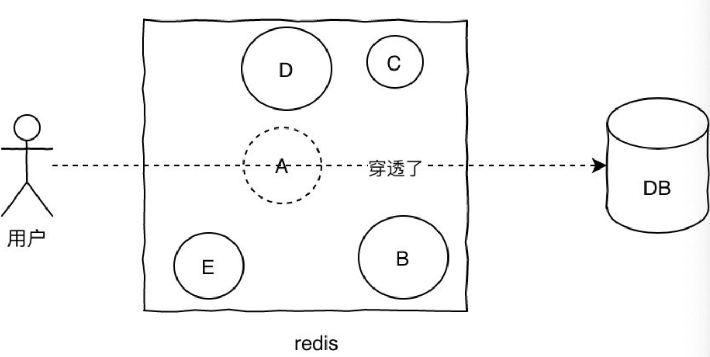

### Redis总结

##### Redis是一个基于内存的高性能key-value数据库，基于c语言开发

##### Redis基本数据结构

- **字符串SDS**：redis没有直接使用C语言传统的字符串表示，而是自己实现的叫做简单动态字符串SDS的抽象类型。C语言的字符串不记录自身的长度信息，而SDS则保存了长度信息，这样将获取字符串长度的时间由O(N)降低到了O(1)，同时可以避免缓冲区溢出和减少修改字符串长度时所需的内存重分配次数。
- **链表linkedlist**：redis链表是一个双向无环链表结构，很多发布订阅、慢查询、监视器功能都是使用到了链表来实现，每个链表的节点由一个listNode结构来表示，每个节点都有指向前置节点和后置节点的指针，同时表头节点的前置和后置节点都指向NULL。
- **字典hashtable**：用于保存键值对的抽象数据结构。redis使用hash表作为底层实现，每个字典带有两个hash表，供平时使用和rehash时使用，hash表使用链地址法来解决键冲突，被分配到同一个索引位置的多个键值对会形成一个单向链表，在对hash表进行扩容或者缩容的时候，为了**服务的可用性**，rehash的过程不是一次性完成的，而是渐进式的。
- **跳表skiplist**：跳跃表是有序集合的底层实现之一，redis中在实现有序集合键和集群节点的内部结构中都是用到了跳跃表。redis跳跃表由zskiplist和zskiplistNode组成，zskiplist用于保存跳跃表信息（表头、表尾节点、长度等），zskiplistNode用于表示表跳跃节点，每个跳跃表的层高都是1-32的随机数，在同一个跳跃表中，多个节点可以包含相同的分值，但是每个节点的成员对象必须是唯一的，节点按照分值大小排序，如果分值相同，则按照成员对象的大小排序。
- **整数集合intset**：用于保存整数值的集合抽象数据结构，不会出现重复元素，底层实现为数组。
- **压缩列表ziplist**：压缩列表是为节约内存而开发的顺序性数据结构，可以包含多个节点，每个节点可以保存一个字节数组或者整数值。

- 数据类型不是直接存储，而是通过redisObject对象进行存储
- redis通过**encoding属性**设置对象的编码形式来提升灵活性和效率
  - 字符串对象：int整数、embstr编码的SDS，raw简单动态字符串
  - 列表对象list：ziplist，linkedlist
  - 哈希对象：ziplist，hashtable
  - 集合对象：inset，hashtable
  - 有序集合对象：ziplist，skiplist

##### Redis相比memcached有哪些优势？

- memcached所有的值都是简单的字符串，redis支持更为丰富的数据类型
- redis的速度比memcached快很多
- redis支持持久化

##### Redis为什么选择单线程，单线程如何解决并发问题，以及为何如此快？

- 基于内存操作，CPU不是瓶颈，其瓶颈在于内存大小和网络带宽。既然CPU不是瓶颈，单线程实现更加简单。（为什么选择单线程）

- redis利用队列技术将并发访问变为串行访问，消除了传统数据库串行控制的开销。（单线程如何解决并发问题）

 为何如此快？

- 完全基于内存，绝大部分请求是纯内存操作，数据结构类似hashmap，时间复杂度为O(1)
- C语言实现，优化过的数据结构，基于几种基础的数据结构，redis做了大量的优化，性能极高
- 采用单线程，避免线程切换带来的上下文切换，以及竞争条件带来的各种锁机制。
- 使用IO多路复用模型
- 使用底层模型不同，它们之间底层实现方式以及与客户端之间通信的应用协议不一样，Redis直接自己构建了VM 机制 ，因为一般的系统调用系统函数的话，会浪费一定的时间去移动和请

**为什么Redis6.0之后改用多线程呢？**

redis使用多线程并非是完全摒弃单线程，redis还是使用单线程模型来处理客户端的请求，只是使用多线程来处理数据的读写和协议解析，执行命令还是使用单线程。

这样做的目的是因为redis的性能瓶颈在于网络IO而非CPU，使用多线程能提升IO读写的效率，从而整体提高redis的性能。

**Redis三种不同删除策略**

- 定时删除：在设置键的过期时间的同时，创建一个定时任务，当键达到过期时间时，立即执行对键的删除操作；
  - 优点：对内存友好，定时删除策略可以保证过期键会尽可能快地被删除，并释放过期健所占用的内存
  - 缺点：对cpu时间不友好，在过期键比较多时，删除任务会占用很大一部分cpu时间，在内存不紧张但cpu时间紧张的情况下，将cpu时间用在删除和当前任务无关的过期键上，影响服务器的响应时间和吞吐量
- 惰性删除：放任键过期不管，但在每次从键空间获取键时，都检查取得的键是否过期，如果过期的话，就删除该键，如果没有过期，就返回该键
  - 优点：对cpu时间友好，在每次从键空间获取键时进行过期键检查并是否删除，删除目标也仅限当前处理的键，这个策略不会在其他无关的删除任务上花费任何cpu时间。
  - 缺点：对内存不友好，过期键过期也可能不会被删除，导致所占的内存也不会释放。甚至可能会出现内存泄露的现象，当存在很多过期键，而这些过期键又没有被访问到，这会可能导致它们会一直保存在内存中，造成内存泄露。
- 定期删除：每隔一点时间，程序就对数据库进行一次检查，删除里面的过期键，至于要删除多少过期键，以及要检查多少个数据库，则由算法决定。由于定时删除会占用太多cpu时间，影响服务器的响应时间和吞吐量以及惰性删除浪费太多内存，有内存泄露的危险，所以出现一种整合和折中这两种策略的定期删除策略。
  - 定期删除策略每隔一段时间执行一次删除过期键操作，并通过限制删除操作执行的时长和频率来减少删除操作对CPU时间的影响。
  - 定时删除策略有效地减少了因为过期键带来的内存浪费。

**Redis内存淘汰策略**

- noeviction：不删除策略，达到最大内存限制时，如果需要更多内存，直接返回错误信息
- allkeys-lru：所有key通用，优先删除最近最少使用的key
- volatile-lru：只限于设置了expire的部分，优先删除lru
- allkeys-random：所有key通用，随机删除一部分key
- volatile-random：只限于设置了expire的部分，随机删除一部分key
- volatile-ttl：只限于设置了expire的部分，优先删除剩余时间TTL短的key

**Redis持久化方案**

为什么需要持久化？Redis是内存型数据库，如果不持久化，服务器宕机，数据机会丢失。因此需要将数据保存到磁盘中。	

Redis服务器默认开启RDB，关闭AOF；开启AOF需要配置appendonly yes

- RDB
  
  原理是将某个时间点上的数据状态保存到RDB文件中，RDB文件是一个压缩的二进制文件，通过它可以还原某个时刻数据库的状态。由于RDB文件是保存在硬盘上，所以即使redis崩溃，只要RDB文件在，就可以恢复数据。可以通过SAVE/BGSAVE来生成RDB文件。其中SAVE会阻塞redis进程，直到RDB文件生成完毕，在进程阻塞期间，redis不能处理任何命令请求。BGSAVE会fort一个进程，由子进程去负责生产RDB文件，父进程可以继续处理命令请求，不会阻塞进程。
  
  - 优点：RDB文件紧凑，体积小，网络传输快，适合全量复制；恢复速度比AOF快很多。与AOF相比，其最重要的优点之一是对性能的影响相对较小
  - 缺点：致命缺点在于其数据快照的持久化方式决定了必然做不到实时持久化，因此AOF持久化成为主流。此外，RDB文件需要满足特定格式，兼容性差。
  
- AOF

  AOF的原理是用过保存Redis服务器所执行的命令来记录数据库状态。通过追加，写入，同步三个步骤来实现持久化机制。

  - 与RDB持久化相对应，AOF的优点在于支持秒级持久化、兼容性好，缺点是文件大，恢复速度慢，对性能影响大。

**Redis内存模型**

- used_memory：Redis分配器分配的内存总量，包括虚拟内存（swap）
- used_memory_rss：Redis进程占据操作系统的内存，与top/ps命令看到的一致。除了分配器分配的内存外，used_memory_rss还包括进程运行本身需要的内存、内存碎片等。但不包括虚拟内存
- mem_fragmentation_ratio：内存碎片比率，used_memory_rss / used_memory
- mem_allocator：Redis使用的内存分配器，编译时指定，默认jemalloc。

**Redis内存划分**

- 数据：作为数据库，数据是最主要的部分
- 进程本身运行需要的内存：Redis主进程本身运行肯定需要占用内存，如代码、常量池等等，这部分不是由jemalloc分配，不会计入used_memory中
- 缓冲内存：缓冲内存包括客户端缓冲区、复制积压缓冲区、AOF缓冲区等；其中，客户端缓冲存储客户端连接的输入输出缓冲；复制积压缓冲用于部分复制功能；AOF缓冲区用于在进行AOF重写时，保存最近的写入命令。在了解相应功能之前，不需要知道这些缓冲的细节；这部分内存由jemalloc分配，因此会统计在used_memory中。
- 内存碎片：内存碎片是Redis在分配、回收物理内存过程中产生的，不会统计在used_memory中

**Redis主从复制**

- 复制是高可用Redis的基础，哨兵和集群都是在复制基础上实现高可用的
- 复制主要实现了数据的多机备份，以及对于读操作的**负载均衡**和简单的**故障恢复**
- 缺陷：**故障恢复无法自动化**；写操作无法负载均衡；存储能力受到单机的限制。

**Redis哨兵模式**

哨兵可以同时监视多个主从服务器，并且在被监视的master下线时，自动将某个slave提升为master，然后由新的master继续接收命令。

- 在复制的基础上，哨兵实现了自动化故障恢复。
- 缺陷：写操作无法负载均衡，存储能力受到单机限制

**Redis热key是什么？以及如何解决？**

- 热key：突然有大量（几十万）的请求去访问redis上的某个特定key，那么这样会造成流量过于集中，达到物理网卡上限，从而导致这台redis的服务器宕机引发雪崩。
- 解决方案：1.提前将热key分散到不同的服务器上，分散压力；2.加入二级缓存，提前加载热key数据到内存，如果redis宕机，走内存查询

**Redis缓存击穿**

- 现象：单个key并发访问过高，过期时导致所有请求直接打到db上。
- 解决：1. 加锁更新，当访问key失效时，先用setnx锁住key，去db查询回来再更新缓存，后面的请求直接读缓存；2. 将过期时间组合写在value中，通过异步方式不断刷新过期时间。

**Redis缓存穿透**

- 现象：当查询一个缓存中不存在的key时，每次请求都会打到DB，就像缓存不存在一样。
- 解决：布隆过滤器

**Redis缓存雪崩**

- 现象：大量key失效，一大波请求瞬间到来，全都打在db上，造成数据库连接异常
- 解决：限流，分散key的缓存时间；1. 加锁排队；2. 二级缓存; 3.针对不同的key设置不同的过期时间。

**Redis分布式锁**

先拿setnx来争抢锁，抢到之后，再用expire给锁加一个过期时间防止锁忘记了释放

**Redis中海量数据的正确操作方式**

利用SCAN系列命令（SCAN，SSCAN，HSCAN，ZSAN）完成数据迭代

**Redis事务机制**

redis通过MULTI、EXEC、WATCH等命令来实现事务机制，事务执行过程将一系列多个命令按照顺序一次性执行，并且在执行期间，事务不会被中断，也不会去执行客户端的其他请求，直到所有命令执行完毕。事务的执行过程如下：

- 服务端收到客户端请求，事务以MULTI开始
- 如果客户端正处于事务状态，则会把事务放入队列同时返回给客户端QUEUED，反之则直接执行这个命令
- 当收到客户端EXEC命令时，WATCH命令监视整个事务中的key是否有被修改，如果有则返回空回复到客户端表示失败，否则redis会遍历整个事务队列，执行队列中保存的所有命令，最后返回结果给客户端
- WATCH的机制本身是一个CAS的机制，被监视的key会被保存到一个链表中，如果某个key被修改，那么REDIS_DIRTY_CAS标志将会被打开，这时服务器会拒绝执行事务。

