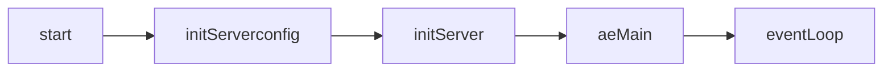

Redis提供evport epoll kqueue select四种方式实现多路复用，默认epoll

单线程epoll，

优点：不存在锁的问题；避免线程间CPU切换

缺点：单线程无法利用多CPU；串行操作，某个操作出问题，会阻塞后续操作

---

#### 网络模块

Redis服务器通过事件机制来接受和处理客户端请求

启动流程

从下到上

anet：封装了一系列tcp socket操作，包括绑定地址和监听，创建与客户端连接，以及读写等操作；

evport：多路io复用层，redis是单线程架构，为解决多连接并发问题，采用I/O多路复用；封装了evport、epoll、kqueue和select四种io多路复用的方式。

ae：统一通过aeApiPoll来标记有读写的套接字变化。比如select有套接字可读写时，会标记ae模块中的事件管理器有待处理文本

networking：负责和客户端交互，包含创建客户端连接、处理命令和回复执行结果等操作，主要使用RESP协议

#### 事件机制

redis通过不断执行aeMain来处理客户端消息以及自身逻辑，即不断通过事件循环来完成读写任务需求；

redis事件主要分为：文件事件(文件描述符的读写操作)、时间事件(定时任务)

redis在网络模块上，封装了不同平台不同的I/O多路复用实现，隐藏其细节，方便上层的调用。通过IO多路复用，单线程处理多个客户端的请求，实现高并发的目的。

