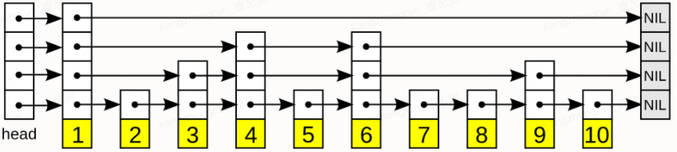

### 第一部分  数据结构与对象

Redis数据库里面的每个键值对(key-value pair)都是由对象(object)组成的，其中：

- 数据库键总使一个字符串对象(string object)
- 数据库键的值，可以是字符串对象，列表对象(list object)，哈希对象(hash object)，集合对象(set object)，有序集合对象(sorted set object)


#### 一.  简单动态字符串SDS

Redis没有直接使用C语言字符串，而是构建了简单动态字符串(simple dynamic string, SDS)。

SDS除了用来保存数据中的字符串值外，还可被用作缓冲区buffer：AOF模块中的AOF缓冲区，客户端输入缓冲区等

##### SDS定义

```c
// sds.h
struct sdshdr {
  	int len;  // buf中已占用空间的长度
    int free;  // buf中剩余可用空间的长度
    char buf[];  // 数据空间，以'\0'结尾，同字符串，好处：可直接重用一部分C字符串函数库中函数
};
```


##### SDS与C字符串的区别

- **获取字符串长度时间复杂度**：SDS获取字符串长度时间复杂度为O(1)，C字符串为O(n)
- 杜绝缓冲区溢出：C在执行比如strcat操作时会出现空间不足而溢出的情况，而SDS的sdscat在执行前会先判断空间是否足够，不够则分配后拼接
- **减少修改字符串时带来的内存重分配次数**：Redis作为数据库，经常被用于对速度要求严格，数据被频繁修改的场合，如果每次修改都需要分配内存，会致使性能下降，因此采用两种优化策略：1. 空间预分配：（< 1M以2倍方式分配；>= 1M 则每次+1M）；2. 惰性空间释放：删除字符后不会立刻释放内存，并提供了相应API真正释放SDS的未使用空间，避免内存浪费
- **二进制安全**：C字符串以'\0'结尾，因此只能保存文本数据；SDS以len属性判断字符串是否结束，因此可保存任意格式的二进制数据
- **兼容部分C字符串函数**


#### 二. 链表List

双向无环链表

常用来做异步队列使用，底层存储为一个quicklist结构；

元素较少时使用一块连续内存存储(ziplist，压缩列表)，将所有元素紧挨着一起存储，分配一块连续内存。

元素较多时会改成quicklist 

使用场景广泛：链表键，发布与订阅，慢查询，监视器等都用到链表。

##### 链表和链表节点定义

```c
// 双端链表节点
typedef struct listNode {
    struct listNode *prev;
    struct listNode *next;
    void *value;  // 节点值
}listNode;

// 双端链表结构
typedef struct list {
    listNode *head;  // 表头节点
    listNode *tail;  // 表尾节点
    void *(*dup)(void *ptr);  // 节点值复制函数
    void (*free)(void *ptr);  // 节点释放函数
    int (*match)(void *ptr, void *key);  // 节点值对比函数
    unsigned long len;  // 节点数量
}list;
```

##### 链表特性

- 双端无环
- 头尾指针
- 长度计数，获取节点数为O(1)
- 多态，链表节点使用void*指针来保存节点值，可通过dup，free，match三个属性为节点值设置乐星特定函数


#### 三. 字典

Redis数据库就是使用字典来作为底层实现；

Redis的字典使用哈希表作为底层实现；

##### 字典实现

###### i) 哈希表

```c
typedef struct dictht {
    dictEntry **table;  // 哈希表数组
    unsigned long size;  // 大小
    unsigned long sizemask;  // size - 1; 掩码; 用于计算索引值
    unsigned long used;  // 已有节点数  持久化时，used可能大于size
} dictht;
```

##### ii) 哈希表节点

```c
typedef struct dictEntry {
    void *key;
    union {
        void *val;
        uint64_t u64;
        int64_t s64;
    } v;
    struct dictEntry *next;  // 指向下个哈希表节点
} dictEntry;
```

##### iii) 字典

```c
typedef struct dict {
    dictType *type;  // 类型特性函数
    void *privdata;  // 私有数据
    dictht ht[2];  // 哈希表
    int rehashidx;  // rehash 索引，用于表示当前rehash进度，不再rehash时为-1
    int iterators;  // 目前正在运行的安全迭代器的数量
} dict;
```


##### 哈希算法

Redis使用MurmurHash2算法计算哈希值

```c
// 使用字段设置的哈希函数，计算key的哈希值
hash = dict->type->hashFunction(key);

// 根据哈希表的sizemask属性和哈希值，计算出索引值
// 根据情况不同，ht[x]可以是ht[0]或ht[1]
index = hash & dict->ht[x].sizemask;
```

##### 解决键冲突

使用链地址法(separate chaining)来解决键冲突，每个哈希表节点都由一个next指针，多个节点可以用next指针构成一个单向链表，同一个索引的多个节点用单向链表连接。（数组+链表）

##### rehash

为了让哈希表的负载因子(load factor)维持在一个合理的范围内，需要根据哈希表中数量对其大小进行相应的扩展或收缩。

rehash步骤如下：

1) 为字典ht[1]分配空间，分配空间大小取决于要执行的操作，以及ht[0]当前包含的键值对数量(ht[0].used值)

- 如果是扩展操作，ht[1]大小为第一个大于等于ht[0].used * 2 的2^n
- 如果是缩容操作，ht[1]的大小为第一个大于等于ht[0].used的2^n

2) 将保存在ht[0]中的所有键值对rehash倒ht[1]上面：rehash指重新计算键的哈希值和索引值，然后将键值对放置到ht[1]哈希表的指定位置上

3) 当ht[0]包含的所有键值对都迁移到ht[1]之后(ht[0]为空表)，释放ht[0]，将ht[1]置为ht[0]，并在ht[0]新创建一个空哈希表。

**哈希表的扩展和收缩**

满足以下任一个，则**扩展**：`load_factor = ht[0].used / ht[0].size`

- 服务器目前没有执行BGSAVE命令，且哈希表的负载因子>=1
- 服务器目前在执行BGSAVE命令，且哈希表的负载因子(load_factor)>=5

BGSAVE命令是，会fork子进程，而大多数OS采用写时复制(copy-on-write)技术来优化进程的使用效率，所以子进程存在期间，服务器会提高执行扩展操作所需的负载因子，尽可能避免子进程期间进行哈希表扩展操作，避免不必要的内存写入操作，最大限度的节约内存。

**缩容**：哈希表的负载因子 < 0.1时，自动对哈希表进行执行收缩操作

##### 渐进式rehash

rehash动作不是一次性、集中式完成的，而是分多次、渐进式地完成的。避免数据量巨大时导致服务器停止服务。

渐进式hash采用分治法，避免了集中式rehash带来的庞大计算量

渐进hash详细步骤：

- 为ht[1]分配空间，让字典同时持有ht[0]和ht[1]两个哈希表
- 在字典中维持一个索引计数器rehashidx，并将它设置为0，表示rehash开始
- 在rehash进行期间，每次除了对字典执行增删改查，还顺带将ht[0]哈希表在rehashidx索引上的所有键值对rehash到ht[1]，当rehash完成后，将rehashidx++
- 随着字典操作的不断执行，ht[0]的所有键值对都会rehash到ht[1]，这时程序将rehashidx属性的值设为-1，表示rehash操作完成

**渐进式rehash执行期间的哈希表操作**

会同时存在ht[0]和ht[1]两个哈希表。因此期间增删改查等操作会在两个哈希表进行，例如，要在字典里查找一个键时，程序会先在ht[0]里面进行查找，没有找到，再去ht[1]里面进行查找。另外，新添加字典的键值对一律会保存到ht[1]里面，ht[0]里面不再进行任何添加操作，保证ht[0]只减不增。


#### 四. 跳跃表

一种有序结构，通过每个节点中维持多个指向其它节点的指针，从而达到快速访问节点的目的；

支持平均O(logN)，最坏O(N)复杂度的节点查询；

效率可与平衡树媲美，实现比其简单；

Redis使用跳跃表作为有序集合键的底层实现之一，如果一个有序集合包含元素数量比较多(>128)，或者有序集合中元素的成员是比较长的字符串，则选择跳表作为有序集合键的底层实现。

Redis中只有两个地方用到跳表：有序集合键，集群节点中用作内部数据结构；

##### 跳跃表节点

```c
typedef struct zskiplistNode {
    robj *obj;  // 成员对象 指向一个字符串对象，字符串对象保存一个SDS
    double score;  // 分值
    struct zskiplistNode *backward;  // 后退指针
    struct zskiplistLevel {
        struct zskiplistNode *forward;  // 前进指针
        unsigned int span;  // 跨度
    }level [];
} zskiplistNode;
```

- 层level：每次创建一个新跳跃表节点时，根据幂次定律(power law, 越大的数出现的概率越小)，随机生成一个界于1和32之间的值作为level

```c
// 根据随机算法所使用的幂次定律，越大的值生成的几率越小
int zslRandomLevel(void) {
    int level;
    while ((random()&0xFFFF) < (ZSKIPLIST_P * 0xFFFF))
        level += 1;
    return (level < ZSKIPLIST_MAX_LEVEL) ? level : ZSKIPLIST_MAXLEVEL;
}
```


##### 跳跃表

```c
typedef struct zskiplist {
  	struct zskiplistNode *header, *tail;  // 表头，表尾
    unsigned long length;  // 表中节点数量
    int level;  // 表中层数最大的节点的层数
} zskiplist;
```


- 跳表时一种内存离散的数据结构，数据存储在节点上，逻辑连续的节点，内存上不连续
- 跳表在逻辑结构上是分层的，底层最密集，顶层最稀疏
- 每层相邻节点之间存在连接，可以为单向或者双向（一般双向），连接不会跨越层级
- 跳表会有一个头节点，不包含任何数据，只有向后的连接
- 跳表是逻辑有序的，节点除了存储树，还会存储一个score值，作为排序的依据
- 查询效率：平均O(log(n))



为何redis选择跳表而不是红黑树？

- 红黑树在查找区间元素的效率没有跳表高，其它操作时间复杂度一致
- 相比红黑树，跳表实现比较简单，易读，易维护
- 跳表更加灵活，通过改变索引构建策略，有效平衡效率和内存消耗

在大部分情况下， 跳表的效率可以和平衡树相媲美， 并且因为跳表的实现比平衡树要来得更为简单， 所以有不少程序都使用跳表来代替平衡树。

调表解决的问题是实现对链表的二分查找，牺牲空间换取时间，如果n个元素的链表，需要额外n/2 + n/4 + ... + 2 = n - 2个索引节点。

##### 跳跃表总结

- 有序集合的实现之一
- 由zskiplist和zskiplistNode两个结构组成，前者保存跳跃表信息(比如表头，表尾节点，长度)，后者表示节点
- 每个跳跃表节点的层高都是1到32之间的随机数
- 同一个表中，多个节点可包含相同的分值，但每个节点的成员对象必须唯一
- 按分值排序，分值相同时按成员对象的大小进行排序


#### 五. 整数集合intset

intset是集合键的底层实现之一，当一个集合**只包含整数值元素**，并且这个集合的元素**数量不多**时，Redis就会使用intset作为集合键的底层实现。

用于保存整数值的集合抽象数据结构，可保存类型为int16_t, int32_t, int64_t的整数值，并且保证集合中不会出现重复元素

```c
typedef struct intset {
    uint32_t encoding;  // 编码方式
    uint32_t length;  // 元素个数
    int8_t contents;  // 保存元素的数组
} intset;
```


##### intset总结

- 集合键底层实现之一
- 底层为数组，以有序、无重复方式保存元素集合
- 升级操作为intset带来了操作上的灵活性，尽可能节约内存
- 只支持升级，不支持降级操作


#### 六. 压缩列表ziplist

压缩列表时列表键和哈希键的底层实现之一；

一个列表键只包含少量列表项，并且每个列表项要么就是小整数值，要么就是长度比较短的字符串，就使用压缩列表来做底层实现。

压缩列表时Redis为了节约内存而开发的，由一系列特殊编码的连续内存块组成的顺序型数据结构；一个压缩列表可以包含任意多个节点，每个节点可以保存一个字节数组或一个整数值；

添加新节点到压缩列表，或从中删除节点，可能会引发连锁更新操作，但几率不高。


#### 七. 对象

以上介绍了SDS，list，dict，ziplist，intset等数据结构，但是redis不直接使用这些数据结构来实现键值对数据库，而是基于这些数据结构创建了一个对象系统，

这个系统包含**字符串对象，列表对象，哈希对象，集合对象和有序集合对象这五种类型的对**象，每种对象都至少用到一种基础数据结构。

Redis再执行命令前，根据对象的类型来判断一个对象是否可以执行给定的命令。针对不同场景，为对象设置不同的数据结构实现，优化对象在不同场景下的使用效率；

Redis对象系统还实现了基于引用计数技术的内存回收机制。

Redis对象带有访问时间记录信息，用于在计算数据库键的空转时长，在服务器启用了maxmemory功能情况下，空转时长较大的键优先被删除。


```c
typedef struct redisObject {
    unsigned type:4;  // 类型 REDIS_STRING, _LIST, _HASH, _SET, _ZSET
    unsigned encoding:4;  // 编码 REDIS_ENCODING_INT, _EMBSTR, _RAW, _HT, _LINKETLIST, _ZIPLIST, _INTSET, _SKIPLIST
    unsigned lru:REDIS_LRU_BITS;  // 对象最近一次被访问的时间
    int refcount;  // 引用计数
    void *ptr;  // 指向实际值的指针
}robj;
```


5种不同类型的对象：string(字符串)，list(链表)，set(集合)，hash(哈希)，zset(有序集合)

##### 字符串对象

编码可以是int， raw，embstr(专用用来保存短字符串的一种优化编码方式)

- embstr编码将创建字符串对象所需的内存分配次数从raw编码的两次降低为一次（raw编码会调用两次内存分配函数来分别创建redisObject结构和sdshrd结构）
- 释放embstr编码的字符串只需要调用一次内存释放函数，而raw编码需要两次
- embstr编码的字符串对象的所有数据都保存在一块连续的内存，比raw俄共好的利用缓存带来的优势。


##### 列表对象

编码可为ziplist或者linkedlist


##### 哈希对象

编码可为ziplist或hashtable


##### 集合对象

编码可以是intset或者hashtable

##### 有序集合对象

编码可为ziplist或者skiplist

zset应用场景,分布式限流,实时排行榜,优先级消息队列

```c
typedef struct zset {
    zskiplist *zsl;
    dict *dict;
} zset;
```


##### 类型检查与命令多态

##### 内存回收

##### 对象共享

#### 对象总结

- Redis数据库种的每个键值对的键和值都是一个对象
- Redis共有字符串、列表、哈希、集合、有序集合五种类型的对象，每种类型的对象至少都有两种或以上的编码方式，不同编码可在不同的使用场景上优化对象的使用效率
- 服务器在执行某些命令之前，会先检查给定键的类型能否执行指定的命令，而检查一个键的类型就是检查键的值对象的类型
- 内存回收机制
- 共享0到9999的字符串对象


