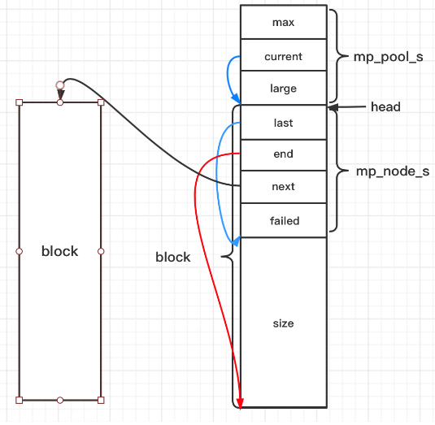

> 本文主要介绍内存管理机制，以及各种优秀开源框架采用的内存管理方法

内存管理的目的：提高内存使用率，避免内存泄漏，减少内存碎片，减少内存分配的系统调用。

内存管理可分为操作系统层面和用户层面。接下来会首先介绍操作系统的内存管理，再介绍一些开源框架是如何进行内存管理的。


#### 一. 物理内存与虚拟内存

程序要加载到物理内存才能运行，早期程序员是直接操作物理内存的（单片机时代），随着多核时代的到来，会出现多个进程同时操作同一物理内存地址的情况，造成混乱和程序崩溃。因此引入了虚拟内存，程序不再直接操作物理内存，只能看到虚拟内存，通过虚拟内存的概念非常优雅的把进程环境隔离开来。每个进程都拥有自己独立的虚拟地址空间，且地址大小范围完全一样，这给程序编码带来了很大的便利。

##### 1. 那么，物理内存和虚拟内存之间是什么样的关系呢？

虚拟内存以页为单位进行划分，每个页对应物理内存上的页框（通常大小为4KB），MMU（内存管理单元）负责将虚拟地址转换为物理地址，MMU中有一张页表来存储这些映射关系。但并不是虚拟内存的所有页都会分配对应的物理内存，为了充分利用物理内存，保证更多进程运行在操作系统上，尽可能把要用到的页放到内存里，其它基本不用或者很少用的虚拟页则不给它分配物理内存，而是把相关内容存在磁盘上。那如果访问的虚拟内存，通过MMU并没有找到与之对应的物理内存怎么办呢？操作系统会触发缺页中断，从磁盘中取得所缺的页并将其换入物理内存，并在页表建立虚拟页和物理页的映射关系，如果物理内存满了，操作系统就会根据某种页面置换算法（比如LRU算法），将物理内存中对应的页换出到磁盘。（这里需要注意的是，如果被换出的物理内存被修改过，必须把它写回磁盘以更新对应的副本，否则不需要写回）。因此虚拟内存是可以远远大于物理内存的。(整张物理内存和虚拟内存的映射图)

TLB(Translation Lookaside Buffer)：缓存虚拟地址到物理地址的映射关系（因为CPU和物理内存之间速度差距大），作为cache加快访问，而不需要每次地址转换都访问内存，加速转换过程


#### 二. Linux内存管理机制

##### 1. 物理页与进程地址空间

linux内核用`struct page`结构体表示物理页

```c
// include/linux/mm.h
struct page {
    unsigned long flags;  // 页标识符
    atomic_t count;  // 页引用计数
    struct list_head list;  // 页链表
    struct address_space *mapping;  // 所属的inode
    unsigned long index;  // mapping中的偏移
    struct list_head lru;  // 最近最久未使用, struct slab结构指针链表头变量
    void *virtual;  // 页虚拟地址
}
```

进程地址空间分为内核空间(3G到4G)和用户空间(0到3G); (整张进程地址空间图). 每个进程都对应一个`mm_struct`结构体,即唯一的进程地址空间

```c
// include/linux/mm.h
struct vm_area_struct {
    struct mm_struct * vm_mm;
};


// include/linux/sched.h
struct mm_struct {
    struct vm_area_struct *mmap;  // vma链表结构
    struct rb_root mm_rb;   // 红黑树指针
    struct vm_area_struct *mmap_cache;  // 指向最近找到的虚拟区间
    atomic_t mm_users;  // 正在使用该地址的进程数
    atomic_t mm_count;  // 引用计数，为0时销毁
    struct list_head mmlist;  // 所有mm_struct结构体都通过mmlist连接在一个双向链表中
};
```

##### 2. 内存分配

内核通过`brk`和`mmap`来分配（虚拟）内存，`malloc/free`底层实现即为`brk`, `mmap`和`unmmap`

`brk`是通过将数据段(.data)的地址指针`_edata`往高地址推来分配内存，当malloc内存小于128k时采用；`brk`分配的内存需要高地址内存全部释放后才会释放，当最高地址空间空闲内存大于128K时，执行内存紧缩操作。

`mmap`是在堆栈中间的文件映射区域找空闲虚拟内存，当malloc内存大于128K时采用；`mmap`分配的内存可单独释放

##### 3. 内部碎片和外部碎片

- 内部碎片

  原因：分配的内存空间大于请求所需的内存空间，造成内存碎片

  解决：伙伴算法；

  伙伴算法主要包括内存分配和释放两步：

  - 内存分配：需要满足两个条件：1.必须大于请求的内存大小；2. 必须是最小内存块（比如64K为一页）的倍数；比如最小内存块为64K，如果分配100K，那么分配的块大小为64*2=128K。
  - 内存释放：分为两步，1. 释放内存，2. 检查是否可以和相邻块合并，直到没有可合并的内存块

  

  接下来通过一张图来说明伙伴算法的原理， 以下是wiki中截图的一张图，共1024KB，最小分配内存块为64KB，伙伴算法步骤如下：

  1. 初始化内存，分配1024KB

  2. A申请34K的内存，因此需要分配给64K的块

     2.1 2.2 2.3 2.4：全部执行对半分操作

     2.5：找到满足条件的块，进行内存块

  3. B申请66K内存，因此需要分配128K的块，由现成的直接分配

  4. C申请35K内存，需要64K的块，直接分配

  5. D申请67K内存，需要128K的块

     5.1：对半分(黄色)

     5.2：分配128K

  6. 释放B内存块，没有相邻的内存可以合并

  7. 释放D内存块

     7.1：释放内存

     7.2：与相邻内存合并

  8. A释放内存，没有相邻的内存可合并

  9. C释放内存

     9.1：释放内存

     9.2-9.5：进行合并

  

  

  理解了伙伴算法的原理后，linux实现如下

  ```c
  // 数据结构定义
  // include/linux/mmzone.h 
  struct free_area {
      struct list_head free_list;  // 所有空闲块
      unsigned long *map;
  };
  #define MAX_ORDER 11
  struct zone {
      // free areas of different sizes
      // 第K个元素，表示大小为2^k的空闲块
  	struct free_area free_area[MAX_ORDER];
  }
  //mm/page_alloc.c
  // 块分配, removing an element from the buddy allocator
  // 再zone中找到一个空闲块，order（0：单页，1：双页，2：4页  2 ^ order）
  static struct page * __rmqueue(struct zone *zone, unsigned int order)
  {
      for (current_order = order; current_order < MAX_ORDER; ++current_order) {
          area = zone->free_area + current_order;
          if (list_empty(&area->free_list)) continue;
          page = list_entry(area->free_list.next, struct page, list);
          list_del(&page->list);
          index = page - zone->zone_mem_map;
          ...
      }
  }
  // 块释放，处理合并逻辑
  static int
  free_pages_bulk(struct zone *zone, int count, struct list_head *list, unsigned int order) {
  }
  ```

  贴一份[云风的伙伴算法实现](https://github.com/cloudwu/buddy.git)，简单注释，实现思路：通过一个数组形式的完全二叉树来管理内存，二叉树的节点标记使用状态，高层节点对应大的块，底层节点对应小的块，在分配和释放中通过节点的状态来进行块的分离合并,如下图

  

  ```c
  // 节点使用状态
  #define NODE_UNUSED 0
  #define NODE_USED 1
  #define NODE_SPLIT 2
  #define NODE_FULL 3
  // 二叉树的部分请才参考上图来，比较容易理解
  struct buddy {
    	int level;  // 二叉树深度
      uint8_tree[1]; // 记录二叉树用来存储内存块(节点)使用情况,柔性数组，不占内存
  };
  // 为内存池申请内存块
  struct buddy *
  buddy_new(int level) {
      // 分配内存大小，5层即为32K
      int size = 1 << level;
      // 分配size * 2 - 2 + buddy头部大小的内存？   sizesof(uint_8_t) == 1 
      // 因此level =  5 其实是分配62kb可供分配的空间
      struct buddy * self = malloc(sizeof(struct buddy) + sizeof(uint_8_t) * (size * 2 - 2));
      // 初始化buddy结构
      self->level = level;
      memset(self->tree, NODE_UNUSED, size * 2 - 1);
      return self;
  }
  // 释放内存块
  void
  buddy_delete(struct buddy * self) {
      free(self);
  }
  // 判断是否为2的幂
  static inline int
  is_pow_of_2(uint32_t x) {
      // 2 ^ n: 最高位为1，其它位为0
      // 2 ^ n - 1: 最高位为0，其它位为1
      // 因此 (2^n) & (2^n-1) == 0
      return !(x & (x - 1));
  }
  // 获取大于x的下一个最小2次幂
  static inline uint32_t
  next_pow_of_2(uint32_t x) {
      if (is_pow_of_2(x))
          return x;
      x |= x>>1;
      x |= x>>2;
      x |= x>>4;
      x |= x>>8;
      x |= x>>16;
      return x + 1;
  }
  // 根据index, level, max_level取得当前节点在数组中的偏移量
  // 比如0, 0, 5 就是整块内存
  static inline int
  _index_offset(int index, int level, int max_level) {
      return ((index + 1) - (1 << level)) << (max_level - level);
  }
  // 判断父节点是否状态应该变为FULL
  static void
  _mark_parent(struct buddy * self, int index) {
      for (;;) {
          int buddy = index - 1 + (index & 1) * 2;  // 兄弟节点
          // 兄弟节点是否被使用
          if (buddy > 0 && (self->tree[buddy] == NODE_USED || self->tree[buddy] == NODE_FULL)) {
              index = (index + 1) / 2 - 1;  // 父节点
              self->tree[index] = NODE_FULL;
          } else {
              return;
          }
      }
  }
  // 分配内存
  int
  buddy_alloc(struct buddy * self, int s) {
      // 分配大小s的内存，返回分配内存偏移量地址(首地址)
      int size;
      if (s == 0) {
          size = 1;
      } else {
          // 获取大于s的最小2次幂
          size = (int)next_pow_of_2(s);
      }
      int length = 1 << self->level;
      if(size > length)
          return -1;
      int index = 0;
      int level = 0;
      while (index >= 0) {
          if (size == length) {
              if (self->tree[index] == NODE_UNUSED) { // 分配成功
                  self->tree[index] = NODE_USED;
                  _mark_parent(self, index);
                  return _index_offset(index, level, self->level);
              } else {
                  switch (self->tree[index]) {
                      case NODE_USED:
                      case NODE_FULL:
                          break;
                      case NODE_UNUSED:
                          self->tree[index] = NODE_SPLIT;
                          self->tree[index * 2 + 1] = NODE_UNSED;
                          self->tree[index * 2 + 2] = NODE_UNSED;
                      default:
                          // 往下层走
                          index = index * 2 + 1;
                          length /= 2;
                          level++;
                          continue;
                  }
              }
              // 遍历兄弟右节点
              if (index & 1) {
                  ++index;
                  continue;
              }
              // 左右节点都USED，回溯
              for ( ;; ) {
                  level--;
                  length *= 2;
                  index = (index + 1) / 2 - 1;
                  if (index < 0)
                      return -1;
                  if (index & 1) {
                      ++index;
                      break;
                  }
              }
          }
      }
      return -1;
  }
  static void
  _combine(struct buddy * self, int index) {
      // 释放内存尝试合并
      for (;;) {
          int buddy = index - 1 + (index & 1) * 2;  // 兄弟节点
          if (buddy < 0 || self->tree[buddy] != NODE_UNUSED) {
              self->tree[index] = NODE_UNSED;
              // 回溯更新父节点状态
              while (((index = (index + 1) / 2 - 1) >= 0) && self->tree[index] == NODE_FULL) {
                  self->tree[index] = NODE_SPLIT;
              }
              return;
          }
          index = (index + 1) / 2 - 1;
      }
  }
  // 释放内存
  void
  buddy_free(struct buddy * self, int offset) {
      // 释放偏移量offset开始的内存块
      int left = 0;
      int length = 1 << self->level;
      int index;
      for (;;) {
          switch(self->tree[index]) {
              case NODE_USED:
                   // 释放内存并合并
  				_combine(self, index);
                  return;
              case NODE_UNUSED:
                  return;
              default:
                  length /= 2;
                  if (offset < left + length) {
                      index = index * 2 + 1;
                  } else {
                      left += length;
                      index = index * 2 + 2;
                  }
                  break;
          }
      }
  }
  ```

- 外部碎片

  原因：未被分配的内存，出现大量零碎不连续小内存，无法满足较大内存申请，造成外部碎片

  解决：slab分配器，处理小内存分配问题，slab分配器分配内存以字节为单位，基于伙伴系统分配的大内存进一步细分成小内存分配
  
  slab分三种：slabs_full(完全分配的slab)，slabs_partial(部分分配的slab)，slabs_empty(空slab)，一个slab分配满了之后就从slabs_partial删除，同时插入到slab_fulls中。
  
  
  
  slab两个作用：1. 小对象分配，不必每个小对象分配一个页，节省空间；2. 内核中一些小对象创建析构频繁，slab对小对象缓存，可重复利用一些相同对象，减少内存分配次数。（应用于内核对象的缓存）
  
  slab分配器基于对象（内核中数据结构）进行管理，相同类型对象归为一类，每当申请这样一个对象，slab分配器就从一个slab列表中分配一个这样大小的单元，当释放时，将其重新保存到原列表中，而不是直接返还给伙伴系统，避免内存碎片。slab分配对象时，会使用最近释放的对象的内存块，因此其驻留载cpu高速缓存中的概率会大大提高
  
  
  
  
  
  ```c
  // mm/slab.c  相关接口在这里面
  // kmem_cache结构体描述的一段内存称作slab缓存池
  struct kmem_cache_s{
  };
  ```
  
  slab与buddy关系图：
  
  


#### 三.  Python内存管理 

#### 1. 内存管理架构


- 第0层：操作系统提供的内存管理接口，比如malloc，free，python不能干涉这一层
- 第1层：包装malloc，free等接口PyMem_API，提供统一的raw memory管理接口，为了可移植性
- 第2层：构建了更高抽象层次的内存管理策略（GC藏身之处）
- 第3层：对象缓冲池

```c
// 第1层 PyMem_Malloc通过一个宏PyMem_MALLOC实现
// pymem.h
PyAPI_FUNC(void *) PyMem_Malloc(size_t);
PyAPI_FUNC(void *) PyMem_Realloc(size_t);
PyAPI_FUNC(void *) PyMem_Free(size_t);

#define PyMem_MALLOC(n)		((size_t)(n) > (size_t)PY_SSIZE_T_MAX ? NULL\
				: malloc(((n) != 0) ? (n) : 1))
#define PyMem_MALLOC(n)		((size_t)(n) > (size_t)PY_SSIZE_T_MAX ? NULL\
				: realloc(((n) != 0) ? (n) : 1))
#define PyMem_FREE 			free

// Type-oriented memory interface 指定类型
#define PyMem_New(type, n) \
	( ((size_t)(n) > PY_SSIZE_T_MAX / sizeof(type)) ? NULL : \
	( (type*)PyMem_Malloc((n) * sizeof(type))) ) )
#define PyMem_NEW(type, n) \
	( ((size_t)(n) > PY_SSIZE_T_MAX / sizeof(type)) ? NULL : \
	( (type*)PyMem_MALLOC((n) * sizeof(type))) ) )


// object.c
void *
PyMem_Malloc(size_t nbytes)
{
    return PyMem_MALLOC(nbytes);
}
void *
PyMem_Realloc(void *p, size_t nbytes)
{
    return PyMem_REALLOC(p, nbytes);
}
void *
PyMem_Free(void *p)
{
    PyMem_FREE(p);
}

```


#### 2. 小块空间的内存池

内存池可视为一个层次结构，自下而上分为四层：block，pool，arena和内存池(概念)，其中bock, pool, arena在python中都能找到实体

Python针对小对象（小于512字节）的内存分配采用内存池来进行管理，大对象直接使用标准C的内存分配器；

对小对象内存的分配器Python进行了3个等级的抽象：arena，pool和block

##### Block

block内存大小值被称为size class， 大小为：[8, 16, 24, 32, 40, 48 ... 256]，(8*n)，内存管理器的最小单元，一个Block存储一个Python对象，

```c
// obmalloc.c
// 8字节对齐
#define ALIGNMENT	8
#define ALIGNMENT_SHIFT	3
#define ALIGNMENT_MASK	(ALIGNMENT - 1)

// block大小上限为256，超过256KB，则交由第一层的内存管理机制
#define SMALL_REQUEST_THRESHOLD		256
#define NB_SMALL_SIZZE_CLASSES	(SMALL_REQUEST_THREASHOLD / ALIGNMENT)

// size class index 转换到 size class
#define INDEX2SIZE(I) (((unit) (I)) + 1) << ALIGMENT_SHIFT)
// sizes class 转换到size class index
size = (uint )(nbytes - 1) >> ALIGMENT_SHIFT;
```

小于256KB的小块内存分配如下图，如果申请内存大小为28字节，则`PyObject_Malloc`从内存池中分配32字节的block，size class index为3的pool


block释放时，会引起pool的状态改变

##### Pool

一系列Block组成一个Pool，一个Pool中所有Block大小一样；一个Pool大小通常为4K(一个虚拟/系统内存页的大小)。

一个小对象被销毁后，其内存不会马上归还系统，而是在pool中被管理着，用于分配给后面申请的内存对象。pool的三种状态：used，full，empty

```c
// obmalloc.c
#define SYSTEM_PAGE_SIZE	(4 * 1024)
#define SYSTEM_PAGE_SIZE_MASK	(SYSTEM_PAGE_SIZE - 1)
// 一个pool大小
#define POOL_SIZE	SYSTEM_PAGE_SIZE
#define POOL_SIZE_MASK	SYSTEM_PAGE_SIZE_MASK

/*pool for small blocks*/
struct pool_header {
    union {
        block *_padding;
        uint count; }ref;   // 分配的block数量
    block *freeblock;  // 指向pool中可用block的单向链表
    struct pool_header *nextpool;
    struct pool_header *prevpool;
    uint arenaindex;
    uint szidx;  // 记录pool保存的block的大小，一个pool中所有block都是szidx大小  和size class index联系在一起
    uint nextoffset;  
    uint maxnextoffset;
};

typedef struct pool_header *poolp;
```


拥有相同block大小的pool通过双向链表连接起来，

python使用一个数组usedpools来管理使用中的pool


```c
// obmalloc.c
typedef uchar block;
void *
PyObject_Malloc(sizes_t nbytes)
{
    block *bp;  // 指向从pool中取出第一块block的指针
    poolp pool;  // 指向一块4kb内存
    poolp next;
    uint size;
	// 小于SMALL_REQUEST_THRESHOLD 使用Python的小块内存的内存池，否则走malloc
    if ((nbytes - 1) < SMALL_REQUEST_THRESHOLD) {
        // 根据申请内存的大小获得对应的获得size class index, 从usedpools中取pool
        size = (uint)(nbytes - 1) >> ALIGNMENT_SHIFT;
        pool = usedpools[size + size];
        // 如果usedpools中有可用pool, 使用这个pool来分配block$
        if (pool != pool->nextpool) {
            ...
        }
        
    }
}
```


##### Arena

多个pool聚合的结果就是一个arena，每个arena大小为256KB，一个arena中容纳的pool个数就是

arena管理的内存是离散的，pool管理的内存是连续的

Arena则是Python从系统分配申请和释放的单位，有256KB，每个Arena中包含了**64个Pool**（256KB，因此只有<=256KB的数据才会在内存池中申请内存，否则采用malloc），也为双向链表，Python在分配Pool的时候优先选择可用Pool数量少的Arena进行内存分配。因为Python只有在Arena中所有的Pool全为空时才释放Arena中的内存，如果选择上可用Pool数量最多的Arena的话，大量内存会被占用不会销毁。


由于Python对内存的申请和释放是以Arena为单位的，所以，如果存在一些对象迟迟没有被释放，那么此时Arena将不会被释放掉，一直占用着这块内存

python中会存在多个arena，这些arena通过一个数组arenas来统一管理。


```c
// obmalloc.c
#define ARENA_SIZE 		(256 << 10)  // 256kb
// arena包含arena_object以及七管理的pool集合，就如同pool和pool_header一样
struct arena_object {
    uintptr_t address;  // arena地址
    block* pool_address; // 下一个pool地址
    uint nfreepools;
    uint ntotalpools;
    struct pool_header* freepools;  // 可用pool通过单链表连接
    struct arena_object* nextarena;
    struct arena_object* prearena;
};
// arenas管理着arena_object的集合
static struct arena_object* arenas = NULL;
// 未使用的arena_object链表
static struct arena_object * unused_arena_objects = NULL;
// 可用的arena_object链表
static struct arena_object * usable_arenas = NULL;
static struct arena_object * nwe_arena(void)
{
    struct arena_object * arenaobj;
    uint excess;
    // 判断是否需要扩充“未使用的”arena_object列表
    if (unused_arena_objects == NULL) {
        ...
        // 确定本次需要申请的arena_object的个数，并申请内存
        numarenas = maxarenas ? maxarenas << 1 : INITIAL_ARENA_OBJECTS;
        ...
    }
    // 从unused_arena_objects中取出一个未使用的arena_object
    arenaobj = unused_arena_objects;
    unused_arena_objects = arenaobj->nextarena;
    // 建立arena_object和pool的联系
    arenaobj->address = (uptr)address;
    ...
    return arenaobj;
}
```


#### 3. 内存池

可用pool缓冲池，usedpools;

当申请28个字节内存时，python会在内存池中寻找一块能满足需求的pool（block大小为32），从中取出一个block返回。pool总是和某个size class index对应。

pool不仅有size，还有状态：

- used状态：pool中至少有一个block已经被使用，并且至少还有一个block未被使用，存在usedpools数组中
- full状态：pool中所有的block都已经被使用，这种状态的pool在arena中，但不再arena的freepools链表中
- empty状态：pool中所有的block都未被使用，处于这个状态的pool的集合通过其pool_head中的nextpool构成一个链表，表头为arena_object中的freepools


Python小块内存全景图


##### 小块内存申请与释放流程：

申请：

- 当申请内存时，先取SMALL_REQUEST_THRESHOLD来判断，如果小于它则进行小块分配函数调用
- 通过要申请的nbytes来计算其相应的size index, 再用usedpool[index + index]来优先查看已有的pool，如果没有，则从usable_arenas里找一个可用的pool。如果usable_arenas == NULL, 则调用new_arena来创建一个新的arena，且让usable_arena指向它。
- 从usable_arenas里HEAD取出一个pool，初始化这个pool把它加入usedpool.
- 初始化pool_header并返回对应的BLOCK*.

释放：

- 检查block的地址是否属于内存池，如果是则进行小块内存释放逻辑
- 如果pool包含了该block, 则将其添加至freeblock
- 如果pool的状态是从FULL到USED，则将其添加至usedpool
- 如果pool的状态是从USED到EMPTY，则将其从usedpool中移除。并且将其加入arena_object的freepools中并将nfreepools++
- 如果此时nfreepools == ntotalpools说明所有的pool都被释放了，则可以安全的释放掉这个arena对象并把它从unsable_arenas移到unusded_arena_objects
- 如果nfreepools == 1， 说明改arena从full变为了usable, 则需把它添加到usable_arenas。

#### 4. 垃圾回收GC

引用计数一种垃圾回收机制；

引用计数优点：简单和实时

缺点：

- 执行回收效率低，维护引用计数的额外操作与内存分批和释放，引用赋值次数成正比；因此python才设计了小块内存的内存池
- **循环引用**：引用标记-清除和分代收集

垃圾回收机制一般分为：垃圾检测和垃圾回收；python基于三色模型来进行垃圾收集；（白色为未检测/不可达，灰色为可达，黑色为已检查）

步骤：

- 寻找root object（全局引用和函数栈的引用）
- 来及检测阶段，找到可达对象
- 把不可达对象的内存回收

[Python源码分析](https://book.douban.com/subject/3117898/)


#### 四. Ringbuffer环形缓冲区

需求来源于网络服务提供程序的一个普遍场景：一个服务器程序可能会收到多个客户端的网络数据流，在每个数据流上实际上有多个独立的数据包，只有一个数据包接收完整了才能做进一步的处理。如果在一个网络连接上数据包并不完整，就需要暂时缓存住尚未接收完的数据包。

环形缓冲区的好处是可以减少内存分配继而减少系统的开销，减少内存碎片数量，有利于程序长期稳定的运行；

在网络IO线程中，我们会为每一个连接都准备一个环形缓冲区，用于临时存放接收到的数据，以应付半包及粘包的情况。在解包及解密完成后，我们会将这个数据包复制到逻辑线程消息队列中，如果我们只使用一个队列，那这里也将会是个环形缓冲区，IO线程往里写，逻辑线程在后面读，互相追逐。

Ringbuffer两个特性：先进先出；当缓冲区被使用完，又有新的数据需要存储，则丢弃久远的数据，保存新的数据。

如下图：环形缓冲区的长度是固定的，在使用该缓冲区时，不需要将所有的数据清除，只需要调整指向该缓冲区的pHead、pValidWrite和pTail指针位置即可。pValidWrite指针最先指向pHead指针位置（环形缓冲区开头位置），数据从pValidWrite指针处开始存储，每存储一个数据，pValidWrite指针位置向后移动一个长度 ，随着数据的添加，pValidWrite指针随移动数据长度大小个位置。当pValidWrite指向pTail尾部指针，pValidWrite重新指向pHead指针位置（折行处理），并且覆盖原先位置数据内容直到数据存储完毕。


Linux 5.1合入了一个新的异步IO框架和实现：io_uring， io_uring设计了一对共享的ring buffer用于应用和内核之间的通信，其中，针对提交队列（SQ），应用是IO提交的生产者（producer），内核是消费者（consumer）；反过来，针对完成队列（CQ），内核是完成事件的生产者，应用是消费者

[copy ringbuffer c实现一份](https://blog.csdn.net/maowentao0416/article/details/81984269)

[参考云风blog](https://blog.codingnow.com/2012/02/ring_buffer.html)

```c
// ringbuffer.h
typedef unsigned char u8;
typedef unsigned int u32;
void initRingbuffer(void);
int writeRingbuffer(u8 * buffer, u32 len);
int readRingbuffer(u8 * buffer, u32 len);
u32 getRingbufferValidLen(void);
void releaseRingbuffer(void);

// ringbuffer.c
#define BUFFER_SIZE 16  // 缓冲区的长度
static u32 validLen;  // 已使用的数据长度
static u8* pHead = NULL;  // 环形存储区的首地址
static u8* pTail = NULL;  // 环形存储区的尾地址
static u8* pValid = NULL;  // 已使用的缓冲区首地址
static u8* pValidTail = NULL;  // 已使用的缓冲区尾地址
// 初始化环形缓冲区
void init Ringbuffer(void) {
    if (pHead == NULL) pHead = (u8*)malloc(BUFFER_SIZE);
    pValid = pValidTail = pHead;
    pTail = pHead + BUFFER_SIZE;
    validLen = 0;
}
// 向缓冲区写入数据，buffer写入数据指针，addLen写入数据长度
int writeRingbuffer(u8* buffer, u32 addLen) {
    if (addLen > BUFFER_SIZE) return -1;  // 过长
    if (pHead == NULL) return -2;  // 未初始化
    assert(buffer);
    // 将数据copy到pValidTail处
    if (pValidTail + addLen > pTail) // ringbuffer回卷
    {
        int len1 = addLen - pValidTail;
        int len2 = addLen - len1;
        memcpy(pValidTail, buffer, len1);
        memcpy(pHead, buffer + len1, len2);
        pValidTail = pHead + len2;  // 新的有效数据区结尾指针
    } else {
        memcpy(pValidTail, buffer, addLen);
        pValidTail += addLen;  // 新的有效数据结尾指针
    }
    // 重新计算已使用区的起始位置
    if (validLen + addLen > BUFFER_SIZE) {
        int moveLen = validLen + addLen - BUFFER_SIZE;  // 有效指针将要移动的长度
        if (pValid + moveLen > pTail) {
            int len1 = pTail - pValid;
            int len2 = moveLen - len1;
            pValid = pHead + len2;
        } else {
            pValid = pValid + moveLen;
        }
        validLen = BUFFER_SIZE;
    }else {
        validLen += addLen;
    }
    return 0;
}
// 从缓冲区内取出数据，buffer读取数据的buffer，len长度
int readRingBuffer(u8* buffer, u32 len)
{
    if (pHead == NULL) return -1;
    assert(buffer);
    if(validLen == 0) return 0;
    if (len > validLen) len = validLen;
    if (pValid + len > pTail) {  // 回卷
        int len1 = pTail - pValid;
        int len2 = len - len1;
        memcpy(buffer, pValid, len1);
        memcpy(buffer + len1, pHead, len2);
        pValid = pHead + len2;
    } else {
        memcpy(buffer, pValid, len);
        pValid = pValid + len;
    }
    validLen -= len;
    return len;
}
// 获取已使用缓冲区的长度
u32 getRingbufferValidLen(void) {
    return validLen;
}
// 释放环形缓冲区
void releaseRingbuffer(void) {
    if (pHead != NULL) free(pHead);
    pHead = NULL;
}
```

C++ boost 提供的circular_buffer 模板，待补充


#### 五. Nginx内存管理

在介绍Nginx内存管理之前，先参照Nginx实现一个简单的内存池，结构图如下：



`mp_pool_s`为内存池的结构体头，包含内存池的一些全局信息，`block`为小块内存块，每一个`block`有一个`mp_node_s`结构体，也即`mp_pool_s`通过链表将所有的`block`连接起来进行管理，而大块内存由`mp_large_s`进行分配。直接看代码，由详细注释

```c
// 对齐，找到下一个对齐的数值
// 比如aligment为2，11-->16
#define MP_ALIGNMENT	32  // 对齐方式
#define MP_PAGE_SIZE	4096 // 页大小
#define MP_MAX_ALLOC_FROM_POOL	(MP_PAGE_SIZE-1) // 
#define mp_align(n, alignment) (((n)+（alignment-1)) & ~(alignment-1))
#define mp_align_ptr(p, aligment) (void*)((((size_t)p)+(alignment-1)) & ~(alignment-1)))

// 结构体
// 大块内存结构体
struct mp_large_s {
    struct mp_large_s *next;
    void *alloc;
};

// 小块内存节点，没有小块内存构成一个链表
struct mp_node_s {
 	unsigned char *last;  // 下一次内存从此分配
    unsigned char *end;  // 内存池结束位置
    struct mp_node_s *next;  // 指向下一个内存块
    size_t failed;  // 改内存块/node分配失败的次数
};

// 内存池结构
struct mp_pool_s {
  	size_t max;  // 能直接从内存池中申请的最大内存，超过需要走大块内存申请逻辑
    struct mp_node_s *current;  // 当前分配的node
    struct mp_large_s *large;  // 大块内存结构体
    struct mp_node_s head[0];  // 柔性数组不占用大小，其地址为紧挨着结构体的第一个node
};

// 需要实现的接口
struct mp_pool_s *mp_create_pool(size_t size);  // 创建内存池
void mp_destory_pool(struct mp_pool_s *pool);	// 销毁内存池
void *mp_alloc(struct mp_pool_s *pool, size_t size);  // 分配内存 对齐
void *mp_nalloc(struct mp_pool_s *pool, size_t size);  // 不对齐
void *mp_calloc(struct mp_pool_s *pool, size_t size);  // 分配内存，并初始化为0
void mp_free(struct mp_pool_s *pool, void *p); // 释放p节点内存

// posix提供的malloc,calloc,realloc返回的地址都是对齐的，32位8字节, 64位16字节，不可调；所以有了posix_memalign
// 
// 介绍一个函数posix_memalign，类似malloc，分配的内存由free释放
// int posix_memalign(void**memptr, size_t alignment, size_t size)
// memptr: 分配好的内存空间的首地址
// alignment: 对齐边界，Linux中32位系统8字节，64位系统16字节，必须为2的幂
// size: 指定分配size字节大小的内存
// 发牛size字节的动态内存，这块内存为alignment倍数；

// 创建并初始化内存池
struct mp_pool_s *mp_create_pool(size_t size) {
    struct mp_pool_s *p;
  	// 分配内存池内存：mp_pool_s + mp_node_s + size
    int ret = posix_memalign((void**)&p), MP_ALIGNMENT, size + sizeof(struct mp_pool_s) + sizeof(struct mp_node_s));
    if (ret) {
        return NULL;
    }
    // 可从内存池申请的最大内存
    p->max = (size < MP_MAX_ALLOC_FROM_POOL) ? size : MP_MAX_ALLOC_FROM_POOL;
    p->current = p->head;  // 当前可分配的第一个节点mp_node_s
    p->large = NULL;
    // 下一个可分配的地址
    p->head->last = (unsigned char *)p + sizeof(struct mp_pool_s) + sizeof(struct mp_node_s);
    p->head->end = p->head->last + size;
    p->head->failed = 0;
    return p;
}
// 销毁
void mp_destroy_pool(struct mp_pool_s *pool) {
    struct mp_node_s *h, *n;
    struct mp_large_s *l;
    // 销毁大块内存
    for (l = pool->large; l; l = l->next) {
        if (l->alloc) {
            free(l->alloc);
        }
    }
    // 销毁小块内存
    h = pool->head->next;
    while (h) {
        n = h->next;
        free(h);
        h = n;
    }
    free(pool);
}
// 重置
void mp_reset_pool(struct mp_pool_s *pool) {
		struct mp_node_s *h;
  	struct mp_large_s *l;
  	// 大块内存全部销毁
  	for (l = pool->large; l; l = l->next) {
      	if (l->alloc) {
        		free(l->alloc);
        }
    }
  	pool->large = NULL;
  	for (h = pool->head; h; h = h->next) {
      	// 每个节点的last位置重置
      	h->last = (unsigned char *)h + sizeof(struct mp_node_s);
    }
}
// 分配大块内存
static void *mp_alloc_large(struct mp_pool_s *pool, size_t size) {
    void *p = malloc(size);
    size_t n = 0;
    struct mp_large_s *large;
    for (large = pool->large; large; large = large->next) {
        if (large->alloc == NULL) {
            large->alloc = p; // 存入large链表中
            return p;
        }
        if (n ++ > 3) break;
    }
    large = mp_alloc(pool, sizeof(struct mp_large_s));
    if (large == NULL) {
        free(p);
        return NULL;
    }
    large->alloc = p;
    large->next = pool->large;
    pool->large = large;
    return p;
}
// 分配新的内存块/node: mp_node_s + psize
static void *mp_alloc_block(struct mp_pool_s *pool, size_t size) {
    unsigned char *m;
    struct mp_node_s *h = pool->head;
    size_t psize = (size_t)(h->end - (unsigned char *)h);  // 第一个内存块大小
    // 分配psize大小的内存块
    int ret = posix_memalign((void **)&m, MP_ALLIGMENT, psize);
   	if (ret) return NULL;
    
    struct mp_node_s *p, *new_node, *current;
    new_node = (struct mp_node_s*)m;  // 新的节点
    new_node->end = m + psize;  // end位置
    new_node->next = NULL; 
    new_node->failed = 0;
    
    m += sizeof(struct mp_node_s);  // 移可分配的内存位置起始位置
    m = mp_align_ptr(m, MP_ALIGMENT);
    new_node->last = m + size;  // 分配完当前size后下一个分配内存的起点
    current = pool->current;
    // 寻找内存池下一个分配的节点，5次分配失败的过滤
    for (p = current; p->next; p = p->next) {
        if (p->failed++ > 4) {
            current = p->next;
        }
    }
    p->next = new_node;  // 加入链表
    pool->current = current ? current : new_node;
    return m;
}

// mp_alloc 分配内存
void *mp_alloc(struct mp_pool_s *pool, size_t size) {
    unsigned char *m;
    struct mp_node_s *p;
    if (size <= pool->max) {
        p = pool->current;
        do {
            // 32位对齐的下个位置
            m = mp_align_ptr(p->last, MP_ALIGMEENT);
            if ((size_t)(p->end - m) >= size) {
                // 当前节点内存足够，分配成功，返回
                p->last = m + size;
                return m;
            }
            p = p->next; // 不够则找下一个节点
        } while (p);
        // 内存池中所有节点内存都不以满足分配size内存，需要再次分配一个block
        return mp_alloc_block(pool, size);
    }
    return mp_alloc_large(pool, size);
}

// 分配内存并初始化
void *mp_calloc(struct mp_pool_s *pool, size_t size) {
    void *p = mp_alloc(pool, size);
  	if (p) {
      	memset(p, 0, size);
    }
  return p;
}

// 大块节点内存释放
void mp_free(struct mp_pool_s *pool, void *p) {
  	struct mp_large_s *l;
  for (l = pool->large; l; l = l->next) {
    	if (p == l->alloc) {
        	free(l->alloc);
        	l->alloc = NULL;
        	return ;
      }
  }
}
```

接下来介绍Nginx内存管理的实现，先上图，原理跟上述内存池实现一致


以下为Nginx实现，在`src/core/ngx_palloc.h/c`两个文件中

```c
// 内存块结构体，每个内存块都有，在最开头的部分，管理本块内存
// 64位系统大小为32字节
typedef struct {
    u_char 		*last;  // 可用内存的起始位置，小块内存每次都从这里分配
    u_char		*end;  // 可用内存的结束位置
    ngx_pool_t	*next;	// 写一个内存池节点
    ngx_unit_t	failed;  // 本节点分配失败次数，超过4次，认为本节点满，不参与分配，满的内存块也不会主动回收
}ngx_pool_data_t;
// 大块内存节点
typedef struct ngx_pool_large_s ngx_pool_large_t;
struct ngx_pool_large_s {
    ngx_pool_large_t	*next;  // 多块大内存串成链表，方便回收利用
    void			   *alloc;  // 指向malloc分配的大块内存
};
// nginx内存池结构体
// 多个节点串成的单向链表，每个节点分配小块内存
// max，current，大块内存链表旨在头节点
// 64位系统大小位80字节，结构体没有保存内存块大小的字段，由d.end - p得到
struct ngx_pool_s {
    // 本内存节点信息
    ngx_pool_data_t		d;
    // 下面的字段旨在第一个块中有意义
    size_t			   max;  // 块最大内存
    ngx_pool_t		   *current;  // 当前使用的内存池节点
    ngx_chain_t		   *chain;
    ngx_pool_large_t    *large;   // 大块内存
    ngx_pool_cleanup_t  *cleanup;  // 清理链表头指针
    ngx_log_t		   *log;
};
// 创建内存池
ngx_pool_t *ngx_create_pool(size_t size, ngx_log_t *log);
// 销毁内存池
// 调用清理函数链表，检查大块内存链表，直接free，遍历内存池节点，逐个free
void ngx_destroy_pool(ngx_pool_t *pool);
// 重置内存池，释放内存，但不归还系统
// 之前分配的内存块依旧保留，重置空闲指针位置
void ngx_reset_pool(ngx_pool_t *pool);
// 分配内存 8字节对齐，速度快，少量浪费 >4k则直接malloc分配大块内存
void *ngx_palloc(ngx_pool_t *pool, size_t size);
void *ngx_pnalloc(ngx_pool_t *pool, size_t size);  // 不对齐
void *ngx_pcalloc(ngx_pool_t *pool, size_t size); // 对齐分配，且初始化
// 大块内存free
ngx_int_t ngx_pfree(ngx_pool_t *pool, void *p);
```


#### 六. TCMalloc(Thread-Caching Malloc)内存分配器

不少项目中都使用，例如Golang就使用了类似的算法进行分配。

> 1. TCMalloc is faster than the glibc2.3  malloc
> 2. TCMalloc also reduces lock contention for multi-threaded programs, 
> 3. TCMalloc is space-efficient representation of small objects（<=32K）

每一个线程都有一个ThreadCache，维护了对象的链表；

内存申请流程：

- ThreadCache对象不够，就从CentralCache中批量申请
- CentralCache不够，从PageHeap申请Span
- PageHeap没有适合的Page，则向操作系统申请

内存释放流程：

- ThreadCache释放对象积累到一定程度，就释放给CentralCache
- CentralCache中一个Span释放完全了，则把这个Span归还给PageHeap
- PageHeap发现一批连续的Page都释放了，则归还给操作系统

多个连续的Page组成Span， Span 中记录起始 Page 的编号，以及 Page 数量，大对象(>32k)直接分配Span，小对象(<=32k)在Span中分配Object


**Page管理**


伙伴系统：合并相邻page，减少内存碎片

内存申请：分裂Span

内存释放：合并Span

RadixTree基数树实现PageMap，记录每个Page所属的 Span


tcmalloc优点：内存分配效率高，运行速度快，稳定性强，能够有效降低系统负载；

应用场景：多核，高并发，多线程

其它内存分配器(管理库)：glibc，ptmalloc，jemallloc

[tcmalloc图来源](https://zhuanlan.zhihu.com/p/29216091)

[tcmalloc文档](http://goog-perftools.sourceforge.net/doc/tcmalloc.html)


#### 七. Andriod内存管理

##### Q：Andriod的Java程序为什么容易出现OOM？

A：因为Andriod系统堆Dalvik的VM HeapSize做了硬性限制，当java进程申请的java空间超过阈值时，就会抛出OOM，这样设计的目的是为了让比较多的进程常驻内存，这样程序启动时就不用每次都重新加载到内存，能够给用户更快的响应。

Andriod系统中的应用程序基本都是Java进程。

##### Andriod内存管理机制

**分配机制：**

为每一个进程分配一个合理大小的内存块，保证每个进程能够正常运行，同时确保进程不会占用太多的内存；Andriod系统需要最大限度的让更多进程存活在内存中，以保证用户再次打开应用时减少应用的启动时间，提高用户体验。

**回收机制：**

当系统内存不足时，需要一个合理的回收再分配机制，以保证新的进程可以正常运行。回收时杀死那些正在占用内存的进程，OS需要提供一个合理的杀死进程机制。
