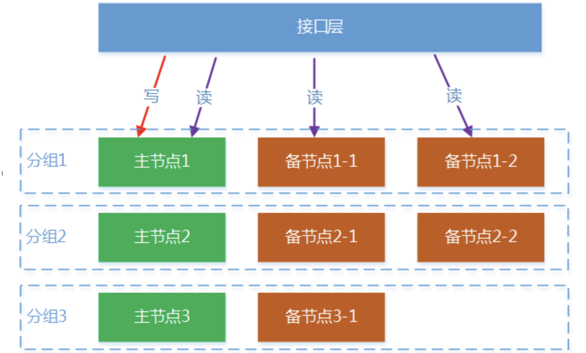
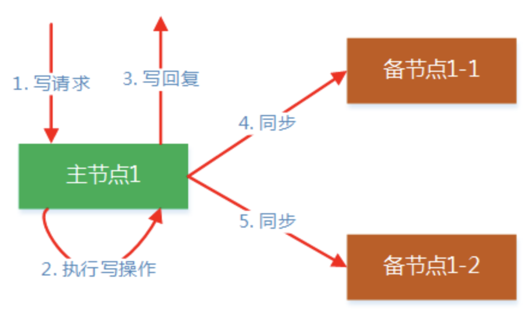

#### 备份容灾

在分布式存储系统中，系统可用性是最重要的指标之一，需要保证在机器发生故障时，系统可用性不受影响，为了做到这点，数据就需要保存多个副本，并且多个副本要分布在不同的机器上，只要多个副本的数据是一致的，在机器故障引起某些副本失效时，其它副本仍然能提供服务。本文主要介绍数据备份的方式，以及如何保证多个数据副本的一致性，在系统出现机器或网络故障时，如何保持系统的高可用性。

#### 数据备份

数据备份是指存储数据的多个副本，备份方式可以分为热备和冷备，热备是指直接提供服务的备副本，或者在主副本失效时能立即提供服务的备副本，冷备是用于恢复数据的副本，一般通过Dump的方式生成。

数据热备按副本的分布方式可分为同构系统和异步系统。**同构系统是把存储节点分成若干组，每组节点存储相同的数据**，其中一个主节点，其他为备节点；**异构系统是把数据划分成很多分片，每个分片的多个副本分布在不同的存储节点，存储节点之间是异构的，即每个节点存储的数据分片集合都不相同**。在同构系统中，只有主节点提供写服务，备节点只提供读服务，每个主节点的备节点数可以不一样，这样在部署上会有更大的灵活性。在异构系统中，所有节点都是可以提供写服务的，并且在某个节点发生故障时，会有多个节点参与故障节点的数据恢复，但这种方式需要比较多的元数据来确定各个分片的主副本所在的节点，数据同步机制也会比较复杂。相比较而言，异构系统能提供更好的写性能，但实现比较复杂，而同构系统架构更简单，部署上也更灵活。鉴于互联网大部分业务场景具有写少读多的特性，我们选择了更易于实现的同构系统的设计

#### 同步机制

在上面的备份架构中，每个分组只有主节点接收写请求，然后由主节点负责把数据同步到所有的备节点，如下图所示，主节点采用一对多的方式进行同步，相对于级联的方式，这种方式在某个备节点故障时，不会影响其它备节点的同步。在CAP理论中，可用性和一致性是一对矛盾体，在这里主节点执行写操作后会立即回复客户端，然后再异步同步数据到备节点，这样并不能保证主备节点的数据强一致性，主备数据会有短暂的不一致，通过牺牲一定的一致性来保证系统的可用性。在这种机制下，客户端可能在备节点读到老数据，如果业务要求数据强一致性，则可以在读请求中设置只读主选项，这样读请求就会被接口层转发到主节点，这种情况下备节点只用于容灾，不提供服务。

为了保证主备节点的数据一致性，需要一种高效可靠的数据同步机制。同步分为增量同步和全量同步，增量同步是主节点把写请求直接转发到备节点执行，全量同步是主节点把本地的数据发到备节点进行覆盖。接下来详细介绍同步机制的实现，同步的整体流程如下图所示。

限流，服务分级，分层，mysql分库分表 binlog 多数据中心，容灾：接入层/逻辑层/存储层，名字服务。 存储层容灾（MongoDB，MySQL）

