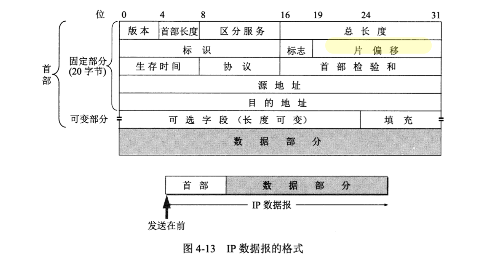
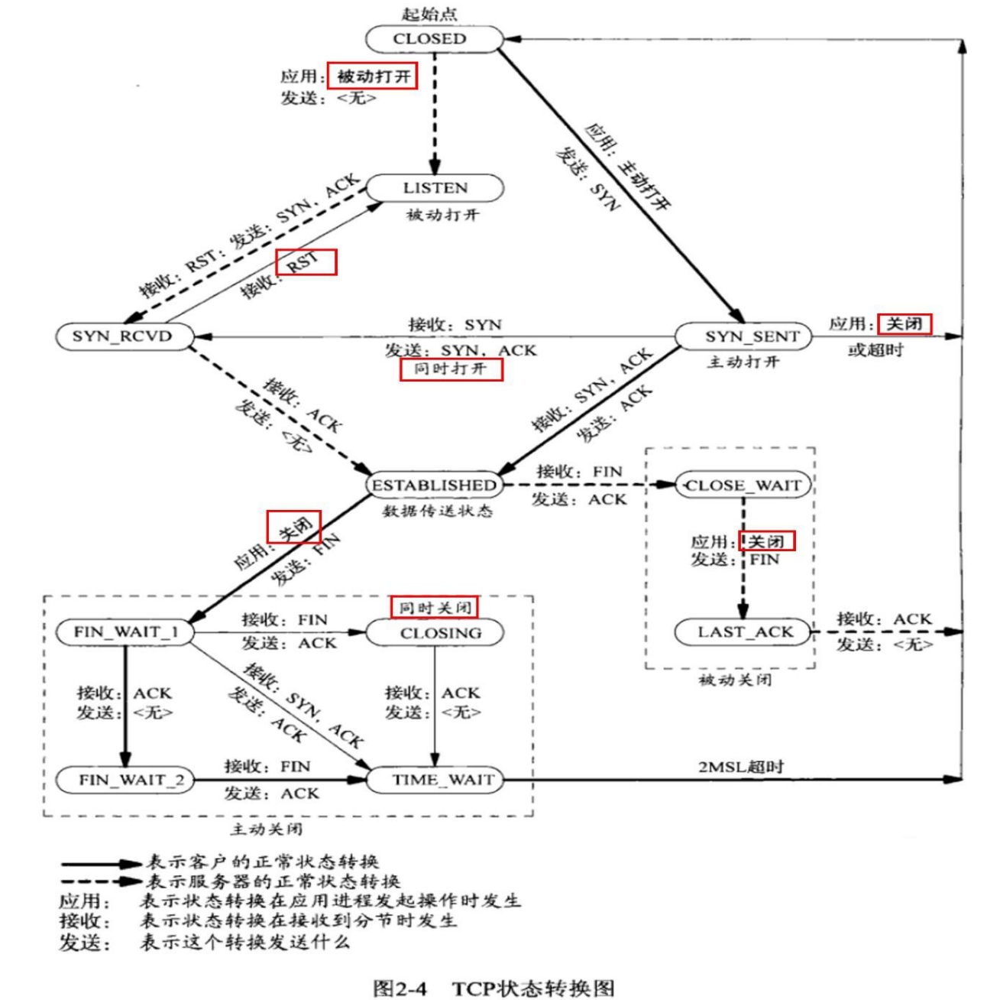

#### 一. TCP/IP协议栈实现

分层模型

开局一张图，计算机网络体系结构如下：


本文将采用右侧五层模型从下往上依次讲解，详细讲述每一层的协议和作用，并且会层层介绍Linux内核(2.6版本)如何实现协议栈，其中数据链路层、网络层和传输层属于内核(TCP/IP协议栈属于内核)，也是重点介绍的内容。

##### 1.物理层

**功能**：主要进行物理信号传输，负责A/D转换，即物理信号和数字信号之间的转换。

**交互中间设备**：转发器

##### 2.数据链路层

网络适配器工作在这一层，因此Mac地址属于这一层，需要进行差错控制等

**数据传输单位**：MAC帧

**交互中间设备**：网桥/桥接器(bridge);

**协议**：以太网协议

- 封装成帧（帧头SOH，帧尾EOT，中间为IP数据报），透明传输（ESC字节填充），差错检测（循环冗余检测CRC）
- 以太网MAC层的硬件地址，（计算机的硬件地址-MAC地址，在适配器的ROM中；软件地址-IP地址在存储器中）
- 适配器、转发器、集线器、网桥、以太网交换机作用以及使用场合

**适配器**是什么？为什么要有适配器？

适配器（网络接口卡NIC+ROM+RAM等），适配器与局域网之间的通信通过电缆/双绞线以串行传输方式进行，与计算机之间的通信通过主板上IO以并行传输方式进行。两者数据率不一致，因此适配器需要缓存。

**Mac帧格式**如下图：


- 前12个字节表示目的地址和源地址(48位长)；在不同网络上传输时，mac地址会不断变化
- 接下来2个字节表示上层协议（0x0800 IP数据报）
- 接下来数据范围（46字节-1500字节）
- FCS，4个字节，采用CRC检验

以太网协议头实现：

```c
#define ETH_ALEN 	6
struct ethhdr {
  	unsigned char h_dest[ETH_ALEN];  // 6个字节目的地址
  	unsigned char h_src[ETH_ALEN];  // 6个字节源地址
  	unsigned short h_proto;  // 2个字节协议
};
```

##### 3.网络层

**交互中间设备**：路由器

本层主要介绍三个协议：IP协议，ICMP协议，以及ARP协议

**IP协议**；数据传输单位为**IP数据报**，向上为运输层提供数据(解包)，向下将运输层数据封装成包进行传输

不可靠（不能保证IP数据包成功到达目的地），无连接（每个数据报处理都是相互独立的，也不保序）

**网络字节序**：(4个字节的32bit值以大端字节序传输：0~7bit，8~15，16~23，24~31，因此大端字节序又称为网络字节序，因此在传输数据前，如果主机采用的是小端序，需要先转换成网络/大端字节序，再进行传输)

接下来介绍IP协议头的实现，以下为IP数据报头部固定20个字节，如下图：



- 版本：4位，IPv4/6
- 首部长度：4位
- 区分服务：1个字节服务类型TOS；4个bit，每一位分别表示最小时延，最大吞吐量，最高可靠性和最小费用，**只能置其中1个bit为1**，其它的都为0；例如**Telnet**将第一位置为1，表示最小时延，主要用来传输少量的交互数据。**FTP**文件传输要求最大吞吐量；
- 总长度：2个字节，首部和数据合总长度(2^16)
- 标识：2个字节，一个数据报对应一个标识（相同表示片组成同一数据包）
- 标志：3位，最低位MF（==1 还有分片，==0没有分片）；中间位DF（不能分片）
- 片偏移：13位，较长的分组分片后，某片在原分组中的位置
- 生存时间TTL：1个字节，数据报在网络中的寿命（最大跳数）
- 协议：1个字节，
- 首部检验合：2个字节，只检验数据报首部；
- 源地址+目的地址：各4个字节

IP协议头实现：

```c
struct iphdr {
  unsigned char version: 4,  // 4位版本号
    			head_len: 4;  // 4位首部长度
  unsigned char tos;  // 1个字节TOS服务类型
  unsigned short tot_len;  // 2个字节总长度
  unsigned short id;  // 2个字节表示
  unsigned short flag: 3,  // 3位标志
  				offset: 13;  // 13位片偏移
  unsigned char ttl;  // 1个字节生存时间
  unsigned char protocol;  // 1个字节协议
  unsigned short check;  // 2个字节首部检验和
  unsigned int saddr;  // 4个字节源地址
  unsigned int daddr;  // 4个字节目的地址
};
```

**ICMP协议**(网际控制报文协议)：为更有效转发IP数据报和提高交付成功机会。

- ICMP差错报文报告 traceroute(逐一增加ttl)
  - 终点不可达
  - 时间超过
  - 参数问题
  - 重定向
- ICMP询问报文 ping
  - 回送请求和回答PING（直接只用网络层，没有经过传输层）
  - 时间戳请求和回答

**ARP协议**(地址解析协议)：每台主机都有一个**ARP Cache(高速缓存)**，存有**本局域网上**各主机/路由器的**IP地址**到**MAC地址**的映射表。通过使用ARP，找到IP对应的MAC地址，**找不到则交给路由器处理**。因此MAC地址只在本局域网有效。ARP的功能是在32bit的IP地址和采用不同网络技术的硬件地址之间提供动态映射；

IP地址和MAC地址的关联保存在ARP表中，由驱动程序和操作系统完成

如果找到则介入MAC再通过局域网发送，如果找不到则运行ARP；如果在同一个局域网中，则找到下一跳（路由器），直到找到对应的地址。（Ping， TTL就是一跳一跳）


##### 4.运输层

网络层以上的**交互中间设备**：网关(gateway)

IP网络层角度：通信的端点是两台主机；运输层角度：通信端点是两台主机中的进程。

运输层向进程通信提供通用的数据传输服务，提供了TCP/UDP两种协议

- TCP传输控制协议：**面向连接**的、**面向字节流**的，**全双工**的，**可靠**的数据传输服务，数据传输单位为**报文**段(segment)；TCP连接的端点叫做socket（IP+Port).
- UDP用户数据报协议：**无连接的**，尽最大努力数据传输服务（**不可靠**），数据传输单位为**用户数据报**，一般用在对实时性和传输效率有一定要求的场景（下载，游戏等）

**UDP协议头：**


没有拥塞控制，首部开销小（8个字节）

**UDP协议头和udp数据包**

```c
struct udphdr {
  	unsigned short source;  // 源地址
  	unsigned short dest;  // 目的地址
  	unsigned short len;  // 数据报长度
  	unsigned short check;  // 检验和
};

struct udppkt {
  	struct ethhdr eh;  // 以太网协议
  	struct iphdr	ip;  // ip协议
  	struct udphdr	udp;  // tcp协议
    // 柔性数组，没法知道数组长度 sizeof(body)==0
    // 使用情况：1. 长度不确定；2.长度可以通过计算出来不越界
  	unsigned char body[0];
};
```

**TCP协议头**


- 源端口+目的端口：各占2个字节
- 序号(Seq)：4个字节，报文段序号
- 确认号(Ack)：4个字节，期望收到对方下一个报文段第一个数据字节的序号
- 数据偏移：4位，
- 保留：4位
- 紧急URG：=1，表示紧急字段有效
- ACK：=1，则Ack字段有效
- PSH：推送
- RST：复位，**TCP出现严重差错，释放连接，重新建立连接**。
- SYN：在建立连接时用来同步信号，=1表示连接请求或者接受报文。
- FIN：用来释放一个连接，=1表示数据发送完毕。
- 窗口大小：2个字节，表示**发送报文段一方的接受窗口**。
- 校验和：2个字节，首部+数据
- 紧急指针：URG==1才生效

```c
struct tcphdr {
    unsigned short sport;
    unsigned short dport;
    unsigned int seqnum; // seq序列号，收到客户端，SYN==1生效
    unsigned int acknum; // Ack， server/client确认, ACK==1生效
    unsigned char hdrlen:4,
    			  resv:4;
    unsigned char cwr:1,
    			  ece:1,
    			  urg:1,
    			  ack:1,
    			  psh:1,
    			  rst:1,
    		 	  syn:1,
    			  fin:1;
    unsigned shrot cw;	// 窗口大小
    unsigned short check;
    unsigned short urg_pointer;
};
```

MMS：TCP报文段中**数据字段的最大长度**，不是TCP报文总长度。

MTU(以太网数据帧长度46~1500字节): 最大传输单元 (= MMS + TCP协议头+IP协议头),当IP层数据长度大于MTU时，IP层需要对数据进行分片（Fragmentation）；

MSL：一个包的最大存活时间


网络编程接口：socket，listen，accept，send，recv，close，connect，bind。

其中具有send功能的：connect，close，send


##### 5.应用层

最高层，应用程序之间进行通信（进程间通信），交互数据单元为**报文**(Message)


#### 二. TCP面试常考点

结合上面协议栈的实现（尤其是TCP首部头的实现），来讲解TCP面试常见点

**Q1: TCP三次握手，四次挥手，以及状态如何转移？**

我们将通过两张图来讲解这三个问题，


三次握手建立连接：

1. 

**TCP状态图**



Q3：什么是半连接队列(syn队列)，全连接队列(accept队列)，什么是Syn Floor/DDos攻击？

**syn队列（半连接队列）**：第一次发syn给服务端的客户端，服务端用队列保存（一个节点对应一个客户端）；DDos攻击/Syn Floor，是因为syn队列有长度限制，大量非法连接进入syn队列，会导致有用的连接进不来。

**accept队列（全连接队列）**：三次握手完成后将syn队列中相应的客户端节点move到这里。


`listen(fd, backlog)`中第二个参数`backlog`就表示syn队列长度(syn+accept共同长度)

`clientfd = accept(listenfd, addr)`中accept作用：

1. 从accept队列中取出一个节点
2. 为该节点分配一个fd，将节点与fd一一对应，（fd --  节点 -- 五元组(sip, dip, sport, dport, proto），fd通过五元组判断客户端的唯一性)
3. 当accept队列为空，则阻塞直到有数据，通过条件变量实现

`send(fd)`通过fd找到五元组并找到对应的客户端


sk_buff是什么？

**Q2: 主动方处于FIN_WAIT_2状态，被动方一直没有发送close，主动方如何终止这个状态？**

A：首先这个状态下，主动方依旧可以发送数据，被动方依旧可以收到，但是被动方无法发送数据，处于半关闭状态。这个状态没办法直接终止，除非杀掉进程。


> 参考书籍：
>
> 《计算机网络》
>
> 《TCP/IP详解 卷一》