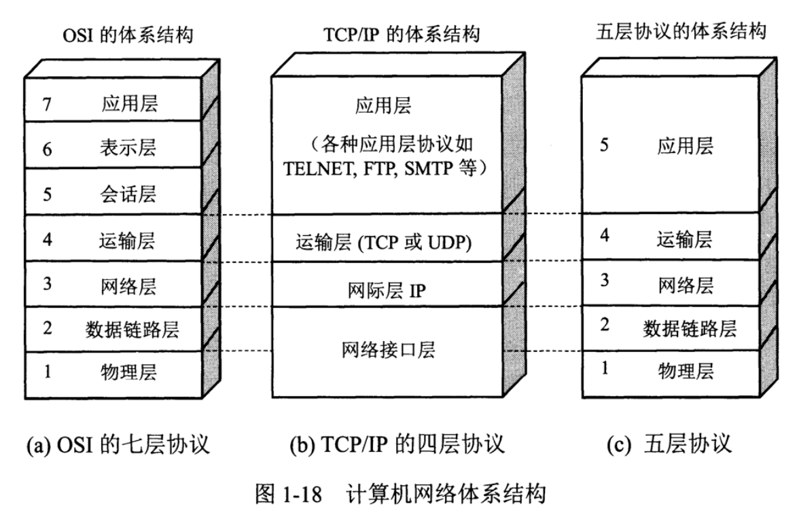
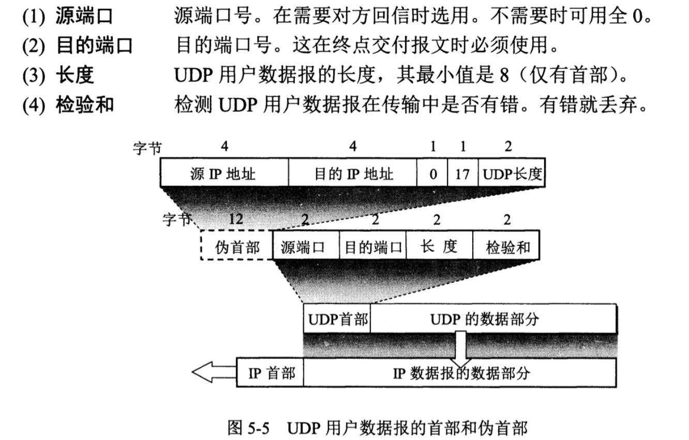

本文主要包含两个方面，一是从计算机网络分层模型出发，分析每一个层的功能，以及TCP/IP协议栈的实现；二是介绍TCP相关面试常考点。


#### 一. TCP/IP协议栈实现

开局一张图，计算机网络体系结构如下：



本文将采用右侧五层模型从下往上依次讲解，详细讲述每一层的协议和作用，并且会层层介绍Linux内核(2.6版本)如何实现协议栈，其中数据链路层、网络层和传输层属于内核(TCP/IP协议栈属于内核)，也是重点介绍的内容。

##### 1.物理层

**功能**：主要进行物理信号传输，负责A/D转换，即物理信号和数字信号之间的转换。

**交互中间设备**：转发器


##### 2.数据链路层

网络适配器工作在这一层，因此Mac地址属于这一层，需要进行差错控制等

**数据传输单位**：MAC帧

**交互中间设备**：网桥/桥接器(bridge)

**协议**：以太网协议

- 封装成帧（帧头SOH，帧尾EOT，中间为IP数据报），透明传输（ESC字节填充），差错检测（循环冗余检测CRC）
- 以太网MAC层的硬件地址，（计算机的硬件地址-MAC地址，在适配器的ROM中；软件地址-IP地址在存储器中）

**适配器**是什么？为什么要有适配器？

适配器（网络接口卡NIC+ROM+RAM等），适配器与局域网之间的通信通过电缆/双绞线以串行传输方式进行，与计算机之间的通信通过主板上IO以并行传输方式进行。两者数据率不一致，因此适配器需要缓存。

**Mac帧格式**如下图：


- 前12个字节表示目的地址和源地址(48位长)；在不同网络上传输时，mac地址会不断变化
- 接下来2个字节表示上层协议（0x0800 IP数据报）
- 接下来数据范围（46字节-1500字节）
- FCS，4个字节，采用CRC检验

以太网协议头实现：

```c
#define ETH_ALEN 	6
struct ethhdr {
  	unsigned char h_dest[ETH_ALEN];  // 6个字节目的地址
  	unsigned char h_src[ETH_ALEN];  // 6个字节源地址
  	unsigned short h_proto;  // 2个字节协议
};
```


##### 3.网络层

**交互中间设备**：路由器

本层主要介绍三个协议：IP协议，ICMP协议，以及ARP协议

**IP协议**；数据传输单位为**IP数据报**，向上为运输层提供数据(解包)，向下将运输层数据封装成包进行传输

不可靠（不能保证IP数据包成功到达目的地），无连接（每个数据报处理都是相互独立的，也不保序）

**网络字节序**：(4个字节的32bit值以大端字节序传输：0~7bit，8~15，16~23，24~31，因此大端字节序又称为网络字节序，因此在传输数据前，如果主机采用的是小端序，需要先转换成网络/大端字节序，再进行传输)

接下来介绍IP协议头的实现，以下为IP数据报头部固定20个字节，如下图：


- 版本：4位，IPv4/6
- 首部长度：4位
- 区分服务：1个字节服务类型TOS；4个bit，每一位分别表示最小时延，最大吞吐量，最高可靠性和最小费用，**只能置其中1个bit为1**，其它的都为0；例如**Telnet**将第一位置为1，表示最小时延，主要用来传输少量的交互数据。**FTP**文件传输要求最大吞吐量；
- 总长度：2个字节，首部和数据合总长度(2^16)
- 标识：2个字节，一个数据报对应一个标识（相同表示片组成同一数据包）
- 标志：3位，最低位MF（==1 还有分片，==0没有分片）；中间位DF（不能分片）
- 片偏移：13位，较长的分组分片后，某片在原分组中的位置
- 生存时间TTL：1个字节，数据报在网络中的寿命（最大跳数）
- 协议：1个字节，
- 首部检验合：2个字节，只检验数据报首部；
- 源地址+目的地址：各4个字节

IP协议头实现：

```c
struct iphdr {
  unsigned char version: 4,  // 4位版本号
    			head_len: 4;  // 4位首部长度
  unsigned char tos;  // 1个字节TOS服务类型
  unsigned short tot_len;  // 2个字节总长度
  unsigned short id;  // 2个字节表示
  unsigned short flag: 3,  // 3位标志
  				offset: 13;  // 13位片偏移
  unsigned char ttl;  // 1个字节生存时间
  unsigned char protocol;  // 1个字节协议
  unsigned short check;  // 2个字节首部检验和
  unsigned int saddr;  // 4个字节源地址
  unsigned int daddr;  // 4个字节目的地址
};
```

**ICMP协议**(网际控制报文协议)：为更有效转发IP数据报和提高交付成功机会。主要功能：确认IP是否成功到达目的地址，报告发送过程中IP包被废弃的原因和改善网络设置等。

- ICMP差错报文报告
  - 终点不可达消息，类型为3，分为网络不可达，主机不可达，协议不可达，端口不可达，需要分片但设置了不分片
  - 重定向消息，类型为5
  - 超时消息：类型11，
  - 重定向
- ICMP询问报文类型
  - 回送请求（Echo Request 类型8）和回送应答（Echo Reply 类型0）PING（直接只用网络层，没有经过传输层）
  - 时间戳请求和回答

traceroute(逐一增加ttl)是ICMP差错报文类型的使用，

- 追踪来去目的地时沿途经过的路由器：通过不断增加TTL实现，当TTL减少到0时，会返回ICMP差错报文（类型为超时）。直到到达目的IP
- 确认路径MTU：将IP包首部的分片禁止标志位设置为1，路由器不会对大数据包分片，进而将包丢弃，并返回一个ICMP不可达消息并携带数据链路上的MTU值。不可达消息类型为“需要分片但是设置了不分片。”

ping是ICMP询问报文的使用，通过回送消息判断所发送的数据包死否已经成功到达对端。


**ARP协议**(地址解析协议)：每台主机都有一个**ARP Cache(高速缓存)**，存有**本局域网上**各主机/路由器的**IP地址**到**MAC地址**的映射表。通过使用ARP，找到IP对应的MAC地址，**找不到则交给路由器处理（下一跳）**。因此MAC地址只在本局域网有效。ARP的功能是在32bit的IP地址和采用不同网络技术的硬件地址之间提供动态映射；IP地址和MAC地址的关联保存在ARP表中，由驱动程序和操作系统完成。


##### 4.运输层

网络层以上的**交互中间设备**：网关(gateway)

IP网络层角度：通信的端点是两台主机；运输层角度：通信端点是两台主机中的进程。

运输层向进程通信提供通用的数据传输服务，提供了TCP/UDP两种协议

- TCP传输控制协议：**面向连接**的、**面向字节流**的，**全双工**的，**可靠**的数据传输服务，数据传输单位为**报文**段(segment)；TCP连接的端点叫做socket（IP+Port).
- UDP用户数据报协议：**无连接的**，尽最大努力数据传输服务（**不可靠**），数据传输单位为**用户数据报**，一般用在对实时性和传输效率有一定要求的场景（下载，游戏等）

**UDP协议头：**



没有拥塞控制，首部开销小（8个字节）

**UDP协议头和udp数据包**

```c
// udp头部
struct udphdr {
  	unsigned short source;  // 源地址
  	unsigned short dest;  // 目的地址
  	unsigned short len;  // 数据报长度
  	unsigned short check;  // 检验和
};

// udp数据包
struct udppkt {
  	struct ethhdr eh;  // 以太网协议
  	struct iphdr	ip;  // ip协议
  	struct udphdr	udp;  // tcp协议
    // 柔性数组，没法知道数组长度 sizeof(body)==0
    // 使用情况：1. 长度不确定；2.长度可以通过计算出来不越界
  	unsigned char body[0];
};
```

**TCP协议头**


- 源端口+目的端口：各占2个字节
- 序号(Seq)：4个字节，报文段序号
- 确认号(Ack)：4个字节，期望收到对方下一个报文段第一个数据字节的序号
- 数据偏移：4位，
- 保留：4位
- 紧急URG：=1，表示紧急字段有效
- ACK：=1，则Ack字段有效
- PSH：推送，**告知对方这些数据包收到以后应该马上交给上层应用，不能缓存起来**
- RST：复位，**TCP出现严重差错，释放连接，重新建立连接**。
- SYN：在建立连接时用来同步信号，=1表示连接请求或者接受报文。
- FIN：用来释放一个连接，=1表示数据发送完毕。
- 窗口大小：2个字节，表示**发送报文段一方的接受窗口**。
- 校验和：2个字节，首部+数据
- 紧急指针：URG==1才生效

```c
struct tcphdr {
    unsigned short sport;
    unsigned short dport;
    unsigned int seqnum; // seq序列号，收到客户端，SYN==1生效
    unsigned int acknum; // Ack， server/client确认, ACK==1生效
    unsigned char hdrlen:4,
    			  resv:4;
    unsigned char cwr:1,
    			  ece:1,
    			  urg:1,
    			  ack:1,
    			  psh:1,  // 
    			  rst:1,
    		 	  syn:1,
    			  fin:1;
    unsigned shrot cw;	// 窗口大小
    unsigned short check;
    unsigned short urg_pointer;
};
```

**MSS，MSL等概念**


MSS：TCP报文段中**应用数据字段的最大长度**，不是TCP报文总长度。

MTU(以太网数据帧长度46~1500字节): 最大传输单元 (MTU = MSS + TCP头20字节+IP头20字节)，当IP层数据长度大于MTU时，IP层需要对数据进行分片（Fragmentation）

路径MTU：一个包从发送端传输到接收端，中间要跨越多个网络，每条链路的MTU都可能不一样，这个通信过程中最小的MTU称为路径MTU。


##### 5.应用层

最高层，应用程序之间进行通信（进程间通信），交互数据单元为**报文**(Message)


#### 二. TCP面试常考点

结合上面协议栈的实现（尤其是TCP首部头的实现），来讲解TCP面试常见点

**PART1: TCP三次握手，四次挥手相关问题？**

下面有两张图，第一张清楚展示了从建立连接到数据传输再到最后断开连接的整个过程，第二张为状态转移图。接下来会基于这两张图对TCP的三次握手和四次挥手进行讲解。


**三次握手建立连接：**（分配资源，告知对端初始化序列号）

1. 主动端调用connect发起连接，首先发送一个SYN包（将TCP首部SYN标记置为1），告诉被动端初始化序列号是x，这时主动端进入SYN_SENT状态，被动端处在Listen状态（调用listen后进入此状态）
2. 被动端收到SYN包后回复ACK表明已收到，并发送自己的初始化序列号y（将TCP首部SYN标记和ACK标记都置为1），被动端把这个连接信息放入SYN队列，进入SYN_RCVD状态
3. 主动端收到包后，回复一个ACK确认包，此时双方进入ESATABLISED状态，被动端把这个连接信息从SYN队列移除，并将其放入Accept队列中。

**四次挥手断开连接：**（回收资源，终止数据传输）

1. 主动端发送一个FIN包给被动端（TCP首部FIN标志置为1），表示没有数据传输，要求断开连接，这时主动端进入FIN_WAIT_1状态
2. 被动端收到FIN包后，回复一个ACK包，这时被动端进入CLOSE_WAIT状态，主动端收到ACK后进入FIN_WAIT_2状态
3. 被动端没有数据再发送后，也向主动端发送一个FIN包，被动端进入LAST_ACK状态
4. 主动端收到FIN包，并回复一个ACK包，主动端从FIN_WAIT_2状态进入TIME_WAIT状态。


**针对建立和断开连接有以下几个问题需要注意：**

1. **握手不一定都是3次？**

   可能出现4次握手情况，比如双方同时发起SYN队列建立连接时，如下图

   

2. **初始序列号（ISN，Inital Sequence Number）能固定吗？**

   不能。如果固定，双方建立连接后主动方发送的数据包被路由器缓存了（路由器是会出现缓存甚至丢弃数据包的），这是主动方挂掉了，然后又采用同样的端口连接到被动端，这时候如果上个连接被路由器缓存的数据包到了被动端，岂不是序列号完全错乱了？（`SO_REUSEADDR`允许端口重用：收到一个包后不知道属于新连接还是旧连接，也导致串包。）

   在RFC793中，初始化序列号是每4微秒加一，直到超时2^32，又从0开始回绕（大概4.5个小时）；这种方式递增也容易让攻击者猜到ISN的值（进而伪造RST包将连接强制关掉），因此一般采用在一个基准值上随机加。

   

3. **初始化连接时，如果主动方发送完SYN后就挂掉了，此时连接处于什么状态？如果大量这种连接出现会造成什么危害？以及如何解决？**

   被动方收到SYN包后就会将这个连接放入SYN半连接队列，一直占用服务器资源，如果大量这种连接会把SYN半连接队列的资源耗尽（这就是所谓的DDos攻击和SYN Flood），从而让正常连接无法得到处理。Linux提供了相应的超时机制，进行5次重发SYN-ACK包，时间间隔以此为1s, 2s,4s,8s,16s，因此需要63s才能断开连接。但是这个时间给了攻击者可乘之机。

   如何应对SYN Flood攻击：

   - 增加SYN连接数：tcp_max_syn_backlog
   - 减少SYN+ACK重试次数：tcp_synack_retries
   - SYN Cookie机制：tcp_syncookies, 原理为最后阶段才分配连接资源，服务端收到SYN包后，根据这个包计算一个Cookie值，作为握手第二步的序列号回复SYN+ACK，等对方回应ACK包时校验回复的ACK值是否合法，合法才握手成功分配资源。具体实现`linux/syncookies.c`

   

4. **什么是SYN队列，什么是Accept队列，listen中backlog参数是指啥？**

   **syn队列（半连接队列）**：服务端收到客户端的SYN包并回复SYN+ACK后，该连接的信息会被放入一个队列，即为SYN半连接队列（此使TCP处于非同步状态），SYN半连接队列由`tcp_max_syn_backlog`这个内核参数决定，如果队列满了，服务端会丢弃新来的SYN包，客户端在多次重发 SYN 包得不到响应而返回（connection time out）错误。但是，当服务端开启了 **syncookies**，那么 SYN 半连接队列就没有逻辑上的最大值了，且tcp_max_syn_backlog 设置的值也会被忽略。

   

   **accept队列（全连接队列）**：Server端收到SYN+ACK包的ACK后，会将连接信息从SYN半连接队列移到另一个队列，即为Accept全连接队列（TCP连接建立，三次握手完成）；accept 连接队列的大小是由 backlog 参数和（/proc/sys/net/core/somaxconn）内核参数共同决定，取值为两个中的最小值。当 accept 连接队列满了，协议栈的行为根据（/proc/sys/net/ipv4/tcp_abort_on_overflow）内核参数而定。

   - tcp_abort_on_overflow=1，全连接队列满后，服务端直接发送RST给客户端，客户端出现(connection reset by peer)错误。

   - tcp_abort_on_overflow=0，全连接队列满后，服务端会丢掉客户端发过来的ACK，随后重传SYN+ACK。

   ```c
   // accept队列去backlog和somaxconn的小者，syn队列大小也跟这两个参数相关，且syn队列略大于accept队列
   int sysctl_somaxconn = SOMAXCONN;
   asmlinkage long sys_listen(int fd, int backlog)
   {
       struct socket *sock;
       int err;
       if ((sock = sockfd_lookup(fd, &err)) != NULL) {
           // 取小者
           if ((unsigned) backlog > sysctl_somaxconn)
               backlog = sysctl_somaxconn;
           err = security_socket_listen(sock, backlog);
           if (err) {
               sockfd_put(sock);
               return err;
           }
           err=sock->ops->listen(sock, backlog);
           sockfd_put(sock);
       }
       return err;
   }
   ```

   

   半连接队列和全连接队列如下图：

   

   

   **listen, accept,send等系统调用：**

   - listen：`listen(fd, backlog)`中第二个参数`backlog`就表示accept队列长度（LInux kernel 2.2之后 ），服务端调用listen后，TCP状态从CLOSE状态变成LISTEN状态，同时在内核创建半连接队列和全连接队列。
   - accept：`clientfd = accept(listenfd, addr)`
     - 从accept队列中取出一个节点
     - 为该节点分配一个fd，将节点与fd一一对应，（fd --  节点 -- 五元组(sip, dip, sport, dport, proto），fd通过五元组判断客户端的唯一性)
     - 当accept队列为空，则阻塞直到有数据，通过条件变量实现
   - send：`send(fd)`通过fd找到五元组并找到对应的客户端

   

5. 什么是TFO（Tcp Fast Open）快速打开：

   分为两阶段：请求Fast Open Cookie和TCP Fast Open

   - 客户端发送一个SYN包，头部包含Fast Open选项，且该选项的Cookie为空，这表明客户端请求Fast Open Cookie
   - 服务端收到SYN包后，生成一个cookie值
   - 服务端发送SYN+ACK包，在Options的Fast Open选项中设置cookie的值
   - 客户端缓存服务端的IP和收到的cookie值
   - 进行数据传输...

   之后，客户端有了缓存在本地的cookies值：

   - 客户端发送SYN数据包，里面包含**数据**和之前缓存在本地的Fast Open Cookie（之前SYN包不含数据）
   - 服务都那检验TFO Cookie和是否合法，合法则返回SYN+ACK+数据
   - 客户端发送ACK包
   - 进行数据传输...

   

6. **四次挥手能不能变成三次？**

   可以。被动端收到主动端的FIN包后，也没有数据要发送了，就把对ACK包和自己的FIN包同时发送给主动端，这样四次挥手变成三次。

   

7. **如果双端同时发起断开连接的FIN包，TCP状态如何转移呢？**

   双方同时发送FIN包后两者都进入FIN_WAIT_1状态，如果FIN_WAIT_1状态收到FIN包，会直接进入CLOSING状态，在CLOSING状态下收到自己发送的FIN包的ACK包后，进入TIME_WAIT状态，即双方可能出现完全一样的状态，并同时进入TIME_WAIT状态，如下图：

   


**PART2: TIME_WAIT状态问题**

1. 为什么要有TIME_WAIT状态？

   如果没有TIME_WAIT状态，主动方发送对FIN的ACK包后就关掉，而ACK包在路由过程中丢掉了，被动方没有收到，就会超时重传FIN数据包，此时主动方已经关闭，被动方便无法正常关闭连接；所以需要有TIME_WAIT状态**以便能够重发丢掉的被动方的FIN的ACK包**。且TIME_WAIT状态需要保持2*MSL（Max Segment Life Time TCP报文在网络中的最大生存时间）。

   

2. TIME_WAIT会带来哪些问题？

   由于TIME_WAIT状态需要等待2*MSL，才能断开连接释放占用的资源。会造成以下问题：

   - 作为服务端，短时间内存关闭了大量的client连接，会造成服务器上出现大量的TIME_WAIT状态的连接，占据大量的tuple，严重消耗服务器资源
   - 作为客户端，短时间内大量的断开连接，会大量消耗客户端机器的端口，毕竟端口只有65535个，端口被耗尽，便无法发起新的连接。

   可以进行TIME_WAIT的快速回收和重用来缓解。

   

3. TIME_WAIT的快速回收和重用

   1. TIME_WAIT快速回收

      Linux同时打开`tcp_tw_recycle`和`tcp_timestamps`(默认打开)两个选项开启快速回收

      Linux下快速回收的时间为3.5 * RTO（Retransmission Timeout）。但是，开启快速回收TIME_WAIT，可能造成同时满足以下三种情况导致新连接被拒绝：

      - 来自同一对端的TCP包携带了时间戳
      - 之前某一台机器的某个tcp数据在MSL时间内到过本服务器
      - 机器新连接的时间戳小于上次TCP到来的时间戳，且差值大于重放窗口戳(TCP_PAWS_WINDOW)。

      >  NAT（Network Address Translator）出现是为了缓解IP地址耗尽的临时方案，
      >
      >  NAT：允许一个整体机构以一个公用IP（Internet Protocol）地址出现在Internet上，内部私有网络地址（IP地址）翻译成合法网络IP地址的技术
      >
      >  NAT分为三种：静态NAT(Static NAT)、动态地址NAT(Pooled NAT)、网络地址端口转换NAPT（Port-Level NAT）

      但是需要考虑**NAT（Network Address Translation网络地址转换）**：在一个 NAT 后面的所有机器在服务端看来都是一个机器（同一个公网IP），NAT 后面的那么多机器的系统时间戳很可能不一致，有些快，有些慢，会导致丢包无法连接的情况，尤其在上网高峰期，由于网络的拥塞，**可能会导致先发出的 TCP 包后到达服务器的情况，导致服务器不响应**。

      

   2. TIME_WAIT重用

      Linux同时开启`tcp_tw_reuse`选项和`tcp_timestamps`选项开启TIME_WAIT重用，还有一个条件：重用 TIME_WAIT 的条件是收到最后一个包后超过 1s。只要满足下面两个点中的一点，一个TW状态的四元组(即一个socket连接)可以重新被新到来的SYN连接使用：

      - 新连接SYN告知的初始序列号比TIME_WAIT老链接的序列号大
      - 新到来的连接的时间戳比老连接的时间戳大

      重用在NAT环境下，依然存在风险，因为时间戳重用 TIME_WAIT 连接的机制的前提是 IP 地址唯一性，而NAT环境下所有的机器都属同一个公网IP。

      重用其实没有解决TIME_WAIT造成的资源消耗问题，Linux中可以通过修改tcp_max_tw_buckets这个值来控制并发的TIME_WAIT数量。

      

**PART3: TCP的可靠性和流量控制问题**

TCP可靠性表现在：

- 对每个包提供校验和
- 包的序列号解决了乱序，重复问题
- 重传机制
- 流量控制，拥塞控制机制

1. TCP确认机制

   如果TCP对每个SYN包都进行确认，那么网络中会出现大量ACK包，消耗大量带宽，降低网络利用率。因此通过延时确认机制和累计式确认机制来减少ACK包数量，并且将ACK包和数据一起传输提高效率。

   - 累计式确认机制：即确认号X的确认表明所有X之前但不包括X的数据已经收到，而不是对所有顺序包进行ACK

   - 采用延迟确认，ACK在收到数据后并不马上回复，而是延迟一段时间再回复

     

2. TCP重传机制

   - 超时重传：发送完SYN包之后会开启一个timer，timer到了还没有收到ACK的话，就重传SYN。那么这个timer如何设置呢？如果太短的话ACK可能还在路上，会造成重传浪费，过多的重传会造成网络拥塞，进一步加剧数据丢失，太长的话，效率又太差。因此，合理的做法就是应当根据网络实际情况进行调整，一般根据往返时间RTT(Round Trip Time)来设置RTO(Retransmission TimeOut)，一般RTO稍微大于RTT。

   - 快速重传：如果连续收到3次相同确认号ACK的包，就立刻进行重传，因为连续收到3个相同ACK，表明当前网络状态好。

   - SACK确认机制（Selective Acknowledement机制）：这种重传方法不会重传丢失的第一个包后面的所有包，而是只针对性的传丢失的包，在TCP首部Option字段中加上SACK即可开启。

     

3. 流量控制

   TCP首部有一个2个字节大小的Window字段，其最大为(2^16=65535)个字节。还有一个TCP窗口扩大因子，来用扩大大Window大小。这个窗口是**接收端告诉发送端自己还有多少缓冲区可以接收数据**，发送端根据这个窗口来调整发送数据的速率，进而达到端对端的流量控制。

   TCP把要发送的数据放入发送缓冲区(Send Buffer)，接收到的数据放入接收缓冲区(Receive Buffer)，应用程序会不停的读取接收缓冲区的内容进行处理；

   流量控制做的事情就是，如果接收缓冲区已满，发送端应该停止发送数据，为了控制发送端速率，接收端会告知客户端自己接收窗口rwnd，也就是接收缓冲区中的空闲部分。

   

   1. **滑动窗口工作原理**

      发送端维护一个跟接收端大小一样的发送窗口，窗口内的可发，窗口外的不可，窗口在发送序列上不断后移。如下图：

      

      从上图可看出，TCP发送端数据可分为4类，其中2，3两部分合起来称之为发送窗口，从左往右依次为：

      - 已经发送并得到接收端ACK的
      - 已经发送但未收到接收端ACK的
      - 未发送但允许发送的（接收方还有空间）
      - 未发送且不允许发送的（接收方没空间）

      下图演示窗口滑动情况，收到36的ACK后，窗口向后滑动5个Byte

      

      

   2. **0窗口问题**

      如果发送端收到一个0窗口，发送端是不能再发送数据的，如下图：

      

      但是如果接收端一直发送0窗口呢？发送端会一直等待吗？答案是否定的。TCP采用Zero Window Probe（ZWP零窗口探测）技术，发送端窗口变成0后，会ZWP给接收端，来探测窗口大小，三次探测后如果还是0的话，会RST调这个连接。

      DDos攻击点：攻击者与服务端建立连接后，向服务端通知一个0窗口，服务端只能等待ZWP，如果攻击者发送大量这样的请求，会耗尽服务端资源。

      

   3. **糊涂窗口综合征问题（Silly Window Syndrome）**

      也即小包问题，如果20个字节TCP首部，20个字节IP首部，只传4个字节的数据，那未免太浪费资源了，造成这个问题主要有以下两个原因：

      - 接收端一直在通知一个小窗口
      - 发送端本身一直在发送小包

      针对上述问题，分别由两种解决方案：

      - Nagle算法：接收端不通知小窗口，仅长度大于MSS，或包含FIN，或设置了TCP_NODELAY，或超时等情况才会立即发送；（因此可以通过设置TCP_NODELAY来禁用Nagle算法`setsockopt(..., TCP_NODELAY)`）

      - 发送端积累一下数据再发送

        

4. **拥塞控制**

   既然有了流量控制，为啥还需要拥塞控制？因为流量控制针对的是端对端，只能看到对端情况，无法知道整个链路上的状况，只要双方处理能力强，就可以很大速率发包，造成链路拥堵，引起大量丢包，大量丢包会导致大量重传，进一步加剧链路拥塞。因此需要拥塞控制来维护整个网络的交通，在之前接收窗口(rwnd)的基础上，加入一个拥塞窗口(cwnd)，发送端真正窗口=min(rwnd, cwnd).

   拥塞控制主要包括四个部分：慢启动算法，拥塞避免算法，快速重传算法，快速恢复算法。

   1. 慢启动算法

      慢启动体现了一个**试探**的过程，刚接入网络的时候先发包慢点，探测一下网络情况，然后在慢慢提速。不要一上来就拼命发包，这样很容易造成链路的拥堵，出现拥堵了在想到要降速来缓解拥堵这就有点成本高了，毕竟无数的先例告诫我们先污染后治理的成本是很高的。步骤如下：

      - 连接建好初始化cwnd = N
      - 每接收一个ACK，++cwnd，线性上升
      - 每过一个RTT，cwnd = cwnd * 2, 指数上升
      - 慢启动门限ssthresh(slow start threadhold)，当cwnd >= ssthresh，进入拥塞避免算法

   2. 拥塞避免算法

      - 每收到一个ACK，cwnd=(cwnd + 1 / cwnd) * MSS个字节
      - 每经过一个RTT时长，cwnd+=1

   3. 快速重传算法

      （正常重传需要等几百毫秒）当接收端收到一个不按序到达的数据段时，TCP立刻发送1个重复ACK，当发送端收到3个或以上重复ACK，就意识到之前发的包可能丢了，就立马重传，而不用等重传定时器超时再重传。并进入快速恢复阶段，步骤如下：

      - 调整门限sthresh的值为当前cwnd的1/2
      - 将cwnd设置为新的ssthresh
      - 重新进入拥塞避免阶段

   4. 快速恢复算法

      解释为网络轻度拥塞，步骤如下：

      - 拥塞阈值ssthread降低为cwnd的一半;
      - 拥塞窗口cwnd设置为ssthresh 
      - 拥塞窗口线性增加

      

**PART4: TCP粘包、拆包及解决方法**

1. 什么是粘包、拆包？

   假设 Client 向 Server 连续发送了两个数据包，用 packet1 和 packet2 来表示，那么服务端收到的数据可以分为三种情况，现列举如下：

   **第一种情况**，接收端正常收到两个数据包，即没有发生拆包和粘包的现象。

   

   **第二种情况**，接收端只收到一个数据包，但是这一个数据包中包含了发送端发送的两个数据包的信息，这种现象即为粘包。这种情况由于接收端不知道这两个数据包的界限，所以对于接收端来说很难处理。

   

   **第三种情况**，这种情况有两种表现形式，如下图。接收端收到了两个数据包，但是这两个数据包要么是不完整的，要么就是多出来一块，这种情况即发生了拆包和粘包。这两种情况如果不加特殊处理，对于接收端同样是不好处理的。

   

2. 为什么TCP有粘包和拆包，而不说UDP？

   UDP 是基于报文发送的，**UDP首部采用了 16bit 来指示 UDP 数据报文的长度**，因此在应用层能很好的将不同的数据报文区分开，从而避免粘包和拆包的问题。

   而 TCP 是**基于字节流**的，虽然应用层和 TCP 传输层之间的数据交互是大小不等的数据块，但是 TCP 并没有把这些数据块区分边界，仅仅是**一连串没有结构的字节流**；另外从 TCP 的帧结构也可以看出，在 **TCP 的首部没有表示数据长度的字段**，基于上面两点，在使用 TCP 传输数据时，才有粘包或者拆包现象发生的可能。

   另外，TCP短连接不用处理分包，因为发送方主动关闭连接后，表示一条消息发送完毕，接收方read返回0，从而知道消息的结尾；只有长连接采用处理

   

3. 为什么会发生TCP粘包、拆包？

   - 要发送的数据大于TCP发送缓冲区剩余空间大小（由接收端窗口决定，流量控制），将会进行拆包

   - 待发送数据大于MSS（最大报文长度），TCP在传输前将进行拆包

   - 要发送的数据小于TCP发送缓冲区的大小，TCP将**多次写入缓冲区的数据一次发送出去**，将会发生粘包

   - 接收端应用层没有及时读取接收缓冲区中的数据，将会发生粘包

     

4. 粘包、拆包解决办法

   由于 TCP 本身是面向字节流的，无法理解上层的业务数据，所以在底层是无法保证数据包不被拆分和重组的，这个问题只能通过**上层的应用协议栈设计来解决**，根据业界的主流协议的解决方案，归纳如下

   - **消息定长**：发送端将每个数据包封装为固定长度（不够的可以通过补 0 填充），这样接收端每次接收缓冲区中读取固定长度的数据就自然而然的把每个数据包拆分开来。
   - **设置消息边界**：服务端从网络流中按消息边界分离出消息内容。在包尾增加回车换行符进行分割，例如 FTP 协议。
   - **消息头+消息体结构**：消息头中包含表示消息总长度（或者消息体长度）的字段；收到包时，先接收固定字节数的头部，解出这个包完整长度，按照此长度接收包体。（这是目前网络应用中用的最多）；比如，每个消息有4字节长度，以网络序存放字符串长度，比如"hello" 和 "world!"两条消息，打包后的字节流为`0x00, 0x00, 0x00, 0x05,'h','e','l','l','o',0x00,0x00,0x00,0x06,'w','o','r','l','d','!'`
   - **利用消息本身的格式来分包**：比如XML格式的消息中...的配对，JSON格式中的{...}配对。解析这种消息格式通常会用到状态机。


##### TCP短连接和长连接的区别？

**短连接**：Client向Serer发送消息，Server回应Client，一次读写完成，双方都可发起close操作。适用于web网站

**长连接**：Client与Server完成一次读写后，双方不会主动关闭连接。**靠心跳维持**，需要一定的系统开销，适用于频繁交互的场景，如即时通信工具：微信，游戏等


##### 发送缓冲区和接收缓冲区


用户态进程调用描述符上的read，它会导致内核从其接收缓冲区中删除数据，并将该数据复制到此进程调用所提供的缓冲区中。

用户态调用write时，会将数据从用户提供的缓冲区复制到内核写入队列，内核再将数据从写入队列复制到NIC中。

首先网卡将接收到的数据放到内核缓冲区，内核缓冲区存放的数据根据TCP信息将数据移动到具体的某一个TCP连接上的接收缓冲区内，也就是TCP接收滑动窗口内，然后应用程序从TCP的接收缓冲区内读取数据，如果应用程序一直不读取，那么滑动窗口会变小，直至为0

TCP发给对方的数据，对方在收到数据时必须给矛确认，**只有在收到对方的确认时，本方TCP才会把TCP发送缓冲区中的数据删除**。

UDP因为是不可靠连接，不必保存应用进程的数据拷贝，应用进程中的数据在沿协议栈向下传递时，以某种形式拷贝到内核缓冲区，**当数据链路层把数据传出**后就把内核缓冲区中数据拷贝删除。**因此它不需要一个发送缓冲区**。

tcp socket的发送缓冲区实际上是一个结构体**struct sk_buff**的队列，我们可以把它称为**发送缓冲队列**，分配一个struct sk_buff是用于存放一个tcp数据报


##### packetdrill

最后介绍一个学习TCP的工具packeetdrill。其它实例[参考这里](https://github.com/arthur-zhang/tcp_ebook)

packetdrill原理：在执行脚本前创建了一个名为tun0的虚拟网卡，脚本执行完后，tun0会被销毁。该虚拟网卡对应于操作系统中/dev/net/tun文件，每次程序通过write等系统调用将数据写入到这个文件fd时，这些数据会经过tun0这个虚拟网卡，将数据写入到内核协议栈，read系统调用读取数据的过程类似。协议栈可以向操作普通网卡一样操作虚拟网卡tun0.

##### packetdrill example

使用packetetdrill构造一个SYN_SENT状态

```shell
# 构造一个SYN_SENT状态的连接
+0 socket(..., SOCK_STREAM, IPPROTO_TCP) = 3  // 新建一个server socket
+0 connect(3, ..., ...) = -1  // 客户端connect
```

执行netstat命令可查看相关状态

````shell
 netstat -atnp | grep -i 8080
 tcp 0 ... SYN_SENT
````

SYN包重传了6次后关闭连接，通过参数tcp_syn_retries可以看到

```shell
cat /proc/sys/net/ipv4/tcp_syn_retries
```


tcpdump抓包指令使用

```shell
$ tcpdump -i any
-i 指定哪个网卡，any表示任意，有哪些网卡可以用ifconfig来查看
# 过滤主机：host选项
tcpdump -i any host 10.211.55.2  # 只查看10.211.55.2的网络包，ip可以源地址，也可以是目的地址
# 过滤源地址，目的地址：src，dst
tcpdump -i any src 10.211.55.10  # 只抓取hostnum发出的包
tcpdump -i any dst hostnum # 只抓取hostunm收到的包
# 过滤端口，port选项
tcpdump -i any port 80  # 只查看80端口
```


> 参考：
>
> 《计算机网络》
>
> 《TCP/IP详解 卷一》
>
> 《Tcp小册》