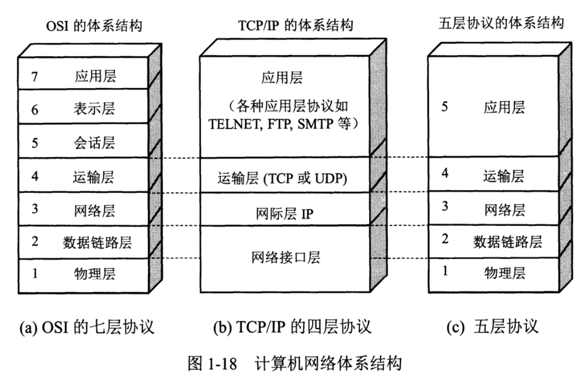
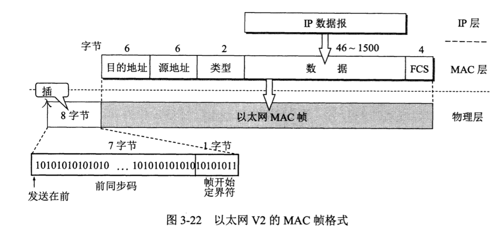
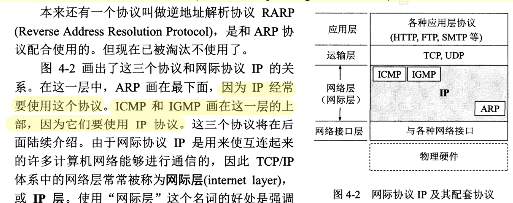
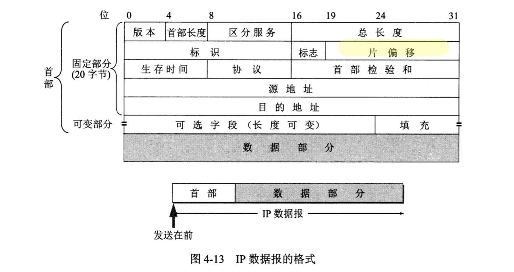
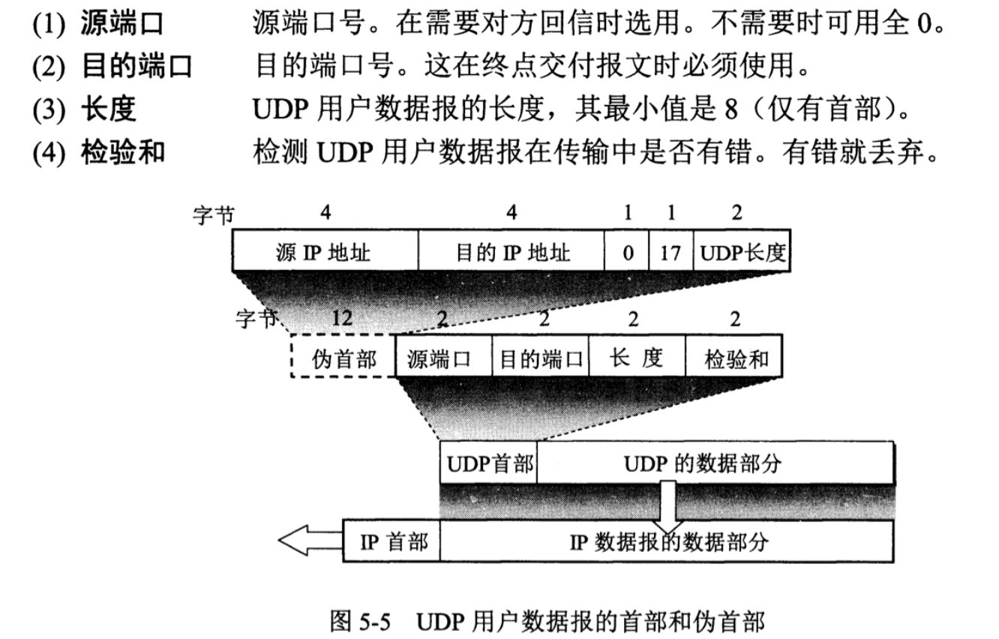
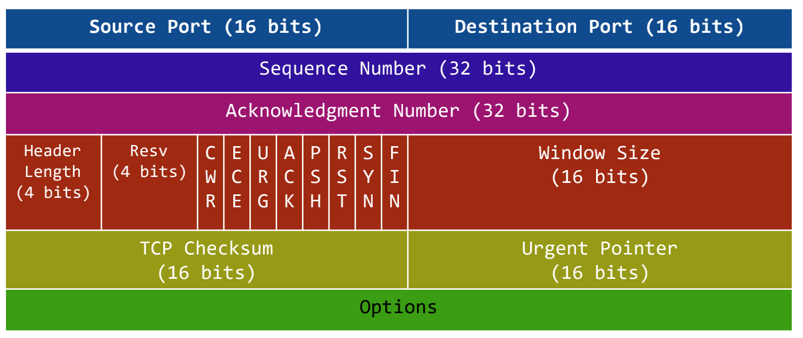
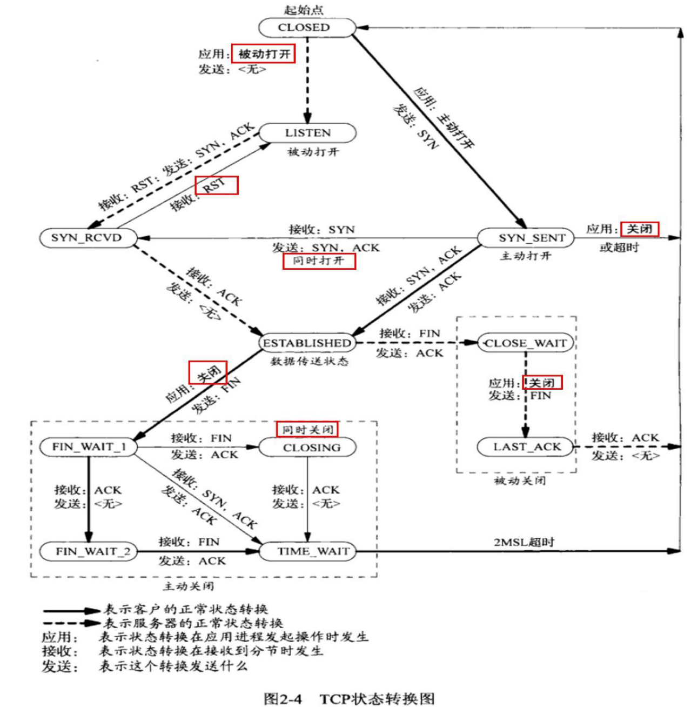

协议栈(protocol stack)设计和实现

问题：

1. 滑动窗口如何实现
2. sk_buff是什么？
3. TCP_NODELAY设置，抓包后是N个包？
4. Epoll检测网络IO，水平触发和边沿触发如何判断
5. DDOS？
6. UDP广播？


#### 一. 计算机网络体系结构



- 应用层：最高层，应用程序之间进行通信（进程间通信），交互数据单元为**报文**(Message)
- 运输层：使用TCP/UDP协议，向进程通信提供通用的数据传输服务
  - TCP传输控制协议：面向连接的、可靠的数据传输服务，数据传输单位为**报文**段(segment)
  - UDP用户数据报协议：无连接的，尽最大努力数据传输服务（不可靠），数据传输单位为**用户数据报**
- 网络层：IP协议；数据传输单位为**IP数据报**，向上为运输层提供数据(解包)，向下将运输层数据封装成包进行传输
- 数据链路层：具有Mac地址，数据传输单位为MAC**帧**；需要进行差错控制等。（MAC地址只在局域网有效）【数字信号01？？？？】
- 物理层：传输单位为bit；进行A/D转换；【光电信号？？？】

其中在**内核**中的为：数据链路层，网络层，运输层，TCP/IP协议栈是在内核中的。

网卡（网络适配器）：工作在物理层和数据链路层之间，【处理光电信号与数字信号之间的转化，即AD转化？？？？】

ARP协议：确认mac地址来源，

IP地址和MAC地址的关联保存在ARP表中，由驱动程序和操作系统完成。


**将网络互相连接需要使用一些中间设备**：

- 物理层：转发器
- 数据链路层：网桥/桥接器(bridge)
- 网络层：路由器
- 网络层以上：网关(gateway)


#### 二，协议栈实现

#### 1. 数据链路层以太网协议

- 封装成帧（帧头SOH，帧尾EOT，中间为IP数据报），透明传输（ESC字节填充），差错检测（循环冗余检测CRC）
- 以太网MAC层的硬件地址，（计算机的硬件地址-MAC地址，在适配器的ROM中；软件地址-IP地址在存储器中）
- 适配器、转发器、集线器、网桥、以太网交换机作用以及使用场合

适配器（网络接口卡NIC+ROM+RAM等），适配器与局域网之间的通信通过电缆/双绞线以串行传输方式进行，与计算机之间的通信通过主板上IO以并行传输方式进行。两者数据率不一致，因此适配器需要缓存。

**帧格式：**

- 前12个字节表示目的地址和源地址(48位长)；在不同网络上传输时，mac地址会不管变化
- 接下来2个字节表示上层协议（0x0800 IP数据报）
- 接下来数据范围（46字节-1500字节）
- FCS，4个字节，采用CRC检验



**以太网协议头**：

```c
#define ETH_ALEN 	6
struct ethhdr {
  	unsigned char h_dest[ETH_ALEN];
  	unsigned char h_src[ETH_ALEN];
  	unsigned short h_proto;
};
```


#### 2. 网络层IP协议



工作在网络层的协议除了IP协议，还有三个协议：

- **地址解析协议ARP**(Address Resolution Protocol)

  每台主机都有一个**ARP Cache**，存有**本局域网上**各主机/路由器的**IP地址**到**MAC地址**的映射表。通过使用ARP，找到IP对应的MAC地址，**找不到则交给路由器处理**。因此MAC地址只在本局域网有效。

  如果找到则介入MAC再通过局域网发送，如果找不到则运行ARP；如果在同一个局域网中，则找到下一跳（路由器），直到找到对应的地址。（Ping， TTL就是一跳一跳）

- 网际控制报文协议ICMP(Internet Control Message Protocol)、

- 网际组管理协议IGMP;

**IP格式**



ip头部固定20个字节；

**网络字节序**：(4个字节的32bit值以大端字节序传输：0~7bit，8~15，16~23，24~31，因此大端字节序又称为网络字节序，因此在传输数据前，如果主机采用的是小端序，需要先转换成网络/大端字节序，再进行传输)

- 版本：4位，IPv4/6
- 首部长度：4位
- 区分服务：1个字节服务类型TOS；4个bit，每一位分别表示最小时延，最大吞吐量，最高可靠性和最小费用，**只能置其中1个bit为1**，其它的都为0；例如**Telnet**将第一位置为1，表示最小时延，主要用来传输少量的交互数据。**FTP**文件传输要求最大吞吐量；
- 总长度：2个字节，首部和数据合总长度(2^16)
- 标识：2个字节，一个数据报对应一个标识（相同表示片组成同一数据包）
- 标志：3位，最低位MF（==1 还有分片，==0没有分片）；中间位DF（不能分片）
- 片偏移：13位，较长的分组分片后，某片在原分组中的位置
- 生存时间TTL：1个字节，数据报在网络中的寿命（最大跳数）
- 协议：1个字节，
- 首部检验合：2个字节，只检验数据报首部；
- 源地址+目的地址：各4个字节

**IP协议头**

```c
struct iphdr {
  unsigned char version: 4,
    			head_len: 4;
  unsigned char tos;
  unsigned short tot_len;
  unsigned short id;
  unsigned short flag: 3,
  				offset: 13;
  unsigned char ttl;
  unsigned char protocol;
  unsigned short check;
  unsigned int saddr;
  unsigned int daddr;
};
```

**网际控制报文协议ICMP**

为更有效转发IP数据报和提高交付成功机会。

- ICMP差错报文报告
  - 终点不可达
  - 时间超过
  - 参数问题
  - 重定向
- ICMP询问报文
  - 回送请求和回答PING（直接只用网络层，没有经过传输层）
  - 时间戳请求和回答

traceroute（逐一增加ttl）


#### 3. 运输层协议TCP/UDP

滑动窗口，流量控制，拥塞控制

**IP网络层角度：通信的端点是两台主机；运输层角度：同时是两台主机中的进程。**


**UDP**

UDP用户数据报协议：无连接的，尽最大努力数据传输服务（不可靠），数据传输单位为**用户数据报**

没有拥塞控制，首部开销小（8个字节）



**UDP协议头和udp数据包**

```c
struct udphdr {
  	unsigned short source;
  	unsigned short dest;
  	unsigned short len;
  	unsigned short check;
};

struct udppkt {
  	struct ethhdr eh;
  	struct iphdr	ip;
  	struct udphdr	udp;
    // 柔性数组，没法知道数组长度 sizeof(body)==0
    // 使用情况：1. 长度不确定；2.长度可以通过计算出来不越界
  	unsigned char body[0];
};
```


UDP应用场景（实时性与传输效率）

- 下载（迅雷下载）
- 游戏（实时性强）


**TCP**

TCP传输控制协议：面向连接的、面向字节流stream（流入进程或进程流出的字节序列），全双工的，可靠的（无差错，不丢失，不重复，按序达）数据传输服务，数据传输单位为**报文**段(segment);

TCP连接的端点叫做socket（IP+Port）。

**TCP格式**



- 源端口+目的端口：各占2个字节
- 序号(Seq)：4个字节，报文段序号
- 确认号(Ack)：4个字节，期望收到对方下一个报文段第一个数据字节的序号
- 数据偏移：4位，
- 保留：4位
- 紧急URG：=1，表示紧急字段有效
- ACK：=1，则Ack字段有效
- PSH：推送
- RST：复位，**TCP出现严重差错，释放连接，重新建立连接**。
- SYN：在建立连接时用来同步信号，=1表示连接请求或者接受报文。
- FIN：用来释放一个连接，=1表示数据发送完毕。
- 窗口大小：2个字节，表示**发送报文段一方的接受窗口**。
- 校验和：2个字节，首部+数据
- 紧急指针：URG==1才生效

**TCP协议头**

```c
struct tcphdr {
    unsigned short sport;
    unsigned short dport;
    unsigned int seqnum; // seq序列号，收到客户端，SYN==1生效
    unsigned int acknum; // Ack， server/client确认, ACK==1生效
    unsigned char hdrlen:4,
    			  resv:4;
    unsigned char cwr:1,
    			  ece:1,
    			  urg:1,
    			  ack:1,
    			  psh:1,
    			  rst:1,
    		 	  syn:1,
    			  fin:1;
    unsigned shrot cw;	// 窗口大小
    unsigned short check;
    unsigned short urg_pointer;
          
      
};
```


MMS：TCP报文段中**数据字段的最大长度**，不是TCP报文总长度。


**滑动窗口**

动态滑动窗口包含三部分数据：1. 已经发送且确认；2. 已经发送还未确认；3. 等待发送

**如何确定窗口大小？**

ACK带过来滑动窗口大小，ACK 等于 下一个未发送的数据包，即下一个待发送数据报序列号Seq；

窗口：[ACK, ACK + Windows size]

**如何保序？**

延时确认：收到包，重置定时器，等待200ms，超时则检查，确认ack前的数据全部收到；

FIN包发送失败，对方没有收到ACK，会超时重传。

**TCP状态图**



**TCP三次握手**

**syn队列（半连接队列）**：第一次发syn给服务端的客户端，服务端用队列保存（一个节点对应一个客户端）；DDos攻击/Syn Floor，是因为syn队列有长度限制，大量非法连接进入syn队列，会导致有用的连接进不来。

**accept队列（全连接队列）**：三次握手完成后将syn队列中相应的客户端节点move到这里。

`listen(fd, backlog)`中第二个参数`backlog`就表示syn队列长度(syn+accept共同长度)

`clientfd = accept(listenfd, addr)`中accept作用：

1. 从accept队列中取出一个节点
2. 为该节点分配一个fd，将节点与fd一一对应，（fd --  节点 -- 五元组(sip, dip, sport, dport, proto），fd通过五元组判断客户端的唯一性)
3. 当accept队列为空，则阻塞直到有数据，通过条件变量实现

`send(fd)`通过fd找到五元组并找到对应的客户端

**TCP四次挥手：**

CLIENT：


SERVER:


**Q1: 主动方处于FIN_WAIT_2状态，被动方一直没有发送close，主动方如何终止这个状态？**

A：首先这个状态下，主动方依旧可以发送数据，被动方依旧可以收到，但是被动方无法发送数据，处于半关闭状态。这个状态没办法直接终止，除非杀掉进程。

**Q2: TIME_WAIT的作用？**

避免最后一次ACK丢失情况，时间一般为2 * MSL；因为如果被动方发送FIN后没有收到ACK包，会超时重传；

一个包的存活时间为MSL；

**Q3: FIN与ACK同时发送，会出现什么情况？为什么会出现这种情况？**

被动方直接进入CLOSING状态；recv后再close，由于延时发送机制，ACK和FIN是可以一起发送的。

**Q4：出现大量TIME_WAIT的原因，如何解决？**

TIME_WAIT设置时间过长；将TIME_WAIT状态设置可重用, 让其尽快回收，

```shell
/etc/sysctl.conf中设置 开启SYN Cookies，

echo "1" > /proc/sys/net/ipv4/tcp_tw_reuse   # 可重用

echo "1" > /proc/sys/net/ipv4/tcp_tw_recyle		# 回收
```


**Q5: 出现大量CLOSE_WAIT的原因，如何解决：**

现象：too many open files

原因：被动方未关闭socket造成（recv后没有close）

解决：1. 设置超时，启用socket keepalive机制 /proc/sys/net/ipv4/tcp_keepalive_time；2. 修改文件限制cat /prop/sys/fs/file-max;  /etc/security/limits.conf


网络编程接口：socket，listen，accept，send，recv，close，connect，bind。

其中具有send功能的：connect，close，send


**滑动窗口，流量控制，拥塞控制，慢启动机制(c = 2 ^ c)。**


#### 三，用户态协议栈Netmap

nginx/skynet/zeromq/redis全部使用linux内核协议栈


- netmap是一个**高性能收发原始数据包**的框架，由Luigi Rizzo等人开发，包含了内核模块以及用户态库函数，

  其目标是：不修改现有操作系统软件以及不需要特殊硬件支持，**实现用户态和网卡之间数据包的高性能传**递。

- netmap通过自带的网卡驱动直接接管网卡，运行时申请一块固定的内存池，通过mmap实现网卡数据包与内存之间的

  映射；

  现在**网卡都使用多个buffer来发送和接受packet，并有一个叫NIC ring的环形数组**，NIC ring是静态分配的，它的槽指向mbufs链的部分缓冲区buffers

  netmap内存映射网卡的packet buffer到用户态，实现了自己的发送和接受报文的`circular ring`来对应网卡的ring，使用netmap时，程序运行在用户态，

  即使出了问题也不会crash操作系统。

netmap使用poll等待网卡的文件描述符的事件(可读可写)；

netmap会建立一个字符设备`/dev/netmap`，然后通过`nm_open`来注册(接管)网卡为netmap模式

（网卡进入netmap模式后，ifconfig是看不到网卡统计信息变化的，ping也不同，wireshark也抓不到报文，因为内核协议栈被旁路了）

**为什么要使用用户态协议栈？**

**`netmap`优势**

- 性能高

  - 数据包不走传统内核协议栈，不需要层层解析，减少处理数据包的时间；
  - 用户态直接与网卡的接受和发送环交互，可减少系统调用
  - 不需要进行数据包的内存内配，采用**数据包池**(内核维护？)，有数据到达时，直接从数据包池中取出一个数据包，然后将数据放入此数据包`pkt_buf`中，再将数据包的描述符放入接收环`netmap_ring`中。
  - 减少数据copy次数，数据包(内存)采用`mmap`技术映射到用户态，实现零拷贝。

- 稳定性高

  网卡寄存器数据的维护都在内核模块进行，用户不会直接操作寄存器。所以用户态操作时，不会导致操作系统崩溃

- 亲和性

  可采用`cpu`亲和性，实现`cpu`和网卡绑定，提高性能

- 易用性好

  API操作简单，用户态只需要调用ioctl函数即可完成数据包收发工作

- 与硬件解耦

  不依赖硬件，只需要对网卡驱动程序稍微做点修改就可使用。传统网卡驱动将数据包传送给内核协议栈，而修改后的数据包直接让如**netmap_ring**供用户使用

**内核协议栈流程**：


**用户态协议栈**：

把协议栈做到应用程序，实现零copy；使用mmap，p f_ring, libcap等


原生的socket可以抓到链路层的数据，还是会经过协议栈，只是不经过tcp/ip解析。

netmap：将网卡数据通过mmap映射到内存

dpdk：商业团队维护，有比较多的资料，更适合做产品。

**如何实现用户态协议栈？**

用户态协议栈NtyTCP基于netmap实现。


单机服务器实现c10M(千万并发)，考虑以下方面：

内存，cpu，磁盘，网卡，应用程序，操作系统。

**应用场景**

- 抓包程序

- 高性能发包器

- 虚拟交换机：虚拟交换机场景下，使用`netmap`可以实现不同网卡间高效数据转发，

  ​						将一个网卡数据放到另一个网卡上时，只需要将接收环(`netmap_ring`)中的packet描述符放入发送环？不需要copy数据，实现数据零拷贝

【防火墙是再协议栈上实现的】

【劫持之后所有改网卡上的网络服务都用不了了】

**了解Netmap实现了哪些功**能

example:

```c
int main(){
    struct nm_desc *nmr = nm_open("netmap:eth0", NULL, 0, NULL);  // 映射网卡etho0
    if (nmr == NULL)
  		return -1;
    
    // 内存中有数据通过poll通知cpu，poll/epoll选择标准，IO数量<1024选择poll，IO数量较大选择epoll
    struct pollfd pfd = {0};
    pfd.fd = nmr->fd;
    pfd.events = POLLIN;
    
    while(1){
        int ret = poll(&pfd, 1, -1);
        if (ret < 0) continue;
        if (poll(fd.revents & POLLIN)){
            struct nm_pkthdr *h;
            // 从内存中读取网卡数据
            unsigned char *stream = nm_nextpkt(nmr, &h);
            // stream转成以太网包
            struct ethhdr *eh = (struct ethhdr*)stream;
            // ntohs 网络字节序(大端) --> 主机字节序(可能是大端，可能是小端)
            if (ntohs(eh->h_proto) == PROTO_IP) {
                // 转UDP包
                struct udppkg *udp = (struct udppkt *)stream;
                if(udp->ip.proto == PROTO_UDP) {
                    int udp_length = ntohs(udp->ip.length);
                    udp->body[udp_length - 8] = '\0';
                    printf("udp ---> %s \n", udp->body);
                }
            }
        }
    }
    return 0;
}
```


http, ftp等使用TCP，确保可靠性；而视频、在线游戏多使用UDP，确保实时性。 (有的游戏使用kcp协议，它是一个快速可靠协议，**能以比TCP浪费10-20%的带宽为代价**，**换取平均延迟降低30-40%，且最大延迟降低三倍的效果。**

TCP为流量设计，讲究充分利用带宽，KCP为流速设计，10%-20%带宽浪费的代价换取了比 TCP快30%-40%的传输速度。TCP信道是一条流速很慢，但每秒流量很大的大运河，而KCP是水流湍急的小激流


---


### TCP-IP详解卷1

网桥是在**链路层**上对网络进行互连，而路由器则是在**网络层**上对网络进行互连。

以太网数据帧长度：46 ~ 1500字节；最大传输单元MTU(1500, 1492)，当IP层数据长度大于MTU时，IP层需要对数据进行分片（Fragmentation）；


#### 链路层

#### IP：网际协议

不可靠（不能保证IP数据包成功到达目的地），无连接（每个数据报处理都是相互独立的，也不保序）


